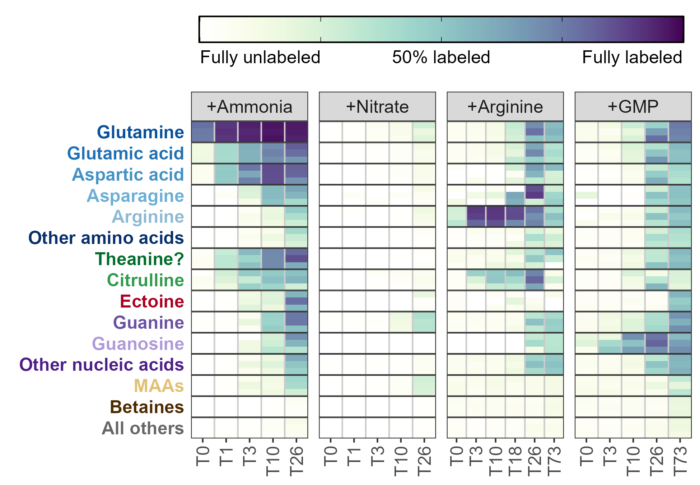
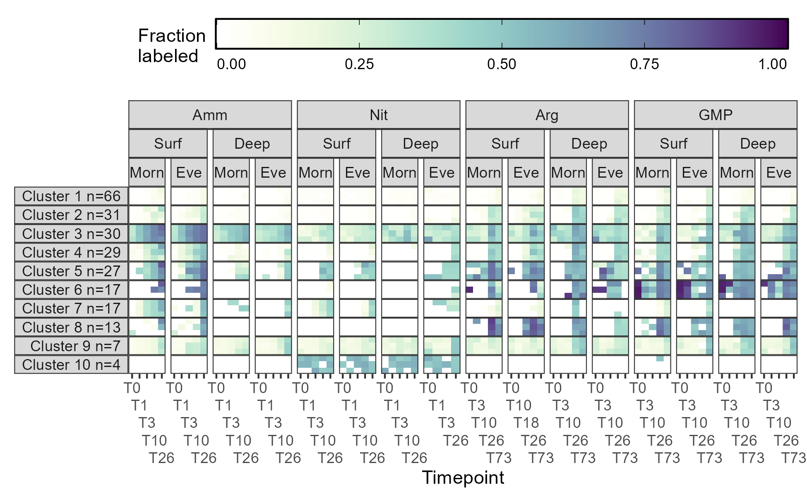

```{r setup, include=FALSE}
knitr::opts_chunk$set(echo = TRUE)
```

Nitrogen availability controls productivity in much of the surface ocean and 
the form of this nitrogen controls who it is available to and how it is used. 
Here, we explored how four different forms of nitrogen (ammonia, nitrate, 
arginine, and guanosine monophosphate) were taken up and transformed in the 
North Pacific Subtropical Gyre using stable isotope labeling metabolomics. We 
repeated these experiments both at the surface and at the base of the euphotic 
zone as well as in the morning and evening. We found that ammonia is converted 
into glutamate in less than 20 minutes and results in labeling throughout the 
metabolome, though osmolytes like betaines had slow turnover rates. This process 
was slower at depth but largely independent of time of day. Nitrate amendments 
resulted in the labeling of only a small subset of molecules such as 
mycosporine-like amino acids, whose incorporation patterns suggest that this 
form of nitrogen was available to a subset of the community, likely eukaryotes. 
The two organic nitrogen amendments labeled the metabolome more slowly than the
inorganic forms of nitrogen and showed similar usage at depth and at the 
surface, hinting at the major role that heterotrophic bacteria likely play in 
their uptake and use. A large fraction of the organic nitrogen added was 
remineralized into ammonia and used as glutamate rather than as intact 
substrates, though labeled arginine was incorporated into proteins directly. 
These measurements reveal the forms and fluxes of organic nitrogen in the 
natural environment to provide constraints on biogeochemical models and better 
characterize the transformations between organic and inorganic nitrogen.

## Figure gallery



Figure 1: Fraction of each metabolite or metabolite group containing at least 
one ^15^N label during the surface seawater amendments with various substrates 
after the number of hours shown on the x-axis. Darker colors indicate a larger 
percentage of the compound signal was isotopically labeled. Three biological 
replicates are stacked vertically at each timepoint and the categories with 
multiple entries have been averaged. MAA = mycosporine-like amino acids, 
GMP = guanosine monophosphate.

---


Figure 2: Stacked bar plots showing the fraction of various total hydrolyzable 
amino acids (THAAs) labeled at the end of the incubations across the four 
amendments. Total uM nitrogen (N) in the protein pool is shown in the top plot 
while the fraction of individual amino acids labeled is shown in the rows below. 
Colors denote specific labeling patterns detected in the THAAs.

<table>
  <tr>
    <td style="vertical-align: middle; text-align: center;">
      Figure 3: Fraction of UV-reactive mycosporine-like amino acids (MAAs) containing at least one ^15^N label over one day during the treatments amended with ^15^N labeled ammonia or nitrate. Incubations started at 6AM are shown in yellow while incubations started at 6PM are shown in blue, with grey background regions highlighting nighttime. Three replicates are included at each of the 5 timepoints and best-fit power law curves have been fit behind the data.
    </td>
    <td>
      
    </td>
  </tr>
</table>

---


Figure 4: Plots of the metabolite fraction labeled at the surface (25 meters) and the fraction labeled at 175 meters. Incubations with added ammonia, arginine, and guanosine monophosphate (GMP) are shown. Top row of plots show the calculation of % labeled at 25 meters minus % labeled at 175 meters for three example compounds. All compounds are shown in the middle row of plots, grouped by chemical similarity and labeling pattern where positive values indicate increased synthesis in the surface samples relative to those at depth. Finally, the bottom row of plots shows the relative difference between the surface and deep as boxplots for all compounds without aggregating. Points in the first two rows are the average of six biological replicates (incubations started in the morning and the evening are combined here for additional power) while points in the bottom row denote metabolites with labeled fractions falling outside 1.5 times the interquartile range.

---



Figure 5: Fraction of each cluster containing at least one ^15^N label during the surface seawater amendments with various substrates after the number of hours shown on the x-axis. Darker colors indicate a larger percentage of the feature signal was isotopically labeled. Three biological replicates are stacked vertically at each timepoint and the labeling within each clusters has been averaged across all the composing features. The number of features in each cluster is specified by the n in the facet name. GMP = guanosine monophosphate.

## Data products

[Metadata for each of the sample files](metadata/parametadata.csv)

[Environmental concentrations for XX metabolites](targeted/final_env_concs.csv)

[Relative abundances and isotope labeling patterns for XX metabolites](targeted/all_peak_areas_w_isos.csv)

[Environmental concentrations for THAAs and their isotopes](thaas/quant_data.csv)

[Relative abundance (peak area) and peak quality for 500,000 xcms peaks](untargeted/cleaned_combined_peaks.rds)

[Annotation of the 80 best features in the untargeted analysis](untargeted/best_labeled_anno.xlsx)

---

README last built on "`r Sys.Date()`"
