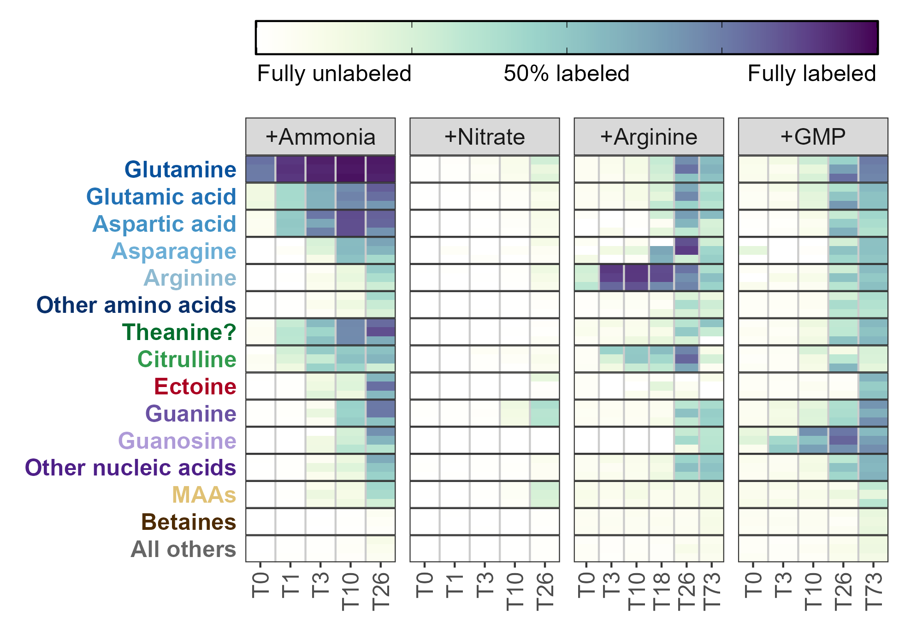
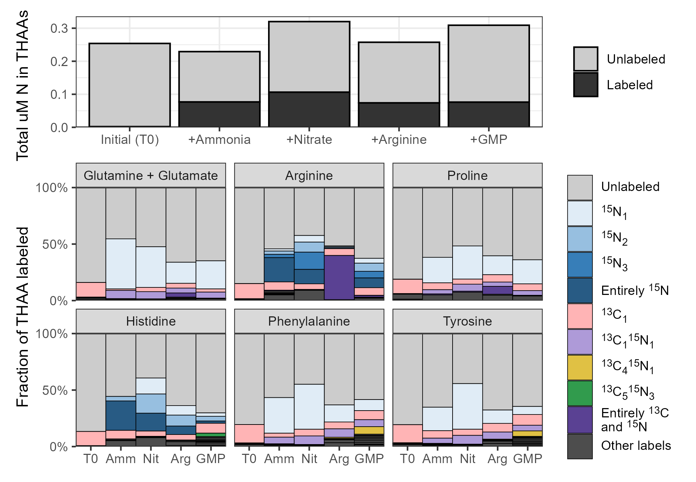
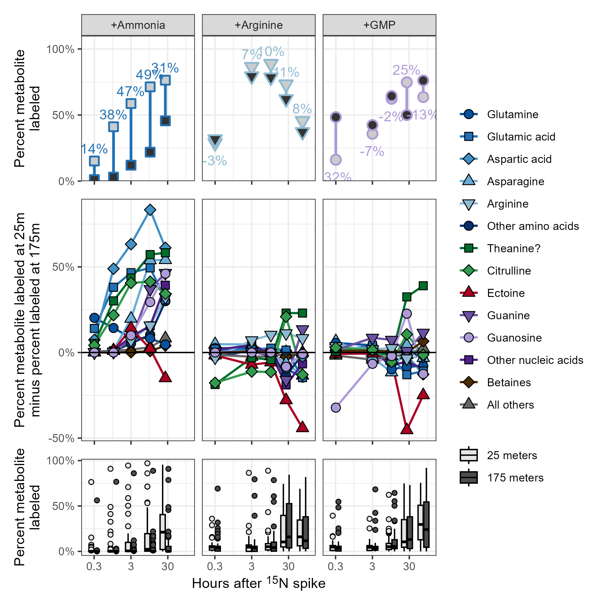
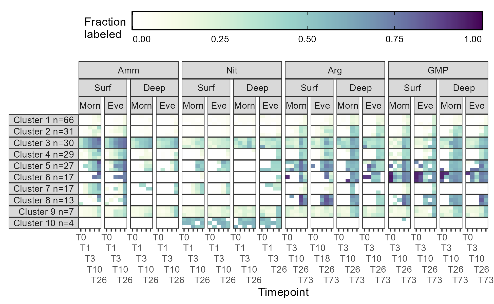

Nitrogen’s form determines its fate in the North Pacific Subtropical
Gyre
================

Nitrogen availability controls productivity in much of the surface ocean
and the form of this nitrogen controls who it is available to and how it
is used. Here, we explored how four different forms of nitrogen
(ammonia, nitrate, arginine, and guanosine monophosphate) were taken up
and transformed in the North Pacific Subtropical Gyre using stable
isotope labeling metabolomics. We repeated these experiments both at the
surface and at the base of the euphotic zone as well as in the morning
and evening. We found that ammonia is converted into glutamate in less
than 20 minutes and results in labeling throughout the metabolome,
though osmolytes like betaines had slow turnover rates. This process was
slower at depth but largely independent of time of day. Nitrate
amendments resulted in the labeling of only a small subset of molecules
such as mycosporine-like amino acids, whose incorporation patterns
suggest that this form of nitrogen was available to a subset of the
community, likely eukaryotes. The two organic nitrogen amendments
labeled the metabolome more slowly than the inorganic forms of nitrogen
and showed similar usage at depth and at the surface, hinting at the
major role that heterotrophic bacteria likely play in their uptake and
use. A large fraction of the organic nitrogen added was remineralized
into ammonia and used as glutamate rather than as intact substrates,
though labeled arginine was incorporated into proteins directly. These
measurements reveal the forms and fluxes of organic nitrogen in the
natural environment to provide constraints on biogeochemical models and
better characterize the transformations between organic and inorganic
nitrogen.

## Figure gallery

Figure 1: Fraction of each metabolite or metabolite group containing at
least one 15N label during the surface seawater amendments
with various substrates after the number of hours shown on the x-axis.
Darker colors indicate a larger percentage of the compound signal was
isotopically labeled. Three biological replicates are stacked vertically
at each timepoint and the categories with multiple entries have been
averaged. MAA = mycosporine-like amino acids, GMP = guanosine
monophosphate.

Figure 2: Stacked bar plots showing the fraction of various total
hydrolyzable amino acids (THAAs) labeled at the end of the incubations
across the four amendments. Total uM nitrogen (N) in the protein pool is
shown in the top plot while the fraction of individual amino acids
labeled is shown in the rows below. Colors denote specific labeling
patterns detected in the THAAs.

<table>
<tr>
<td>

</td>
<td style="vertical-align: middle; text-align: center;">
Figure 3: Fraction of UV-reactive mycosporine-like amino acids (MAAs)
containing at least one 15N label over one day during the
treatments amended with 15N labeled ammonia or nitrate.
Incubations started at 6AM are shown in yellow while incubations started
at 6PM are shown in blue, with grey background regions highlighting
nighttime. Three replicates are included at each of the 5 timepoints and
best-fit power law curves have been fit behind the data.
</td>
</tr>
</table>

Figure 4: Plots of the metabolite fraction labeled at the surface (25
meters) and the fraction labeled at 175 meters. Incubations with added
ammonia, arginine, and guanosine monophosphate (GMP) are shown. Top row
of plots show the calculation of % labeled at 25 meters minus % labeled
at 175 meters for three example compounds. All compounds are shown in
the middle row of plots, grouped by chemical similarity and labeling
pattern where positive values indicate increased synthesis in the
surface samples relative to those at depth. Finally, the bottom row of
plots shows the relative difference between the surface and deep as
boxplots for all compounds without aggregating. Points in the first two
rows are the average of six biological replicates (incubations started
in the morning and the evening are combined here for additional power)
while points in the bottom row denote metabolites with labeled fractions
falling outside 1.5 times the interquartile range.

Figure 5: Fraction of each cluster containing at least one
15N label during the surface seawater amendments with various
substrates after the number of hours shown on the x-axis. Darker colors
indicate a larger percentage of the feature signal was isotopically
labeled. Three biological replicates are stacked vertically at each
timepoint and the labeling within each clusters has been averaged across
all the composing features. The number of features in each cluster is
specified by the n in the facet name. GMP = guanosine monophosphate.

## Data products

[Metadata for each of the sample files](metadata/parametadata.csv)

[Environmental concentrations for XX
metabolites](targeted/final_env_concs.csv)

[Relative abundances and isotope labeling patterns for XX
metabolites](targeted/all_peak_areas_w_isos.csv)

[Environmental concentrations for THAAs and their
isotopes](thaas/quant_data.csv)

[Relative abundance (peak area) and peak quality for 500,000 xcms
peaks](untargeted/cleaned_combined_peaks.rds)

[Annotation of the 80 best features in the untargeted
analysis](untargeted/best_labeled_anno.xlsx)

------------------------------------------------------------------------

README last built on “2025-05-22”
