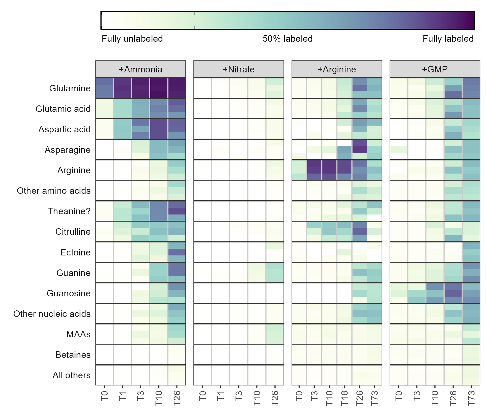
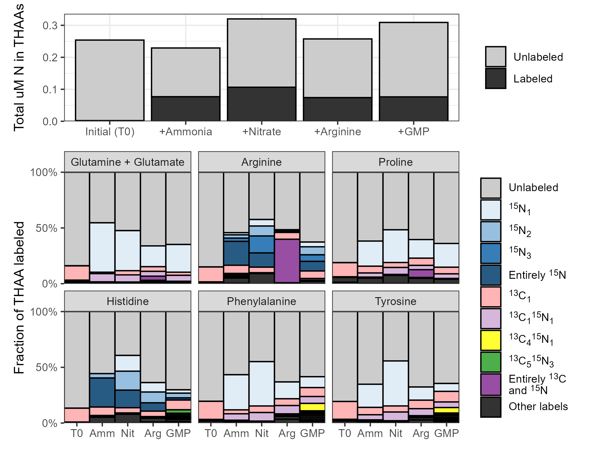
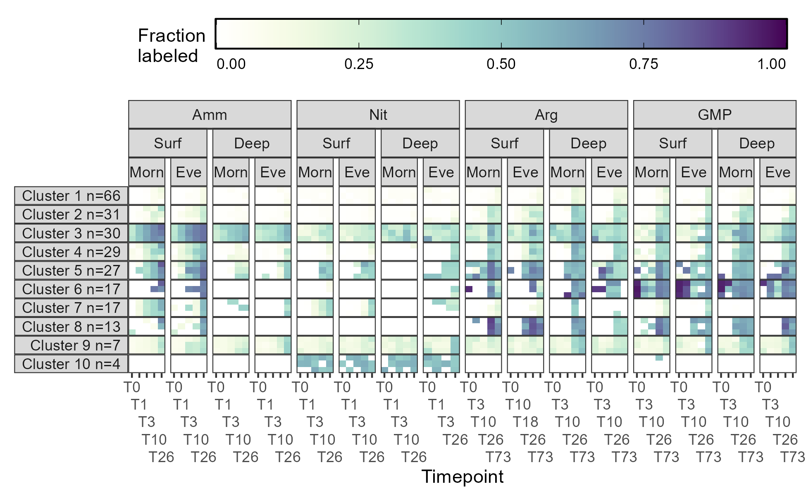

```{r setup, echo=FALSE, include=FALSE}
knitr::opts_chunk$set(echo = FALSE, message=FALSE, warning=FALSE, eval=FALSE)
library(tidyverse)
library(ggh4x)
library(patchwork)
library(ggtext)
library(minpack.lm)
library(RaMS)
options(pillar.sigfig = 7)
options(pillar.print_min = 100)

wc <- function(
  comment, 
  highlight = "", 
  author = "Will", 
  time = Sys.time(),
  id = "0"
) {
  if (isTRUE(knitr:::pandoc_to() == "docx")) {
    return(
      sprintf(
        '[%s]{.comment-start id="%s" author="%s" date="%s"} %s []{.comment-end id="%s"}',
        comment,
        id,
        author,
        time,
        highlight,
        id
      )
    )
  } else {
    return(
      sprintf(
        "*%s* **[Comment id %s by %s at time %s: %s]**", 
        highlight,
        id,
        author, 
        time, 
        comment
      )
    )
  }
}
```

```{r load data, eval=FALSE}
parametadata <- read_csv("metadata/parametadata.csv") %>%
  # filter(IS_type=="noIS") %>%
  filter(polarity=="pos") %>%
  filter(samp_type=="Smp" | samp_type=="Bad") %>%
  mutate(startime=factor(startime, levels=c("Morn", "Eve"))) %>%
  mutate(depth=factor(depth, levels=c("Surf", "Deep"))) %>%
  mutate(amendment=factor(amendment, levels=c("Amm", "Nit", "Arg", "GMP"))) %>%
  arrange(amendment, depth, timepoint_num, startime) %>%
  mutate(timepoint=factor(timepoint, levels=c("T0", "T1", "T3", "T10", "T18", "T26", "T73")))

all_stans <- read_csv("metadata/all_stans.csv")
stan_patched <- all_stans %>%
  filter(!compound_name=="beta-Glutamic acid") %>%
  mutate(compound_name=str_replace(compound_name, "L-Glutamic acid", "L-Glutamic acid/beta-Glutamic acid")) %>%
  filter(!compound_name=="L-Isoleucine") %>%
  mutate(compound_name=str_replace(compound_name, "L-Leucine", "L-Leucine/L-Isoleucine")) %>%
  filter(!compound_name=="L-Homoserine") %>%
  mutate(compound_name=str_replace(compound_name, "L-Threonine", "L-Threonine/L-Homoserine")) %>%
  filter(!compound_name=="Allopurinol") %>%
  mutate(compound_name=str_replace(compound_name, "Hypoxanthine", "Hypoxanthine/Allopurinol"))
maa_names <- c("Also Palythene/Usujirene?", "Shinorine?", "Mycosporine-glycine?", 
               "Palythine?", "Another Palythene/Usujirene?", "Porphyra-334?", 
               "Also Porphyra-334?", "Asterina-330?", "Palythene/Usujirene?",
               "Mycosporine-2-glycine?", "Mycosporine-alanine/Mycosporine-beta alanine?",
               "Mycosporine-methylamine:serine?", "Mycosporine-glutamine?",
               "Mycosporine glutaminol/Palythinol/Mycosporine-methylamine:threonine?", 
               "Palythenic acid?")
nucleo_names <- c("5-Methylcytosine", "Adenosine", "Cytidine", "Adenine", "Guanosine",
                  "Cytosine", "Hypoxanthine/Allopurinol", "Guanine", "Deoxycytidine?",
                  "Deoxyadenosine", "Deoxyguanosine?")
betaine_names <- c("beta-Alaninebetaine", "Glycine betaine", "Homarine", "Trigonelline",
                   "Choline", "Glycerophosphocholine", "Homoserine betaine?", 
                   "Threonine betaine?", "Proline betaine",
                   "(3-Carboxypropyl)trimethylammonium", "O-Acetylcarnitine", 
                   "Betonicine", "Acetylcholine", "Phosphocholine")
non_n_names <- c("Dimethylsulfonioacetate", "Dimethylsulfoniopropionate",
                 "Arsenobetaine", "Dimethylsulfoxonium propionate?", "Gonyol",
                 "2-O-alpha-D-Glucosylglycerol")
aa_names <- c("Glutamine", "Aspartic acid", "Glutamic acid/beta-Glutamic acid",
              "Asparagine", "Alanine", "Methionine", "Arginine", "Proline",
              "Lysine", "Threonine/Homoserine", "Serine", "Glycine", "Histidine",
              "Leucine/Isoleucine", "Valine", "Arginine")
bad_cmpds <- c("Melamine", "Uridine", "Itaconic acid?", "Inosine", "Dexpanthenol", 
               "Choline sulfate", "5-Hydroxyectoine", "L-Tyrosine")
class_levels <- c("Glutamine", "Glutamic acid", "Aspartic acid", "Asparagine", "Arginine", 
                  "Other amino acids", "Theanine?", "Citrulline", "Ectoine", "Guanine", 
                  "Guanosine", "Other nucleic acids", "MAAs", "Betaines", "All others")
aa_ncs <- all_stans %>%
  filter(compound_type=="Amino Acid") %>%
  mutate(compound_name=str_remove(compound_name, "^L-")) %>%
  distinct(compound_name, n_C, n_N) %>%
  add_row(compound_name="Phenylalanine", n_C=9, n_N=1)

peak_areas <- read_csv("targeted/all_peak_areas_w_isos.csv") %>%
  left_join(parametadata %>% distinct(filename, shortname))
samp_areas <- parametadata %>%
  filter(samp_type=="Smp") %>%
  distinct(shortname, depth) %>%
  left_join(peak_areas) %>%
  mutate(shortname=fct_inorder(shortname)) %>%
  filter(!compound_name%in%bad_cmpds) %>%
  filter(!(depth=="Deep" & compound_name%in%maa_names)) %>%
  select(-depth)
labeled_fracs <- samp_areas %>%
  mutate(labeled_frac=1-area/sum(area), .by = c("shortname", "compound_name")) %>%
  select(compound_name, iso_name, shortname, labeled_frac) %>%
  filter(str_detect(iso_name, "13C0, 15N0")) %>%
  select(-iso_name)

env_concs <- read_csv("targeted/final_env_concs.csv") %>%
  select(-conc_um_in_vial) %>%
  left_join(parametadata %>% distinct(filename, shortname)) %>%
  select(-filename)
nM_labeled <- samp_areas %>%
  left_join(env_concs) %>%
  mutate(labeled_frac=area/sum(area), .by = c("shortname", "compound_name")) %>%
  mutate(rel_label=labeled_frac/labeled_frac[str_detect(iso_name, "13C0, 15N0")], .by = c("shortname", "compound_name")) %>%
  mutate(nM_labeled=conc_nm_in_env*rel_label) %>%
  select(filename, compound_name, iso_name, nM_labeled)


cleaned_combined_peaks <- readRDS("untargeted/cleaned_combined_peaks.rds")

thaa_quant <- read_csv("thaas/quant_data.csv") %>%
  filter(iso_name!="Proline, 13C3, 15N1")
metathaa <- read_csv("thaas/metathaa.csv") %>%
  mutate(depth=factor(depth, levels=c("Surf", "Deep"))) %>%
  mutate(startime=factor(startime, levels=c("Morn", "Eve")))
```

# Abstract

Nitrogen availability controls productivity in much of the surface ocean and the form of this nitrogen controls who it is available to and how it is used. Here, we explored how four different forms of nitrogen (ammonia, nitrate, arginine, and guanosine monophosphate) were taken up and transformed in the North Pacific Subtropical Gyre using stable isotope labeling metabolomics. We repeated these experiments both at the surface and at the base of the euphotic zone as well as in the morning and evening. We found that ammonia is converted into glutamate in less than 20 minutes and results in labeling throughout the metabolome, though osmolytes like betaines had slow turnover rates. This process was slower at depth but largely independent of time of day. Nitrate amendments resulted in the labeling of only a small subset of molecules such as mycosporine-like amino acids, whose incorporation patterns suggest that this form of nitrogen was available to a subset of the community, likely eukaryotes. The two organic nitrogen amendments labeled the metabolome more slowly than the inorganic forms of nitrogen and showed similar usage at depth and at the surface, hinting at the major role that heterotrophic bacteria likely play in their uptake and use. A large fraction of the organic nitrogen added was remineralized into ammonia and used as glutamate rather than as intact substrates, though labeled arginine was incorporated into proteins directly. These measurements reveal the forms and fluxes of organic nitrogen in the natural environment to provide constraints on biogeochemical models and better characterize the transformations between organic and inorganic nitrogen.

# Introduction

Marine carbon is fixed into biomass very quickly. In most of the surface ocean this flux is controlled by the availability of nitrogen, an element with a complex and incompletely characterized biogeochemical cycle [@Capone2008; @Moore2013; @Hutchins2022]. Organic nitrogen in particular is often treated as a black box despite substantial variability in its bioavailability and chemical nature. While extensive work has been done to characterize the forms and fluxes of nitrogen within the inorganic pool, the equivalent for the organic pool is woefully underdeveloped [@ref, prob NME2008 or Hansell2024, maybe @Hutchins2022 for visual?]. This is largely due to the difficulty of comprehensively measuring the many organic molecules that contain nitrogen in the marine environment [@Boysen2018; @Moran2022]. The bioavailability of the nitrogen atom is in the environment is largely determined by the form of the organic material it composes.

The mechanisms by which dissolved nitrogen becomes biomass and vice versa are major factors in our ability to predict ecosystem productivity and therefore carbon fixation and export. Traditionally, the conversion of inorganic material into organic substrate was thought to be limited to autotrophs while remineralization was performed by the heterotrophic community. Today, it’s known that many photosynthetic organisms are able to take up and use organic nitrogen [@Anita1991; @Morando2018; @Hugo2021] and that only a select subset of phototrophs are capable of nitrate reduction or nitrogen fixation [@ref], while inorganic nitrogen is directly accessible to heterotrophs as well. This means that the transformations possible for a given N-containing compound are a function of the microbial community and its environment while the microbial community is in turn also expected to be a function of the N-containing molecules available. This creates a recursive network that’s difficult to untangle and cannot necessarily be extrapolated from axenic culture studies.

One way to reveal the pathways and transformations that marine N undergoes in a natural community is via 15N labeling paired with metabolomics. Metabolites that incorporate the labeled nitrogen can then be separated on the mass spectrometer and quantified separately from the unlabeled pool. Here, we trace the uptake and use of labeled ammonia, nitrate, arginine, and guanosine monophosphate in a natural community from the NPSG at multiple depths and diel conditions. Our application of metabolomics to these samples allows us to map out the pathways and restructuring that organic nitrogen experiences in the largest biomes on the planet, quantifying the pool sizes and turnover rates for various low molecular weight compounds that serve as building blocks and intermediates of cell biology.

## Other things to maybe discuss:

  -	mention the expected differences with depth and diel effects
  -	detail which compounds we chose and why?
  -	expand on DON-PON interactions and importance?
  - Extracellular enzymes, organic use as ammonia vs as-is?
  -	expand on the importance of biogeochemical models and why we need pathways mapped out?
  -	mention basic biosynthetic pathways (maybe better suited to discussion?)
  -	new (nitrate) vs regenerated (ammonia and DON) production (maybe also discussion?)

## Other soundbites:
  - It is assumed that most fixed nitrogen becomes protein, presumably based on the large fraction of cell nitrogen in protein and previous research showing how quickly it enters the (free?) amino acid pool. However, 1) important intermediates molecules 2) doesn’t explain where biounavailable N comes from 3) makes gene-based molecular modeling really difficult.
  - In each case, assimilation into organic matter is typically done via the glutamine synthetase (GS)/glutamate synthase (GOGAT) or glutamate dehydrogenase (GDH) pathways to produce glutamate from α-ketoglutarate [@ref, see bronk chapter]. Glutamate then serves as a nitrogen supply in an enormous number of biochemical pathways in both primary and secondary metabolism [@Walker2016].
  - nitrate amendments typically resulting in diatom blooms while ammonia incubations favor cyanobacteria [@Glibert2016].
  - Communities to distinguish are 1) surface (largely regenerated production) and 2) 175m (largely new production(??))
  - use of organics vs synthesis of organics
  - Compounds such as non-proteinogenic amino acids (e.g., ornithine, citrulline, creatine, MAAs), osmolytes like betaines, nucleobases, and sulfur-containing molecules like taurine represent significant but poorly quantified pools. Understanding the rates and pathways by which these compounds are utilized is crucial, as they form the fundamental unit linking genetic potential to elemental cycling in biogeochemical models.
  - Nitrogen use varies significantly between the sunlit surface where productivity is largely regenerated through recycling of ammonia and organic nitrogen, and deeper waters near the base of the euphotic zone, where nitrate supports “new” production. Quantifying rates of nitrogen assimilation into ammonia and downstream products across these gradients is therefore essential for predicting marine productivity and nutrient cycling.
  - Nonetheless, how the community uses a substrate is arguably more important than whether it can. 

# Results

`r wc("Do I need a 'here's what the cruise looked like' results section?")`

## Differences in nitrogen labeling at the surface between amendments

```{r gln numbers}
labeled_fracs %>%
  filter(compound_name=="L-Glutamine") %>%
  left_join(parametadata %>% filter(IS_type=="noIS")) %>%
  filter(timepoint%in%c("T0", "T26")) %>%
  filter(depth=="Surf") %>%
  filter(amendment=="Amm") %>%
  summarise(frac=mean(labeled_frac), .by=c(compound_name, timepoint))
peak_areas %>%
  filter(compound_name=="L-Glutamine") %>%
  left_join(parametadata %>% filter(IS_type=="noIS")) %>%
  filter(depth=="Surf") %>%
  filter(amendment=="Amm") %>%
  ggplot(aes(x=tripl, y=area, fill=iso_name)) +
  geom_col(color="black") +
  facet_grid(startime~timepoint)
nM_labeled %>%
  filter(compound_name%in%c("L-Glutamine")) %>%
  left_join(parametadata %>% filter(IS_type=="noIS")) %>%
  filter(depth=="Surf") %>%
  filter(amendment=="Amm") %>%
  summarise(conc=mean(nM_labeled), .by=c(compound_name, timepoint)) %>%
  arrange(timepoint)
```

We observed significant differences in ^15^N labeling patterns between the different treatment incubations performed with ALOHA surface seawater (Figure 1). Ammonia incubations resulted in very rapid labeling, with glutamine more than 75% labeled even at the T0 timepoint, corresponding to the amount of time required to spike and immediately filter the 2 liters of seawater (~15 minutes). The dominant labeling pattern at T0 was a single ^15^N, though all later timepoints showed more doubly-^15^N labeled glutamine than singly-labeled. After 24 hours, glutamine was more than 95% labeled and had approximately doubled in pool size (initially ~0.3 nM becoming 0.8 nM).

```{r fig1 grouped metab heatmap}
xamend_metab_gp <- labeled_fracs %>%
  left_join(parametadata %>% distinct(shortname, samp_type, timepoint, timepoint_num, depth, startime, amendment, tripl)) %>%
  filter(samp_type!="Bad") %>%
  filter(depth=="Surf") %>%
  mutate(compound_name=str_remove_all(compound_name, "^L-")) %>%
  mutate(compound_name=str_remove(compound_name, "/beta-Glutamic acid")) %>%
  mutate(compound_class=case_when(
    compound_name%in%c("Glutamine", "Aspartic acid", "Asparagine", "Glutamic acid", "Ectoine", "Theanine?", "Citrulline", "Guanine", "Guanosine", "Arginine") ~ compound_name,
    compound_name%in%maa_names~"MAAs",
    compound_name%in%aa_names~"Other amino acids",
    compound_name%in%nucleo_names~"Other nucleic acids",
    compound_name%in%betaine_names~"Betaines",
    TRUE~"All others"
  )) %>%
  mutate(compound_class=factor(compound_class, levels=class_levels)) %>%
  summarise(avg_frac=mean(labeled_frac), .by = c(compound_class, amendment, timepoint, tripl)) %>%
  mutate(amendment=factor(amendment, levels=c("Amm", "Nit", "Arg", "GMP"),
                          labels=c("+Ammonia", "+Nitrate", "+Arginine", "+GMP"))) %>%
  ggplot() +
  geom_raster(aes(x=timepoint, y=tripl, fill=avg_frac)) +
  geom_vline(xintercept = c(1.5:5.5), color="grey80") +
  facet_nested(compound_class~amendment, scales = "free_x", switch="y") +
  scale_fill_gradientn(colours = viridis::viridis(10, alpha = seq(0, 1, length.out=10), direction = -1),
                       limits=c(0, 1), breaks=c(0, 0.25, 0.5, 0.75, 1),
                       labels=c("Fully unlabeled", "", "50% labeled", "", "Fully labeled")) +
  scale_x_discrete(expand = expansion()) +
  scale_y_discrete(expand = expansion()) +
  labs(x=NULL, y=NULL, fill=NULL) +
  theme_bw() +
  theme(panel.spacing.x=unit(0.5, "lines"), 
        panel.spacing.y = unit(0, "lines"),
        axis.text.x = element_text(angle=90, hjust=1, vjust=0.5),
        axis.text.y = element_blank(),
        axis.ticks.y = element_blank(),
        strip.text.y.left = element_text(angle=0, hjust = 1),
        strip.background.y = element_rect(fill=NA, color=NA),
        panel.grid.major = element_blank(), 
        panel.grid.minor = element_blank(),
        legend.position = "top", 
        legend.key.width = unit(1, "null")) +
  guides(
    fill=guide_colorbar(theme=theme(
      legend.frame = element_rect(color = "black"),
      legend.ticks = element_line(color="black"),
      legend.text = ggtext::element_markdown(hjust=c(0, 0, 0.5, 1, 1))),
      text=element_text(size=12)
    )
  )
ggsave("xamend_metab_gp.png",plot = xamend_metab_gp, device = "png", path = "manuscript/figures",
       width = 6.5, height = 4, units = "in", dpi = 300)
```



*Figure 1: Fraction of each metabolite or metabolite group containing at least one ^15^N label during the surface seawater amendments with various substrates after the number of hours shown on the x-axis. Darker colors indicate a larger percentage of the compound signal was isotopically labeled. Three biological replicates are stacked vertically at each timepoint and the categories with multiple entries have been averaged. MAA = mycosporine-like amino acids, GMP = guanosine monophosphate.*

```{r gluaspcit numbers}
labeled_fracs %>%
  filter(compound_name%in%c("L-Glutamic acid/beta-Glutamic acid", "L-Aspartic acid",
                            "Citrulline", "L-Arginine", "Theanine?")) %>%
  left_join(parametadata %>% filter(IS_type=="noIS")) %>%
  filter(timepoint=="T1") %>%
  filter(depth=="Surf") %>%
  filter(amendment=="Amm") %>%
  summarise(frac=mean(labeled_frac), .by=c(compound_name))
env_concs %>%
  filter(compound_name%in%c("L-Glutamic acid/beta-Glutamic acid", "L-Aspartic acid",
                            "Citrulline", "L-Arginine")) %>%
  left_join(parametadata %>% filter(IS_type=="wIS")) %>%
  filter(timepoint=="T1") %>%
  filter(depth=="Surf") %>%
  filter(amendment=="Amm") %>%
  summarise(conc=mean(conc_nm_in_env), .by=c(compound_name))
```

```{r theanine annotation check}
# Check theanine annotation and numbers
cleaned_combined_peaks %>% 
  filter(mzmed%between%pmppm(175.1077, 10)) %>%
  left_join(parametadata) %>%
  filter(amendment=="Amm") %>%
  filter(depth=="Surf") %>%
  summarise(mzmed=unique(mzmed), rtmed=unique(rtmed)/60, into=mean(into),
            beta_snr=median(beta_snr), beta_cor=median(beta_cor), 
            .by=feature)
arrow::open_dataset("tmzMLs/pqds") %>%
  filter(amendment=="Amm") %>%
  filter(samp_type=="Smp") %>%
  filter(polarity=="pos") %>%
  filter(mz%between%pmppm(175.1077, 10) | mz%between%pmppm(176.1047, 10)) %>%
  filter(rt%between%c(7.2, 8.5)) %>%
  dplyr::collect() %>%
  mutate(mz=round(mz)) %>%
  slice_max(int, by=c(filename, mz, rt)) %>%
  arrange(rt) %>%
  summarise(area=trapz(rt, int), .by=c(filename, mz)) %>%
  pivot_wider(names_from=mz, values_from=area) %>%
  mutate(labeled_frac=`176`/(`175`+`176`)) %>%
  left_join(parametadata %>% filter(IS_type=="noIS")) %>%
  filter(depth=="Surf") %>%
  ggplot() +
  geom_boxplot(aes(x=timepoint, y=labeled_frac, color=startime))
```

The ^15^N was then quickly propagated to glutamate and aspartate, creating a metabolite pool 40-50% labeled for each of these after a single hour. Aspartate was labeled slightly faster than glutamate, likely as a result of its smaller pool size (0.2 nM Asp versus 0.5 nM Glu). Also rapidly labeled was citrulline, reaching 20% labeled after a single hour, though arginine was not labeled until much later despite its location immediately downstream of this metabolite. Untargeted detection of other molecular features revealed an additional metabolite that was 30% labeled at the one hour timepoint with an *m/z* value of 175.1077 and a retention time of 8.2 minutes which we have putatively identified as theanine (N5-ethyl glutamine) based on *m/z* match and labeling pattern.

```{r betaine and nucleo numbers}
labeled_fracs %>%
  filter(compound_name%in%nucleo_names) %>%
  left_join(parametadata %>% filter(IS_type=="noIS")) %>%
  filter(timepoint=="T26") %>%
  filter(amendment=="Amm") %>%
  summarise(frac=mean(labeled_frac), .by=c(compound_name)) %>%
  mutate(nuc_type=case_when(
    compound_name%in%c("Cytosine", "Adenine", "Guanine", "Hypoxanthine/Allopurinol")~"Nucleobase",
    compound_name%in%c("Cytidine", "Adenosine", "Guanosine")~"Nucleoside",
    compound_name%in%c("Deoxycytidine?", "Deoxyadenosine", "Deoxyguanosine?")~"Deoxy"
  )) %>%
  mutate(nuc_shortname=str_extract(tolower(compound_name), tolower("Cy|Ad|Gu|Hy"))) %>%
  select(nuc_shortname, nuc_type, frac) %>%
  pivot_wider(names_from=nuc_type, values_from=frac) %>%
  select(nuc_shortname, Nucleoside, Nucleobase, Deoxy)

labeled_fracs %>%
  filter(compound_name%in%betaine_names) %>%
  left_join(parametadata %>% filter(IS_type=="noIS")) %>%
  filter(timepoint=="T26") %>%
  filter(amendment=="Amm") %>%
  summarise(frac=mean(labeled_frac), .by=c(compound_name))

peak_areas %>%
  filter(compound_name%in%nucleo_names) %>%
  left_join(parametadata %>% filter(IS_type=="noIS")) %>%
  filter(timepoint=="T26") %>%
  filter(amendment=="Amm") %>%
  filter(depth=="Surf") %>%
  mutate(iso_name=str_remove(iso_name, ".*?, ")) %>%
  filter(iso_name!="13C0, 15N0") %>%
  ggplot() +
  geom_col(aes(x=tripl, y=area, fill=iso_name), position="fill", color="black") +
  facet_wrap(~compound_name)
```

Other amino acids and nucleobases/nucleosides had trace amounts of labeling after 3 hours and were extensively labeled (>25%) after 24 hours (Figure 1). Cytidine (42.2% labeled) and adenosine (59.9%) were more heavily ^15^N labeled than their nucleobase constituents at T26 (22.9% and 42.1%, respectively), corresponding to the expected synthesis pathway. Guanine, however, had the inverse trend and at 44.9% labeled was 15% more labeled than guanosine (Supplemental figure XX). The deoxyribose forms were in all cases less completely labeled than their ribose counterparts (deoxycytidine = 18.9%, deoxyadenosine = 20.3%, and deoxyguanosine = 17.2%) `r wc("Maybe better as a small table?")` `r wc("Consider trying harder to get thymine/uracil/inosine values?")`. In each case, the fully ^15^N labeled nucleobase was the dominant constituent of the isotope envelope (^15^N~3~ for cytosine and ^15^N~5~ for adenine and guanine). Other compounds, including betaines (here restricted to quaternary amines with a carboxylic acid group) and choline derivatives showed very little labeling at all, with only homarine (15.0% labeled) and O-acetylcarnitine (9.9% labeled) exceeding 5% labeling after 24 hours`r wc("Expand betaine discussion and turn it into a separate paragraph? Not sure what more to say... fluxes?")`. 

Amendments with ^15^NO~3~ showed a significantly different labeling pattern with very few metabolites incorporating the ^15^N label at the surface even after 24 hours. Glutamine and glutamate, which were labeled within 20 minutes from ammonia and are the main way in which inorganic nitrogen becomes organic, here saw only trace amounts of production from the added nitrate even after 24 hours. The most heavily labeled compound was guanine, which saw trace amounts of labeling at the T10 timepoint and reached ~40% labeling at T26. This labeling was not reflected in the other nucleobases. The only group of compounds that did see compelling degrees of label were the mycosporine-like amino acids (MAAs), a group of compounds produced under UV exposure (see below). These compounds, like guanine, were labeled in excess of the bulk glutamate/amino acid pool from which their nitrogen is sourced. This is only possible if the nitrate is assimilated by a subset of the community that is able to reduce it and prevents it from entering the environment. Metabolites specific to those organisms can then be made from the small pool of heavily-labeled organic material without affecting the fraction of glutamate or glutamine labeled in bulk.

```{r arg numbers}
labeled_fracs %>%
  filter(compound_name=="L-Arginine") %>%
  left_join(parametadata %>% filter(IS_type=="noIS")) %>%
  filter(depth=="Surf") %>%
  filter(amendment=="Arg") %>%
  summarise(frac=mean(labeled_frac), .by=c(compound_name, timepoint)) %>%
  arrange(timepoint)
```

The organic nitrogen amendments also showed labeling patterns distinct from the ammonia incubations, though a large fraction of the nitrogen was clearly remineralized into ammonia/glutamate and used to label a similar suite of compounds (Figure 1). Fully C and N labeled (^13^C~6~, ^15^N~4~) arginine was visibly taken up at the T0 timepoint (within 20 minutes) and 80-90% of the pool was fully labeled after 12 hours. Surprisingly, the fraction of arginine labeled decreased from this point, with the T26 and T73 timepoints dropping to 73% and 46% labeled, respectively. This labeling rapidly propagated into citrulline via the urea cycle, indicating that labeled urea (^13^C~1~, ^15^N~2~) was created and available in the system as well though we were unable to measure this directly `r wc("I could try harder to get urea values for this but it's pretty bad.")`. Glutamate and glutamine were labeled much more slowly, reaching 10% labeled after 10 hours and a maximum of 66% labeled after 24 hours. Much of this nitrogen was then cycled very quickly among other compounds which also saw a jump in labeling at 24 hours. This was particularly true for other amino acids and the nucleobases/nucleosides and here, guanine was not labeled more than other nucleobases. Mycosporine-like amino acids and betaines were unlabeled above background even after 3 days of incubation.

```{r gmp numbers}
labeled_fracs %>%
  filter(compound_name%in%c("Guanosine", "Guanine")) %>%
  left_join(parametadata %>% filter(IS_type=="noIS")) %>%
  filter(depth=="Surf") %>%
  filter(amendment=="GMP") %>%
  summarise(frac=mean(labeled_frac), .by=c(compound_name, timepoint)) %>%
  pivot_wider(names_from=compound_name, values_from=frac) %>%
  arrange(timepoint)
peak_areas %>%
  filter(compound_name%in%c("Guanosine", "Guanine", "Adenine", "Adenosine", "Hypoxanthine/Allopurinol")) %>%
  left_join(parametadata %>% filter(IS_type=="noIS")) %>%
  filter(amendment=="GMP") %>%
  filter(depth=="Surf") %>%
  mutate(iso_name=str_remove(iso_name, ".*?, ")) %>%
  # filter(iso_name!="13C0, 15N0") %>%
  ggplot() +
  geom_col(aes(x=tripl, y=area, fill=iso_name), position="fill", color="black") +
  facet_grid(compound_name~timepoint)
```

The guanosine monophosphate (GMP) incubations showed a pattern very similar to the arginine incubations in the identity, timing, and magnitude in which metabolites were labeled (Figure 1). While we were unable to measure GMP directly `r wc("I can try harder here but the data is pretty bad :(")` we saw clear labeling of fully C and N labeled guanosine (^13^C~10~, ^15^N~5~) after 3 hours that increased to a maximum of 75% after 24 hours before decreasing slightly to 64% labeled at the end of the three-day incubation. A small part of this signal was reflected in guanine, with ^13^C~5~, ^15^N~5~ guanine representing about 10% of the signal at T3 and reaching a maximum of 40% at T26. At T26 we also saw extensive labeling in adenine, adenosine, and hypoxanthine though their dominant labeling patterns (^13^C~0~ ^15^N~5~, ^13^C~5~ ^15^N~5~, and ^13^C~0~ ^15^N~4~ respectively, Supplemental figure XX) suggested that the adenine and hypoxanthine were synthesized from glutamate and that the ribose pool had been swamped by guanosine cleavage. Here, unlike the arginine incubations, we also saw some MAA labeling at the end of the 3 day incubation.

```{r thaa tables}
thaa_avgs <- thaa_quant %>%
  left_join(metathaa) %>%
  filter(samp_type=="Smp") %>%
  filter(depth=="Surf") %>%
  select(compound_name, iso_name, amendment, timepoint, depth, startime, env_conc_nm) %>%
  summarise(thaa_nM=mean(env_conc_nm), .by = c(compound_name, iso_name, amendment, timepoint)) %>%
  mutate(compound_name=case_when(
    compound_name%in%c("Aspartic acid")~"Aspartate + asparagine",
    compound_name%in%c("Glutamic acid")~"Glutamate + glutamine",
    compound_name%in%c("Leucine", "Isoleucine")~"Leucine + isoleucine",
    TRUE~compound_name
  )) %>%
  mutate(iso_name=str_remove(iso_name, ".*(?=13)")) %>%
  summarise(thaa_nM=sum(thaa_nM), .by=c(compound_name, iso_name, amendment, timepoint))


metab_avgs <- nM_labeled %>%
  mutate(compound_name=str_remove_all(compound_name, "L-")) %>%
  mutate(iso_name=str_remove(iso_name, ".*(?=13)")) %>%
  filter(compound_name%in%aa_names) %>%
  filter(!compound_name%in%c("Methionine", "Valine", "Lysine")) %>%
  mutate(compound_name=case_when(
    compound_name%in%c("Asparagine", "Aspartic acid")~"Aspartate + asparagine",
    compound_name%in%c("Glutamine", "Glutamic acid/beta-Glutamic acid")~"Glutamate + glutamine",
    compound_name=="Threonine/Homoserine"~"Threonine",
    compound_name=="Leucine/Isoleucine"~"Leucine + isoleucine",
    TRUE~compound_name
  )) %>%
  summarise(nM_labeled=sum(nM_labeled), .by = c(compound_name, iso_name, filename)) %>%
  left_join(parametadata %>% filter(IS_type=="noIS")) %>%
  mutate(final_timepoint=ifelse(amendment%in%c("Amm", "Nit"), "T26", "T73")) %>%
  filter(timepoint%in%c("T0", final_timepoint)) %>%
  select(compound_name, iso_name, amendment, timepoint, depth, startime, nM_labeled) %>%
  summarise(metab_nM=mean(nM_labeled), .by = c(compound_name, iso_name, amendment, timepoint))

# Fraction of THAA that's DFAA at T0 and T26
left_join(metab_avgs, thaa_avgs) %>%
  summarise(metab_nM=sum(metab_nM, na.rm=TRUE), 
            thaa_nM=sum(thaa_nM, na.rm=TRUE),
            .by=c(compound_name, timepoint, amendment)) %>%
  filter(!(timepoint=="T26" & amendment%in%c("Arg", "GMP"))) %>%
  mutate(perc_in_free=metab_nM/(metab_nM+thaa_nM)*100) %>%
  select(amendment, compound_name, timepoint, perc_in_free) %>%
  pivot_wider(names_from=timepoint, values_from=perc_in_free) %>%
  arrange(amendment, compound_name)

# Breakdown of THAA isotope labeling
left_join(metab_avgs, thaa_avgs) %>%
  mutate(perc_in_free=metab_nM/(metab_nM+thaa_nM)*100) %>%
  arrange(amendment, compound_name) %>%
  filter(perc_in_free<100) %>%
  arrange(timepoint, compound_name)
```


We also explored the degree of labeling incorporation into proteins by measuring the total hydrolyzable amino acids (THAAs) at both the start of each incubation and the end (Figure 2). Proteins were 30-50% of total particulate carbon pool (~2 uM) and 70-100% of the total particulate nitrogen (~0.25 uM), with free amino acids composing between 0.15% and 17% of the total`r wc("I'm not really sure what to say here or how to dive into the variance that's of interest to us. Report the compound with the most/least in protein? Break it down by labeled vs unlabeled?")``.

There were differences in THAA labeling patterns between the amendments (Figure 2). Despite their shorter incubation time (26 hours vs 73 hours), the inorganic nitrogen amendments generally higher fractions of labeled protein. The nitrate amendments in particular were surprisingly heavily labeled given the minimal signal seen in the free metabolites, with a degree of labeling exceeding the ammonia incubation. This indicates that most of the assimilation was done by the small subset of organisms able to reduce nitrate and use it for growth and that these organisms did not share the reduced nitrogen with the rest of the community`r wc("Is this something for the discussion instead?")`.

```{r fig2 thaa data}
all_thaa_plot <- thaa_quant %>%
  filter(!str_detect(iso_name, "2H")) %>%
  left_join(metathaa) %>%
  filter(samp_type=="Smp") %>%
  left_join(aa_ncs) %>%
  select(filename, compound_name, iso_name, env_conc_nm, n_C, n_N) %>%
  mutate(n_N_lab=as.numeric(str_extract(iso_name, "(?<=15N)\\d+"))) %>%
  mutate(n_N_unlab=n_N-n_N_lab) %>%
  mutate(nM_N_lab=env_conc_nm*n_N_lab, nM_N_unlab=env_conc_nm*n_N_unlab) %>%
  select(filename, compound_name, iso_name, nM_N_lab, nM_N_unlab) %>%
  pivot_longer(c(nM_N_lab, nM_N_unlab)) %>%
  summarise(total_uM=sum(value)/1000, .by=c(filename, name)) %>%
  left_join(metathaa) %>%
  mutate(amendment=ifelse(timepoint=="T0", "T0", amendment)) %>%
  mutate(amendment=factor(amendment, levels = c("T0", "Amm", "Nit", "Arg", "GMP"),
                          labels=c("Initial (T0)", "+Ammonia", "+Nitrate", "+Arginine", "+GMP"))) %>%
  summarise(total_uM=mean(total_uM), .by=c(amendment, timepoint, name)) %>%
  mutate(name=factor(name, levels=c("nM_N_unlab", "nM_N_lab"), labels = c("Unlabeled", "Labeled"))) %>%
  ggplot(aes(x=amendment, y=total_uM, fill=name)) +
  geom_col(color="black", width=0.9) +
  theme_bw() +
  # scale_x_discrete(expand = expansion(mult = c(0.05))) +
  scale_y_continuous(expand = expansion(mult=c(0, 0.05))) +
  scale_fill_manual(breaks = c("Unlabeled", "Labeled"), values=c("grey80", "grey20")) +
  labs(x=NULL, y="Total uM N in THAAs", fill=NULL)

plot_iso_levels <- c(
  "Unlabeled", 
  "<sup>15</sup>N<sub>1</sub>", 
  "<sup>15</sup>N<sub>2</sub>", 
  "<sup>15</sup>N<sub>3</sub>", 
  "Entirely <sup>15</sup>N",
  "<sup>13</sup>C<sub>1</sub>", 
  "<sup>13</sup>C<sub>1</sub><sup>15</sup>N<sub>1</sub>",
  "<sup>13</sup>C<sub>4</sub><sup>15</sup>N<sub>1</sub>", 
  "<sup>13</sup>C<sub>5</sub><sup>15</sup>N<sub>3</sub>",
  "Entirely <sup>13</sup>C<br>and <sup>15</sup>N", 
  "Other labels")
plot_iso_colors <- c(
  "grey80",
  "#e0ecf6",
  "#97bfe0",
  "#377EB8",
  "#285b84",
  "#ffb4b5",
  "#d7b6dc",
  "#FFFF33",
  "#4DAF4A",
  "#984EA3",
  "grey20"
)
thaa_spec_cmpds <- c("Glutamine + Glutamate", "Arginine", "Proline", "Histidine", "Phenylalanine", "Tyrosine")
thaa_plot_data <- thaa_quant %>%
  left_join(metathaa) %>%
  filter(samp_type=="Smp") %>%
  mutate(amendment=ifelse(timepoint=="T0", "T0", amendment)) %>%
  summarise(avg_env_conc_nm=mean(env_conc_nm, na.rm=TRUE), .by=c(compound_name, iso_name, amendment, timepoint)) %>%
  mutate(compound_name=ifelse(compound_name=="Glutamic acid", "Glutamine + Glutamate", compound_name)) %>%
  mutate(compound_name=factor(compound_name, levels = thaa_spec_cmpds)) %>%
  filter(!is.na(compound_name)) %>%
  mutate(plot_iso_name=case_when(
    str_detect(iso_name, "13C0, 15N0")~"Unlabeled",
    str_detect(iso_name, "13C0, 15N1")~"<sup>15</sup>N<sub>1</sub>",
    str_detect(iso_name, "13C0, 15N2")~"<sup>15</sup>N<sub>2</sub>",
    str_detect(iso_name, "Histidine, 13C0, 15N3")~"Entirely <sup>15</sup>N",
    str_detect(iso_name, "13C0, 15N3")~"<sup>15</sup>N<sub>3</sub>",
    str_detect(iso_name, "Arginine, 13C0, 15N4")~"Entirely <sup>15</sup>N",
    str_detect(iso_name, "13C1, 15N0")~"<sup>13</sup>C<sub>1</sub>",
    str_detect(iso_name, "13C1, 15N1")~"<sup>13</sup>C<sub>1</sub><sup>15</sup>N<sub>1</sub>",
    str_detect(iso_name, "Glutamic acid, 13C5, 15N1")~"Entirely <sup>13</sup>C<br>and <sup>15</sup>N",
    str_detect(iso_name, "Proline, 13C5, 15N1")~"Entirely <sup>13</sup>C<br>and <sup>15</sup>N",
    str_detect(iso_name, "Arginine, 13C6, 15N4")~"Entirely <sup>13</sup>C<br>and <sup>15</sup>N",
    iso_name=="Tyrosine, 13C4, 15N1"~"<sup>13</sup>C<sub>4</sub><sup>15</sup>N<sub>1</sub>",
    iso_name=="Phenylalanine, 13C4, 15N1"~"<sup>13</sup>C<sub>4</sub><sup>15</sup>N<sub>1</sub>",
    iso_name=="Histidine, 13C5, 15N3"~"<sup>13</sup>C<sub>5</sub><sup>15</sup>N<sub>3</sub>",
    TRUE~"Other labels"
  )) %>%
  mutate(plot_iso_name=factor(plot_iso_name, levels=plot_iso_levels)) %>%
  mutate(amendment=factor(amendment, levels = c("T0", "Amm", "Nit", "Arg", "GMP")))
arg_glut_thaa_plot <- ggplot(thaa_plot_data) +
  geom_col(aes(x=amendment, y=avg_env_conc_nm, fill=plot_iso_name, label=iso_name),
           position="fill",
           color="black", width=1) +
  facet_wrap(~compound_name) +
  theme_bw() +
  scale_x_discrete(expand = expansion()) +
  scale_y_continuous(labels=scales::label_percent(), breaks=c(0, 0.5, 1),
                     expand = expansion()) +
  scale_fill_manual(breaks = plot_iso_levels, values = plot_iso_colors) +
  labs(x=NULL, y="Fraction of THAA labeled", fill=NULL) +
  theme(
    # axis.text.x=element_text(angle=90, hjust=1, vjust = 0.5),
    legend.text = element_markdown()
  )
total_thaa_gp <- all_thaa_plot / arg_glut_thaa_plot + plot_layout(heights = c(0.3, 0.7))
total_thaa_gp
ggsave("total_thaa_gp.png", total_thaa_gp, device = "png", path = "manuscript/figures",
       width = 6.5, height = 5, units = "in", dpi = 300)
```



*Figure 2: Stacked bar plots showing the fraction of various total hydrolyzable amino acids (THAAs) labeled at the end of the incubations across the four amendments. Total uM nitrogen (N) in the protein pool is shown in the top plot while the fraction of individual amino acids labeled is shown in the rows below. Colors denote specific labeling patterns detected in the THAAs.*

We believe the organic nitrogen amendments largely resulted in metabolite labeling via remineralization to ammonia or glutamate based on the absence of a labeled carbon backbone in most of the labeled metabolites, but in the THAAs we were able to see some transformations that used the carbon backbone as-is. Proline and glutamate both had detectable ^13^C~5~ ^15^N~1~ labels in the arginine treatments. We also saw histidine ^13^C~5~ ^15^N~3~ synthesized during the guanosine monophosphate treatment, confirming again that the ribose pool must have been swamped with fully ^13^C labeled ribose cleaved from guanosine in order to enter the PRPP pathway. The ^15^N~3~ pattern also indicates that for these organisms, glutamate, glutamine, and adenine were also heavily labeled. Finally, both phenylalanine and tyrosine had significant ^13^C~4~ ^15^N~1~ labeling, likely from erythrose 4-phosphate via the pentose phosphate pathway indicating new synthesis through shikimate with nitrogen addition from a heavily labeled glutamate pool again.

## Minimal diel signal observed except in the UV-reactive mycosporine-like amino acids

```{r maa numbers}
labeled_fracs %>%
  filter(compound_name%in%chosen_maas) %>%
  left_join(parametadata %>% filter(IS_type=="noIS")) %>%
  filter(timepoint%in%c("T0", "T10")) %>%
  filter(depth=="Surf") %>%
  filter(startime=="Morn") %>%
  filter(amendment=="Amm") %>%
  summarise(frac=mean(labeled_frac), .by=c(compound_name, timepoint))
```

We performed the four nitrogen amendments at both 6AM and at 6PM to test for any diel effects in labeling patterns. Very few compounds showed a significant difference between the 6AM start time and the 6PM start time with the exception being the mycosporine-like amino acids (MAAs, Figure 3). Shinorine and palythine were confirmed via MS^2^ fragments while the other annotations remain putative, though their presence exclusively in the surface is compelling. During the ammonia incubations, six `r wc("double-check this after rerun")` MAAs showed clear ^15^N incorporation while exposed to sunlight, with the labeled fraction increasing sharply over the first 10 hours in the incubations started at 6AM. Incubations started at 6PM showed very little labeling from ammonia until a full 24 hours had passed. Shinorine, mycosporine-glycine, palythine, porphyra-334 were all clearly labeled (>20% ^15^N) as well as two of three molecular features detected at an *m/z* of 285.1445 possibly corresponding to palythene and usujirene.

```{r fig MAA labeling new}
all_maa_data <- labeled_fracs %>%
  filter(compound_name%in%maa_names) %>%
  mutate(compound_name=factor(compound_name, levels=maa_names)) %>%
  arrange(compound_name) %>%
  mutate(compound_name=str_remove(compound_name, "\\?$")) %>%
  mutate(compound_name=str_replace(compound_name, "Also Palythene/Usujirene", "Palythene or\n usujirene")) %>%
  mutate(compound_name=str_replace(compound_name, "Palythene/Usujirene", "Usujirene or\n palythene")) %>%
  mutate(compound_name=str_remove(compound_name, "Also ")) %>%
  mutate(compound_name=str_replace(compound_name, "-glycine", "-\nglycine")) %>%
  mutate(compound_name=fct_inorder(compound_name)) %>%
  left_join(parametadata, relationship = "many-to-many") %>%
  filter(samp_type=="Smp") %>%
  filter(IS_type=="noIS") %>%
  filter(amendment%in%c("Amm", "Nit", "Arg", "GMP")) %>%
  mutate(amendment=factor(amendment, levels=c("Amm", "Nit", "Arg", "GMP"), labels=c("+Ammonia", "+Nitrate", "+Arginine", "+GMP"))) %>%
  mutate(clock_time=ifelse(startime=="Morn", 6+timepoint_num, 18+timepoint_num)) %>%
  mutate(startime=factor(startime, levels=c("Morn", "Eve"), labels=c("6AM start", "6PM start")))
all_maa_gp <- ggplot(all_maa_data) +
  annotate("rect", xmin=-Inf, xmax = 6, ymin=-Inf, ymax=Inf, fill="grey80") +
  annotate("rect", xmin=18, xmax = 30, ymin=-Inf, ymax=Inf, fill="grey80") +
  annotate("rect", xmin=42, xmax = Inf, ymin=-Inf, ymax=Inf, fill="grey80") +
  geom_hline(yintercept = c(0.25, 0.5, 0.75, 1), color="grey90") +
  geom_smooth(aes(x=clock_time, y=labeled_frac, color=startime),
              method=nlsLM, formula="y~a*x^b+d", se = FALSE,
              method.args=list(start=list(a=1, b=2, d=1),
                               control=nls.lm.control(maxiter = 500))) +
  # geom_smooth(aes(x=clock_time, y=labeled_frac, group=startime),
  #             method=glm, formula = "y~x", method.args=list(family="quasibinomial"), 
  #             color="grey10", se=FALSE) +
  # geom_point(aes(x=clock_time, y=labeled_frac, shape=startime), color="black", 
  #            fill="white", size=3) +
  geom_point(aes(x=clock_time, y=labeled_frac, shape=startime, fill=startime),
             color="black", size=2, alpha=0.7) +
  facet_nested(compound_name~amendment, scales="free_x") +
  scale_x_continuous(breaks = c(6, 18, 30, 42), labels = c("6AM", "6PM", "6AM", "6PM")) +
  scale_y_continuous(labels = scales::label_percent(),
                     limits = c(0, 1), breaks = c(0, 0.5, 1)) +
  scale_shape_manual(values=c(24, 25), breaks = c("6AM start", "6PM start")) +
  scale_fill_manual(values=c("#f4bb23", "#0b505c"), breaks = c("6AM start", "6PM start"),
                    aesthetics = c("color", "fill")) +
  labs(x=NULL, color=NULL, shape=NULL, fill=NULL, y="Fraction of MAA containing at least one 15N atom") +
  theme_bw() +
  theme(axis.text.y = element_markdown(vjust=c(0, 0.5, 1)),
        axis.title.x = element_blank(),
        legend.position = "inside",
        legend.margin = margin(0.1,0.25,0.1,0.1, unit="lines"),
        legend.position.inside = c(1, 1),
        legend.justification = c(1, 1), 
        legend.background = element_rect(fill="#FFFFFFAA", color="black", linewidth = 0)) +
  guides(shape=guide_legend(override.aes = list(size=3, stroke=1.2, alpha=1, linetype=0)))
ggsave(plot = all_maa_gp, filename = "supp_MAA_curves.png", device = "png", 
       path = "manuscript/supplement", width = 6.5, height = 9, units = "in", dpi = 300)


chosen_maas <- c("Mycosporine-glycine?", "Shinorine?", "Palythine?",
                 "Palythene/Usujirene?", "Also Palythene/Usujirene?", 
                 "Also Porphyra-334?")
chosen_maa_data <- labeled_fracs %>%
  filter(compound_name%in%chosen_maas) %>%
  mutate(compound_name=factor(compound_name, levels=chosen_maas)) %>%
  arrange(compound_name) %>%
  mutate(compound_name=str_remove(compound_name, "\\?$")) %>%
  mutate(compound_name=str_replace(compound_name, "Also Palythene/Usujirene", "Palythene or\n usujirene")) %>%
  mutate(compound_name=str_replace(compound_name, "Palythene/Usujirene", "Usujirene or\n palythene")) %>%
  mutate(compound_name=str_remove(compound_name, "Also ")) %>%
  mutate(compound_name=str_replace(compound_name, "-glycine", "-\nglycine")) %>%
  mutate(compound_name=fct_inorder(compound_name)) %>%
  left_join(parametadata, relationship = "many-to-many") %>%
  filter(samp_type=="Smp") %>%
  filter(IS_type=="noIS") %>%
  filter(amendment%in%c("Amm", "Nit")) %>%
  mutate(amendment=factor(amendment, levels=c("Amm", "Nit"), labels=c("+Ammonia", "+Nitrate"))) %>%
  mutate(clock_time=ifelse(startime=="Morn", 6+timepoint_num, 18+timepoint_num)) %>%
  mutate(startime=factor(startime, levels=c("Morn", "Eve"), labels=c("6AM start", "6PM start")))
chosen_maa_gp <- ggplot(chosen_maa_data) +
  annotate("rect", xmin=-Inf, xmax = 6, ymin=-Inf, ymax=Inf, fill="grey80") +
  annotate("rect", xmin=18, xmax = 30, ymin=-Inf, ymax=Inf, fill="grey80") +
  annotate("rect", xmin=42, xmax = Inf, ymin=-Inf, ymax=Inf, fill="grey80") +
  geom_hline(yintercept = c(0.25, 0.5, 0.75, 1), color="grey90") +
  geom_smooth(aes(x=clock_time, y=labeled_frac, color=startime),
              method=nlsLM, formula="y~a*x^b+d", se = FALSE,
              method.args=list(start=list(a=1, b=2, d=1),
                               control=nls.lm.control(maxiter = 500))) +
  geom_point(aes(x=clock_time, y=labeled_frac, shape=startime, fill=startime),
             color="black", size=2, alpha=0.7) +
  facet_nested(compound_name~amendment) +
  scale_x_continuous(breaks = c(6, 18, 30, 42), labels = c("6AM", "6PM", "6AM", "")) +
  scale_y_continuous(labels = scales::label_percent(),
                     limits = c(0, 1), breaks = c(0, 0.5, 1)) +
  scale_shape_manual(values=c(24, 25), breaks = c("6AM start", "6PM start")) +
  scale_fill_manual(values=c("#f4bb23", "#0b505c"), breaks = c("6AM start", "6PM start"),
                    aesthetics = c("color", "fill")) +
  labs(x=NULL, color=NULL, shape=NULL, fill=NULL, y="Fraction of MAA containing at least one 15N atom") +
  theme_bw() +
  theme(axis.text.y = element_markdown(vjust=c(0, 0.5, 1)),
        axis.title.x = element_blank(),
        legend.position = "inside",
        legend.margin = margin(0.1,0.25,0.1,0.1, unit="lines"),
        legend.position.inside = c(1, 1),
        legend.justification = c(1, 1), 
        legend.background = element_rect(fill="#FFFFFFAA", color="black", linewidth = 0)) +
  guides(shape=guide_legend(override.aes = list(size=3, stroke=1.2, alpha=1, linetype=0)))
ggsave(plot = chosen_maa_gp, filename = "MAA_curves.png", device = "png", 
       path = "manuscript/figures", width = 3, height = 6, units = "in", dpi = 300)
```


*Figure 3: Fraction of UV-reactive mycosporine-like amino acids (MAAs) containing at least one 15N label over one day during the treatments amended with 15N labeled ammonia or nitrate. Incubations started at 6AM are shown in yellow while incubations started at 6PM are shown in blue, with grey background regions highlighting nighttime. Three replicates are included at each of the 5 timepoints and best-fit power law curves have been fit behind the data.*

Nitrate data showed similar degrees of labeling which was again surprising given the reduced amount of bulk metabolite labeling in those amendments, though the synthesis of MAAs from nitrate appeared less clearly diel. Shinorine and porphyra-334 were particularly well-labeled under nitrate, approaching the values achieved in the ammonia incubations. Very little MAA labeling was observed during the arginine and GMP amendments until the 73 hour timepoint, though at that point the fraction labeled was approximately equivalent to the inorganic amendments and slightly higher for GMP than arginine.

## Ammonia more bioavailable at surface, organics equally bioavailable at 25m and 175m

```{r surfdeep nums}
labeled_fracs %>%
  # filter(compound_name%in%c("L-Glutamic acid/beta-Glutamic acid", "L-Aspartic acid", "L-Asparagine", "Theanine?")) %>%
    # filter(compound_name%in%c("Guanine", "Guanosine", "Cytosine", "Cytidine", "Adenine", "Adenosine")) %>%
  filter(compound_name%in%c("Glycine betaine", "Homarine", "Trigonelline", "Choline")) %>%
  left_join(parametadata %>% filter(IS_type=="noIS")) %>%
  filter(amendment=="Amm") %>%
  summarise(frac=mean(labeled_frac), .by=c(compound_name, timepoint, depth)) %>%
  pivot_wider(names_from=depth, values_from=frac) %>%
  summarise(Surf/Deep, .by=c(compound_name, timepoint)) %>%
  arrange(compound_name)
```

We also performed the four nitrogen amendments at both the surface (25 meters) and below the euphotic zone (175 meters) to investigate the effect of depth on organic and inorganic nitrogen use `r wc("Maybe find and include the light level at 175m?")`. We found that ammonia was used much more readily at the surface as measured by the fraction of metabolite labeled, with ^15^N incorporation for amino acids 5-25% greater in the surface than at depth (Figure 4). Glutamate, theanine, aspartate, and asparagine were among the most different with glutamate and theanine surface values about 10 times those at depth while ^15^N aspartate was undetectable until T3 and ^15^N asparagine never detected. In contrast, glutamine labeling was similar between the two depths, with the fraction labeled 10-20 percentage points higher at the surface across all timepoints; a trend which was clearly not propagated to glutamate or other amino acids and instead must have represented accumulation or protein incorporation. `r wc("Not super happy with the numeric language here - feels like I'm flipping between 'times greater' and 'percentage points higher'.")`

```{r fig surface vs deep labeling rates}
surfdeep_demo_cmpd_gp <- labeled_fracs %>%
  mutate(compound_name=str_remove_all(compound_name, "^L-")) %>%
  mutate(compound_name=str_remove(compound_name, "/beta-Glutamic acid")) %>%
  mutate(compound_class=case_when(
    compound_name%in%c("Glutamine", "Aspartic acid", "Asparagine", "Glutamic acid", "Ectoine", "Theanine?", "Citrulline", "Guanine", "Guanosine", "Arginine") ~ compound_name,
    compound_name%in%aa_names~"Other amino acids",
    compound_name%in%nucleo_names~"Other nucleic acids",
    compound_name%in%betaine_names~"Betaines",
    TRUE~"All others"
  )) %>%
  mutate(compound_class=factor(compound_class, levels=setdiff(class_levels, "MAAs"))) %>%
  left_join(parametadata %>% distinct(shortname, timepoint_num, depth, startime, amendment, tripl)) %>%
  filter(timepoint_num!=18) %>%
  filter(compound_name=="Glutamic acid" & amendment=="Amm" |
           compound_name=="Arginine" & amendment=="Arg" |
           compound_name=="Guanosine" & amendment=="GMP") %>%
  mutate(timepoint_num=ifelse(timepoint_num==0, 0.3, timepoint_num)) %>%
  mutate(amendment=factor(amendment, levels=c("Amm", "Arg", "GMP"),
                          labels=c("+Ammonia", "+Arginine", "+GMP"))) %>%
  select(-shortname) %>%
  summarise(mean_label=mean(labeled_frac), .by=c(compound_class, amendment, timepoint_num, depth)) %>%
  pivot_wider(names_from=depth, values_from=mean_label) %>%
  ggplot(aes(x=timepoint_num, color=compound_class, shape=compound_class)) +
  geom_segment(aes(xend=timepoint_num, y=Surf, yend=Deep), lwd=1) +
  geom_point(aes(y=Surf), fill="grey80", size=3, stroke=1) +
  geom_point(aes(y=Deep), fill="grey20", size=3, stroke=1) +
  stat_summary(aes(y=Surf, label=paste0(round(Surf-Deep, 2)*100, "%"), vjust=-sign(Surf-Deep)*1.5+0.75), 
               geom = "text", fun = mean) +
  facet_wrap(~amendment, nrow=1) +
  scale_color_discrete(drop=FALSE) +
  scale_x_log10(breaks=c(0.3, 3, 30), labels=c("0.3", "3", "30"), expand=expansion(0.15)) +
  scale_y_continuous(labels=scales::label_percent(), expand=expansion(mult=c(0, 0.1)),
                     breaks=c(0, 0.5, 1), limits = c(0, 1)) +
  scale_shape_manual(breaks=c("Glutamic acid", "Arginine", "Guanosine"), values=c(22, 25, 21)) +
  labs(x="Hours after <sup>15</sup>N spike", color=NULL, fill=NULL, shape=NULL,
       y="Percent metabolite\nlabeled") +
  theme_bw() +
  theme(
    axis.title.x = element_blank(),
    axis.text.x = element_blank(),
    legend.position = "none"
  )

surfdeep_all_cmpd_gp <- labeled_fracs %>%
  left_join(parametadata %>% distinct(shortname, timepoint, timepoint_num, depth, startime, amendment, tripl)) %>%
  filter(timepoint_num!=18) %>%
  filter(!compound_name%in%maa_names) %>%
  mutate(compound_name=str_remove_all(compound_name, "^L-")) %>%
  mutate(compound_name=str_remove(compound_name, "/beta-Glutamic acid")) %>%
  mutate(compound_class=case_when(
    compound_name%in%c("Glutamine", "Aspartic acid", "Asparagine", "Glutamic acid", "Ectoine", "Theanine?", "Citrulline", "Guanine", "Guanosine", "Arginine") ~ compound_name,
    compound_name%in%aa_names~"Other amino acids",
    compound_name%in%nucleo_names~"Other nucleic acids",
    compound_name%in%betaine_names~"Betaines",
    TRUE~"All others"
  )) %>%
  mutate(compound_class=factor(compound_class, levels=class_levels)) %>%
  summarise(avg_frac=mean(labeled_frac), .by = c(compound_class, amendment, timepoint_num, depth, tripl)) %>%
  filter(amendment!="Nit") %>%
  summarise(avg_label=mean(avg_frac), .by=c(compound_class, amendment, depth, timepoint_num)) %>%
  pivot_wider(names_from = depth, values_from=avg_label) %>%
  mutate(timepoint_num=ifelse(timepoint_num==0, 0.3, timepoint_num)) %>%
  mutate(amendment=factor(amendment, levels=c("Amm", "Arg", "GMP"),
                          labels=c("+Ammonia", "+Arginine", "+GMP"))) %>%
  ggplot(aes(x=timepoint_num, y=Surf-Deep, color=compound_class, 
             fill=compound_class, shape=compound_class)) +
  geom_line(lwd=0.8) +
  geom_point(color="black", size=3) +
  geom_hline(yintercept = 0) +
  facet_wrap(~amendment, nrow=1) +
  scale_x_log10(breaks=c(0.3, 3, 30), labels=c("0.3", "3", "30"), expand=expansion(0.15)) +
  scale_y_continuous(labels=scales::label_percent()) +
  scale_shape_manual(breaks=setdiff(class_levels, "MAAs"), values = rep(21:25, length.out=14)) +
  labs(x="Hours after <sup>15</sup>N spike", color=NULL, fill=NULL, shape=NULL,
       y="Percent metabolite labeled at 25m\nminus percent labeled at 175m") +
  theme_bw() +
  theme(
    # axis.title.x = element_markdown(),
    axis.title.x = element_blank(),
    axis.text.x = element_blank(),
    strip.text = element_blank(),
    strip.background = element_blank()
  )


surfdeep_all_cmpd_boxplot_gp <- labeled_fracs %>%
  left_join(parametadata %>% distinct(shortname, timepoint_num, depth, startime, amendment, tripl)) %>%
  filter(timepoint_num!=18) %>%
  filter(!compound_name%in%maa_names) %>%
  filter(amendment!="Nit") %>%
  mutate(timepoint_num=ifelse(timepoint_num==0, 0.3, timepoint_num)) %>%
  summarise(labeled_frac=mean(labeled_frac), .by=c(timepoint_num, compound_name, depth, amendment)) %>%
  ggplot(aes(x=timepoint_num, y=labeled_frac, group=interaction(timepoint_num, depth), fill=depth)) +
  geom_boxplot(color="black", outlier.shape=21) +
  facet_wrap(~amendment, nrow=1) +
  scale_x_log10(breaks=c(0.3, 3, 30), labels=c("0.3", "3", "30"), expand=expansion(0.15/2)) +
  scale_y_continuous(labels = scales::label_percent(), breaks=c(0, 0.5, 1)) +
  scale_fill_manual(breaks=c("Surf", "Deep"), values=c("grey90", "grey30"), labels=c("25 meters", "175 meters")) +
  labs(x="Hours after <sup>15</sup>N spike", color=NULL, fill=NULL, shape=NULL,
       y="Percent metabolite\nlabeled") +
  theme_bw() +
  theme(
    axis.title.x = element_markdown(),
    strip.text = element_blank(),
    strip.background = element_blank()
  )


surfdeep_gp <- surfdeep_demo_cmpd_gp / surfdeep_all_cmpd_gp / surfdeep_all_cmpd_boxplot_gp + plot_layout(guides = "collect", heights = c(0.3, 0.5, 0.2))

ggsave(filename = "deep_vs_surf_labeling.png", surfdeep_gp, device = "png", 
       path = "manuscript/figures", width = 6.5, height = 6.5, units = "in", dpi = 300)
```


*Figure 4: Plots of the metabolite fraction labeled at the surface (25 meters) and the fraction labeled at 175 meters. Incubations with added ammonia, arginine, and guanosine monophosphate (GMP) are shown. Top row of plots show the calculation of % labeled at 25 meters minus % labeled at 175 meters for three example compounds. All compounds are shown in the middle row of plots, grouped by chemical similarity and labeling pattern where positive values indicate increased synthesis in the surface samples relative to those at depth. Finally, the bottom row of plots shows the relative difference between the surface and deep as boxplots for all compounds without aggregating. Points in the first two rows are the average of six biological replicates (incubations started in the morning and the evening are combined here for additional power) while points in the bottom row denote metabolites with labeled fractions falling outside 1.5 times the interquartile range.*

Other metabolites varied in their degree of labeling (Figure 4). Nucleobases and nucleosides were much more heavily labeled from ammonia at the surface, with maximum labeling 3-10 times more extensive around T3 and T10 if the isotope was measurable at both depths and infinitely more so if not. Betaines and other nitrogen-containing metabolites, however, were almost entirely unlabeled at 175 meters until the 24 hour mark, at which the fraction labeled in both was 5-20 times higher at the surface. An important exception to this rule is the osmolyte ectoine, an aspartate derivative that nonetheless was synthesized with nitrogen from ammonia at depth at rates equal to or exceeding those of the surface.

We were unfortunately unable to present the data collected from the 175 meter labeled nitrate incubations here due to missed timepoints and confusion during sample collection but the raw numbers are provided in the supplement (Table XX and Supplemental Figure XX).

^15^N use from the organic nitrogen substrates was again strikingly similar between the 25 meter and 175 meter samples aside from the direct products of the amended compounds. In both cases, uptake and use of the labeled substrate was equal or slightly higher at depth for a majority of the metabolites measured. Exceptions to this were theanine, which was 20-30 percentage points more heavily labeled at the surface by the end of the incubations, and ectoine, which was synthesized more at depth even to a larger degree than it was during the ammonia treatments, reaching nearly 50 percentage points more labeled at 175 meters than it was at 25m.

## Untargeted methods reveal widespread labeling throughout the metabolome

```{r load clean_combined and make feat_shape_df}
cleaned_combined_peaks <- readRDS("untargeted/cleaned_combined_peaks.rds")

lmtest_output <- cleaned_combined_peaks %>%
  arrange(feature) %>%
  select(feature, filename, into) %>%
  left_join(parametadata) %>%
  filter(samp_type=="Smp") %>%
  mutate(timepoint_num=ifelse(timepoint_num==0, 0.3, timepoint_num)) %>%
  nest(data=-feature) %>%
  filter(sapply(data, nrow)>2) %>%
  mutate(lm_test=map(data, ~broom::tidy(lm(log10(.x$into)~log10(.x$timepoint_num))),
                     .progress = TRUE)) %>%
  unnest(lm_test) %>%
  filter(term=="log10(.x$timepoint_num)") %>%
  mutate(p_adj=p.adjust(p.value, method = "fdr"))
feat_shape_df <- cleaned_combined_peaks %>%
  summarise(mzmed=unique(mzmed),
            rtmed=unique(rtmed),
            med_iso_cor=median(iso_cor), 
            med_snr=median(beta_snr),
            med_cor=median(beta_cor),
            .by=feature) %>%
  left_join(lmtest_output %>% select(feature, estimate, p_adj)) %>%
  mutate(peak_qual=ifelse(med_snr>-50*med_cor+50, "Good", "Bad")) %>%
  mutate(peak_qual=ifelse(rtmed<2*60 | between(rtmed, 14*60, 14.5*60), 
                          "Solvent artifact", peak_qual)) %>%
  mutate(is_iso=ifelse(med_iso_cor>0.8, "Is iso", "Not iso")) %>%
  mutate(time_trend=ifelse(p_adj<0.001& estimate>0, "Increases", "No change"))


# Repeat analysis across amendments to get additional numbers
lmtest_xamend <- cleaned_combined_peaks %>%
  arrange(feature) %>%
  select(feature, filename, into) %>%
  mutate(samp_type=str_extract(filename, "Smp|Blk|Poo")) %>%
  filter(samp_type=="Smp") %>%
  mutate(timepoint=as.numeric(str_extract(filename, "(?<=T)\\d+"))) %>%
  mutate(timepoint=ifelse(timepoint==0, 0.3, timepoint)) %>%
  mutate(amendment=str_extract(filename, "Amm|GMP|Arg|Nit")) %>%
  mutate(depth=str_extract(filename, "Surf|Deep")) %>%
  nest(data=-c(feature, amendment)) %>%
  filter(sapply(data, nrow)>2) %>%
  mutate(lm_test=map(data, ~broom::tidy(lm(log10(.x$into)~log10(.x$timepoint))), 
                     .progress = TRUE)) %>%
  unnest(lm_test) %>%
  filter(term=="log10(.x$timepoint)") %>%
  mutate(p_adj=p.adjust(p.value, method = "fdr"))
feat_shape_df_xamend <- cleaned_combined_peaks %>%
  mutate(amendment=str_extract(filename, "Amm|GMP|Arg|Nit")) %>%
  summarise(mzmed=unique(mzmed),
            rtmed=unique(rtmed),
            med_iso_cor=median(iso_cor), 
            med_snr=median(beta_snr),
            med_cor=median(beta_cor),
            .by=c(feature, amendment)) %>%
  left_join(lmtest_xamend %>% select(feature, amendment, estimate, p_adj)) %>%
  mutate(peak_qual=ifelse(med_snr>-50*med_cor+50, "Good", "Bad")) %>%
  mutate(peak_qual=ifelse(rtmed<2*60 | between(rtmed, 14*60, 14.5*60), 
                          "Solvent artifact", peak_qual)) %>%
  mutate(is_iso=ifelse(med_iso_cor>0.8, "Is iso", "Not iso")) %>%
  mutate(time_trend=ifelse(p_adj<0.001& estimate>0, "Increases", "No change"))
```

```{r count categories as a whole and by amendment}
feat_shape_df_xamend %>%
  bind_rows(feat_shape_df %>% mutate(amendment="Overall")) %>%
  filter(!is.na(time_trend)) %>%
  count(peak_qual, is_iso, time_trend, amendment) %>%
  pivot_wider(names_from = amendment, values_from=n, values_fill = 0)
```

After a heuristic compound discovery approach revealed the putatively identified theanine, deoxyguanosine, deoxycytidine, and MAAs had interesting labeling patterns, we decided to perform a fully untargeted analysis to detect additional compounds that were labeled over the course of the incubations. Fairly lax peakpicking settings for xcms returned nearly 10,000 chromatographic peaks in each of the ~280 samples across the four LC runs used, one for each amendment sample set. At this point we noted that the nitrate amendment samples had an unusually large number of peaks detected due to the inclusion of a contaminant suite, likely plastic, which fortunately eluted before many of our compounds of interest. Correspondence requiring the presence of a peak in all three biological triplicates for a given treatment/timepoint combination reduced that number to approximately 5,000 unique features. Random inspection revealed that the majority of these features were noise so we calculated additional peak quality metrics as well as reintegrated each peak and its predicted isotope (see Methods). Of the initial 5,602 features, over half (2,956) failed quality control and an additional 1,690 were determined to be likely solvent artifacts due to their elution in less than two minutes or `r wc("when a large proportion of junk was coming off the column (median retention times between 14.0 and 14.5 minutes)? during the retention time when sulfate eluted? based on their peak shape and retention time? due to the fact that they showed no change across any of the treatments or timepoints? The darn things just look bad and I hate them but I can't really explain why.")` and were removed from downstream analysis.

```{r write out the best labels for manual annotation}
best_labeled <- feat_shape_df %>%
  filter(peak_qual=="Good" & is_iso=="Is iso" & time_trend=="Increases") %>%
  arrange(feature) %>%
  select(feature, mzmed, rtmed, med_iso_cor, med_snr, med_cor, p_adj)
psb_stans <- all_stans %>%
  filter(polarity=="pos") %>%
  summarise(compound_name=paste(compound_name, collapse = "/"), .by = mz) %>%
  rowwise() %>%
  mutate(N15_mz_lower=pmppm(mz+0.997035, 10)[1]) %>%
  mutate(N15_mz_upper=pmppm(mz+0.997035, 10)[2]) %>%
  select(compound_name, N15_mz_lower, N15_mz_upper)
best_labeled %>%
  left_join(psb_stans, join_by(between(x$mzmed, y$N15_mz_lower, y$N15_mz_upper))) %>%
  select(-N15_mz_lower, -N15_mz_upper) %>%
  mutate(compound_name=ifelse(duplicated(compound_name)&!is.na(compound_name), "Isocytosine", compound_name)) %>%
  mutate(compound_name=ifelse((mzmed-lag(mzmed))%between%c(0.996, 0.998), "iso_prev?", compound_name)) %>%
  mutate(rtmed=rtmed/60) %>%
  select(feature, mzmed, rtmed, compound_name) %>%
  write_csv("untargeted/best_labeled_anno.csv")
```

Of the 219 features that remained, the majority (150) had a ^15^N isotope with the correct *m/z* value and a chromatographic similarity score above 0.8 (see Methods). 80 of these 150 also showed linear increases in peak area across the timepoints, denoting likely ^15^N-labeled metabolites. We manually inspected each of these 80 metabolites and were able to identify the majority as either compounds in our list of authentic standards (19/80), an isotope of a known compound (39/80), or an in-source fragment of a known compound (12/80, with fragments from proline (70.0658), glutamic acid/glutamate (84.0449, 102.0550, and 130.0499), and the loss of ribose from nucleosides). Five compounds were putatively identified using isotope labeling patterns and literature searches: FT1362 with an *m/z* of 121.07798 and a retention time (RT) of 4.5 minutes we flagged as indoline, FT1564 with an *m/z* of 124.0524 and a 2.7 minute RT we flagged as the ^15^N isotope of nicotinamide, FT4529 with an *m/z* of 228.0979 and a 6.7 minute RT we flagged as deoxycytidine, FT5860 with an *m/z* of 282.1182 and an 11.1 minute RT we flagged as pangamic acid, and FT6622 with an *m/z* of 333.1292 and an 11.2 minute RT we flagged as shinorine. Four additional compounds could not be putatively identified but had plausible molecular formulae: FT3699 with an *m/z* of 192.0866 and 10.3 RT we assigned C~7~H~14~NO~5~, FT4598 with an *m/z* of 231.1703	and 1.9 RT we assigned C~11~H~23~N~2~O~3~, FT4733 with an *m/z* of 236.1492 and 10.0 RT we assigned C~10~H~22~NO~5~, and FT5185 with an *m/z* of 252.1441 and 10.7 RT we assigned C~10~H~22~NO~6~. One feature we were unable to annotate at all (FT5076, *m/z* 248.1258 and RT 12.0).`r wc("Is this information useful? Or should I just refer people to a supplemental table after giving the general breakdown?")`


```{r heatmap of all high-quality feats}
high_qual_feats <- cleaned_combined_peaks %>%
  filter(rtmed>120 & !rtmed%between%c(14*60, 14.5*60)) %>%
  left_join(parametadata %>% distinct(filename, samp_type)) %>%
  filter(samp_type=="Smp") %>%
  summarise(med_iso_cor=median(iso_cor), 
            med_snr=median(beta_snr),
            med_cor=median(beta_cor),
            .by=c(feature)) %>%
  filter(med_snr>-50*med_cor+50) %>%
  filter(med_iso_cor>0.8)
untarg_lab_fracs <- cleaned_combined_peaks %>%
  filter(feature%in%high_qual_feats$feature) %>%
  select(feature, filename, lab_area, unlab_area) %>%
  left_join(parametadata %>% distinct(filename, samp_type)) %>%
  filter(samp_type=="Smp") %>%
  slice_max(unlab_area, by=c(feature, filename), with_ties = FALSE) %>%
  mutate(labeled_frac=lab_area/(lab_area+unlab_area)) %>%
  left_join(parametadata %>% distinct(filename, shortname)) %>%
  select(feature, shortname, labeled_frac)

cmpd_order <- untarg_lab_fracs %>%
  summarise(mean_label=mean(labeled_frac, na.rm=TRUE), .by=feature) %>%
  arrange(desc(mean_label)) %>%
  pull(feature)

colorpal <- viridis::viridis(10, alpha=seq(0, 1, length.out=10), direction = -1)
untarg_heatmap <- untarg_lab_fracs %>%
  complete(feature, shortname, fill=list(labeled_frac=0)) %>%
  mutate(feature=factor(feature, levels=cmpd_order)) %>%
  left_join(parametadata %>% filter(IS_type=="noIS")) %>%
  ggplot() +
  geom_raster(aes(x=timepoint, y=tripl, fill=labeled_frac)) +
  scale_fill_gradientn(colours = colorpal, limits = c(0, 1)) +
  scale_y_discrete(expand=expansion()) +
  scale_x_discrete(guide = guide_axis(n.dodge = 5), expand=expansion()) +
  facet_nested(feature~amendment+depth+startime, scales = "free_x", switch="y", strip=strip_nested(size = "variable")) +
  labs(x="Timepoint", y="Metabolite", fill="Fraction\nlabeled") +
  theme_bw() +
  theme(panel.spacing.x=unit(0.2, "lines"), 
        panel.spacing.y = unit(0, "lines"),
        axis.text.y = element_blank(),
        axis.ticks.y = element_blank(),
        # axis.ticks.length.x=unit(1:5, "lines"),
        # axis.text.x = element_markdown(vjust = -5:-1),
        strip.text.y.left = element_text(angle=0, hjust = 1),
        # strip.background.y = element_rect(fill=NA, color=NA),
        panel.grid.major = element_blank(), 
        panel.grid.minor = element_blank(),
        legend.position = "top", 
        legend.key.width = unit(1, "null")) +
  guides(
    fill=guide_colorbar(theme=theme(
      legend.frame = element_rect(color = "black"),
      legend.ticks = element_line(color="black"),
      legend.text = ggtext::element_markdown(hjust=c(0, 0.5, 0.5, 0.5, 1)))
    )
  )
ggsave("untargeted/untarg_heatmap.pdf", width = 10, height=36, units = "in")
```

To derive biological meaning from the untargeted analysis, we performed a k-means clustering of the features across all the treatments and timepoints and included our targeted data in the clustering. Clear patterns of isotope incorporation emerged in 6 of the 10 clusters we used (Figure 5). Cluster 1, the largest with 64 molecular features, contained many of the unlabeled compounds including those without any nitrogen and all of the betaines. Cluster 2 contained most of the amino acids, the nucleobases cytosine and guanine, the and the deoxynucleosides as well as ectoine and citrulline. Cluster 3 contained homarine, beta-alanine, and O-acetylcarnitine as well as the remaining amino acids aside from aspartate, glutamate, and glutamine which fell into cluster 4. Known compounds in cluster 5 consisted of adenine, adenosine, cytidine, and hypoxanthine while guanosine fell alone into cluster 6. The MAAs were distributed across clusters 8 and 9, while clusters 7 and 10 had no known compounds.

```{r run kmeans}
untarg_lab_mat <- untarg_lab_fracs %>%
  bind_rows(labeled_fracs %>% rename(feature=compound_name) %>% select(-filename)) %>%
  pivot_wider(names_from = "feature", values_from = "labeled_frac", values_fill=0) %>%
  column_to_rownames("shortname") %>%
  data.matrix()

set.seed(124)

# sapply(1:20, function(n_clust){
#   replicate(10, {
#     kmeans_out <- kmeans(t(untarg_lab_mat), centers = n_clust)
#     kmeans_out$betweenss / kmeans_out$totss * 100
#   })
# }) %>%
#   boxplot()

n_clust <- 10
untarg_kmeans <- untarg_lab_mat %>%
  t() %>%
  kmeans(centers = n_clust)
kmeans_df <- data.frame(cluster=1:n_clust, n=untarg_kmeans$size) %>%
  arrange(desc(n)) %>%
  mutate(cluster_name=paste0("Cluster ", row_number(), " n=", n)) %>%
  mutate(cluster_name=fct_inorder(cluster_name)) %>%
  left_join(data.frame(cluster=untarg_kmeans$cluster, feature=names(untarg_kmeans$cluster))) %>%
  select(cluster_name, feature)

# Plot clusters as heatmap
untarg_heatmap <- untarg_lab_fracs %>%
  left_join(kmeans_df) %>%
  summarise(labeled_frac=mean(labeled_frac), .by = c(cluster_name, shortname)) %>%
  left_join(parametadata) %>%
  ggplot() +
  geom_raster(aes(x=timepoint, y=tripl, fill=labeled_frac)) +
  scale_fill_gradientn(colours = colorpal, limits = c(0, 1)) +
  facet_wrap(cluster_name~amendment+depth+startime) +
  scale_y_discrete(expand=expansion()) +
  scale_x_discrete(guide = guide_axis(n.dodge = 5), expand=expansion()) +
  facet_nested(cluster_name~amendment+depth+startime, scales = "free_x", switch="y", 
               strip=strip_nested(size = "variable")) +
  labs(x="Timepoint", y=NULL, fill="Fraction\nlabeled") +
  theme_bw() +
  theme(panel.spacing.x=unit(0.2, "lines"), 
        panel.spacing.y = unit(0, "lines"),
        axis.text.y = element_blank(),
        axis.ticks.y = element_blank(),
        # axis.ticks.length.x=unit(1:5, "lines"),
        # axis.text.x = element_markdown(vjust = -5:-1),
        strip.text.y.left = element_text(angle=0, hjust = 1),
        # strip.background.y = element_rect(fill=NA, color=NA),
        panel.grid.major = element_blank(), 
        panel.grid.minor = element_blank(),
        legend.position = "top", 
        legend.key.width = unit(1, "null")) +
  guides(
    fill=guide_colorbar(theme=theme(
      legend.frame = element_rect(color = "black"),
      legend.ticks = element_line(color="black"),
      legend.text = ggtext::element_markdown(hjust=c(0, 0.5, 0.5, 0.5, 1)))
    )
  )
ggsave("untarg_heatmap.png", untarg_heatmap, path="manuscript/figures",
       width=6.5, height=4, units = "in")

# Export as CSV
kmeans_df %>%
  filter(!startsWith(feature, "FT")) %>%
  arrange(cluster_name, feature) %>%
  split(.$cluster_name) %>%
  map(function(df_i){
    df_i %>% add_row(cluster_name="", feature="")
  }) %>%
  bind_rows() %>%
  write_csv("untargeted/cluster_assignments.csv")
```



*Figure 5: Fraction of each cluster containing at least one ^15^N label during the surface seawater amendments with various substrates after the number of hours shown on the x-axis. Darker colors indicate a larger percentage of the feature signal was isotopically labeled. Three biological replicates are stacked vertically at each timepoint and the labeling within each clusters has been averaged across all the composing features. The number of features in each cluster is specified by the n in the facet name. GMP = guanosine monophosphate.*

# Discussion

[DISCUSSION: surface community not "expecting" nitrate? problems with redox at surface?]

[DISCUSSION: not expecting to see any C labeling from the organics via CO2 because inorganic C pool is so much larger, unlike the N pool]

[DISCUSSION: What does the decrease in arginine labeling in +Arg at T26 and T73 indicate? Pulse-chase behavior? How is the labeled pool specifically decreasing?]

[DISCUSSION: Contrasting the THAA +Nit with the metabolites hints at a small but rapidly churning amino acid pool that's deeply segregated]

[DISCUSSION: MAAs are mostly made from the 4DG core plus N-containing amino acids (glycine). How does the labeling of these compare to their substituent AAs? (it's much larger)]

# Conclusion

# Methods

[explain chromatographic similarity scoring as pearson's correlation coefficient]

# Acknowledgements

# Data availability

# References

```{r packages, eval=FALSE}
packages_used <- list.files(pattern = "*\\.R$|*\\.Rmd$", recursive = TRUE, full.names = TRUE) %>%
  str_subset("old|scripts", negate=TRUE) %>%
  map(function(file_name){
    v <- readLines(file_name)
    libs <- unique(str_extract(v, "(?<=library\\().*?(?=\\)|,)"))
    refs <- unique(str_extract(v, "[[:alnum:]]*(?=::)"))
    pkgs <- unique(c(na.omit(libs), na.omit(refs)))
  }, .progress = TRUE) %>% unlist() %>% unique()
knitr::write_bib(packages_used[nchar(packages_used)>0], file = "manuscript/r-packages.bib")
```

<div id="refs"></div>

# Supplement

## Supp fig: full heatmap of all compounds and timepoints

```{r suppfig full heatmap}
cmpd_order <- labeled_fracs %>%
  left_join(parametadata, relationship = "many-to-many") %>%
  filter(amendment=="Amm") %>%
  filter(depth=="Surf") %>%
  filter(startime=="Morn") %>%
  summarise(mean_label=mean(labeled_frac, na.rm=TRUE), .by=compound_name) %>%
  arrange(desc(mean_label)) %>%
  pull(compound_name) %>%
  str_remove_all("^L-|(?<=/)L-") %>%
  c("5-Methylcytosine")

heatmap_gp <- labeled_fracs %>%
  left_join(parametadata, relationship = "many-to-many") %>%
  arrange(amendment, depth, timepoint_num, startime) %>%
  mutate(shortname=fct_inorder(shortname)) %>%
  mutate(amendment=factor(amendment, levels=c("Amm", "Nit", "Arg", "GMP"),
                          labels = c("+Ammonia", "+Nitrate", "+Arginine", "+GMP"))) %>%
  mutate(depth=factor(depth, levels=c("Surf", "Deep"), labels=c("25m", "175m"))) %>%
  mutate(compound_name=str_remove_all(compound_name, "^L-|(?<=/)L-")) %>%
  mutate(order_name=factor(compound_name, cmpd_order)) %>%
  mutate(compound_class=case_when(
    compound_name%in%maa_names~"MAA",
    compound_name%in%aa_names~"Amino\nacid",
    compound_name%in%nucleo_names~"Nucleic\nacid",
    compound_name%in%non_n_names~"N-free",
    compound_name%in%betaine_names~"Betaine",
    TRUE~"Other"
  )) %>%
  mutate(compound_class=factor(compound_class, levels=c("Amino\nacid", "Nucleic\nacid", "MAA", "Betaine", "N-free", "Other"))) %>%
  # filter(compound_class=="Other") %>%
  ggplot() +
  geom_raster(aes(x=timepoint, y=tripl, fill=labeled_frac)) +
  scale_fill_gradientn(colours = viridis::viridis(10, alpha = seq(0, 1, length.out=10), direction = -1), limits=c(0, 1), breaks=c(0, 0.25, 0.5, 0.75, 1), labels=c("0%<br>(Unlabeled)", "", "50%", "", "100%<br>(Fully labeled)")) +
  scale_y_discrete(expand=expansion()) +
  scale_x_discrete(guide = guide_axis(n.dodge = 5), expand=expansion()) +
  facet_nested(compound_class+compound_name~amendment+depth+startime, scales = "free_x", switch="y", strip=strip_nested(size = "variable")) +
  labs(x="Timepoint", y="Metabolite", fill="Fraction\nlabeled") +
  theme_bw() +
  theme(panel.spacing.x=unit(0.2, "lines"), 
        panel.spacing.y = unit(0, "lines"),
        axis.text.y = element_blank(),
        axis.ticks.y = element_blank(),
        # axis.ticks.length.x=unit(1:5, "lines"),
        # axis.text.x = element_markdown(vjust = -5:-1),
        strip.text.y.left = element_text(angle=0, hjust = 1),
        # strip.background.y = element_rect(fill=NA, color=NA),
        panel.grid.major = element_blank(), 
        panel.grid.minor = element_blank(),
        legend.position = "top", 
        legend.key.width = unit(1, "null")) +
  guides(
    fill=guide_colorbar(theme=theme(
      legend.frame = element_rect(color = "black"),
      legend.ticks = element_line(color="black"),
      legend.text = ggtext::element_markdown(hjust=c(0, 0.5, 0.5, 0.5, 1)))
    )
  )

ggsave(plot = heatmap_gp, "manuscript/supplement/para_heatmap.pdf", device = "pdf",
       width = 10, height = 12)
```


## Supp fig: THAA labeling broken down by triplicate

```{r thaa supplement figures}
pdf("manuscript/supplement/THAA_labeling.pdf", width=9, height = 5)
for(cmpd_i in setdiff(unique(thaa_quant$compound_name), c("Citrulline", "Ornithine", "Taurine"))){
  print(cmpd_i)
  gp <- thaa_quant %>%
    filter(compound_name==cmpd_i) %>%
    left_join(metathaa, by = join_by(filename)) %>%
    drop_na() %>%
    ggplot() +
    geom_col(aes(x=tripl, y=env_conc_nm, fill=iso_name), 
             position="fill",
             color="black", width=1) +
    facet_nested(depth+startime~amendment+timepoint) +
    scale_y_continuous(labels = scales::label_percent()) +
    theme_bw() +
    ggtitle(cmpd_i) +
    labs(x="Biological triplicate", y="Fraction labeled", fill="Isotopologue")
  print(gp)
}
dev.off()
```
