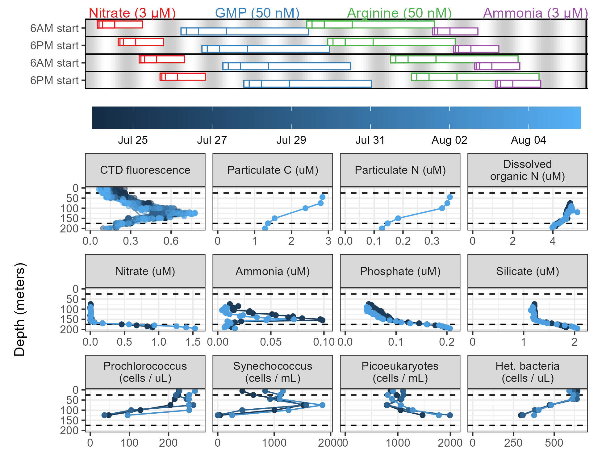
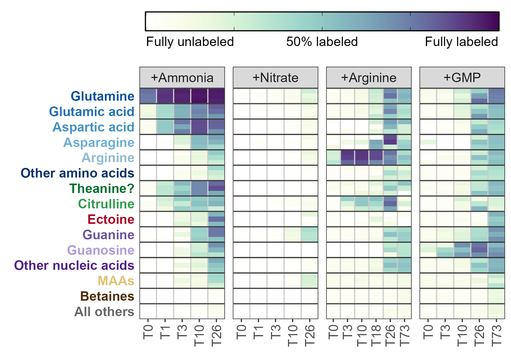
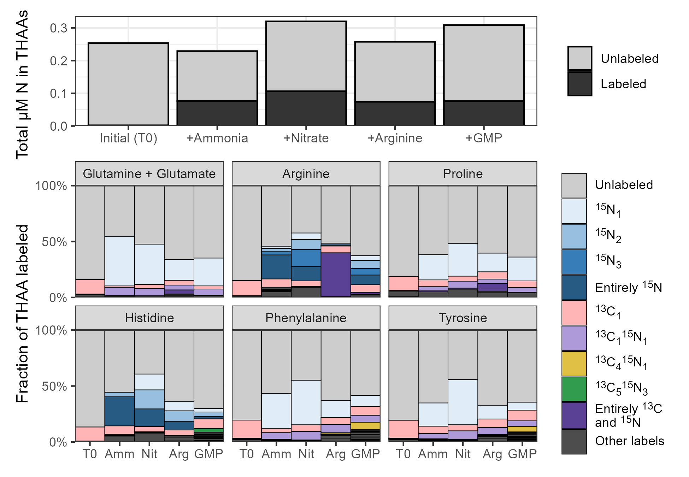
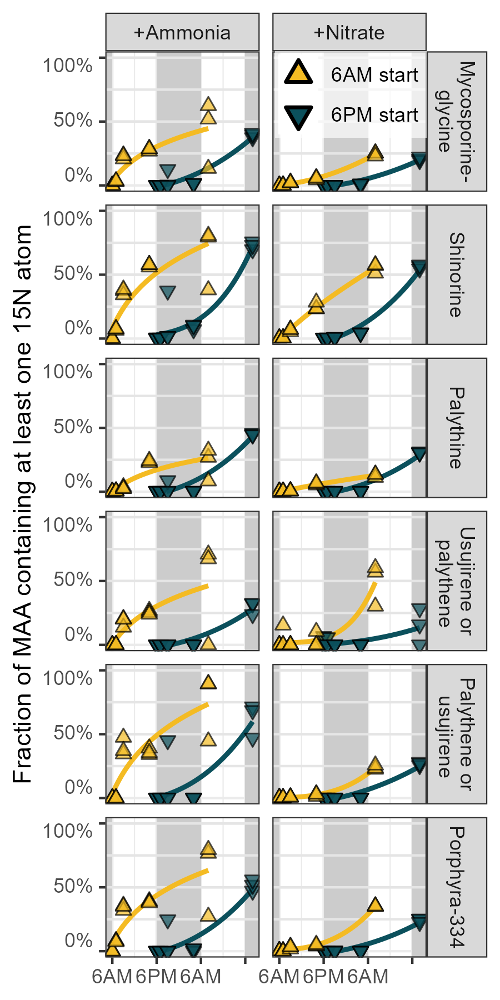
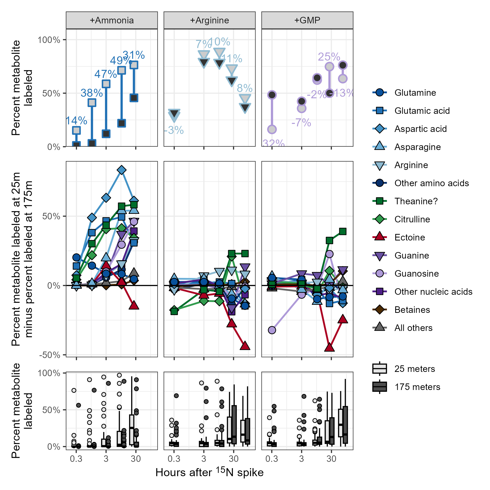
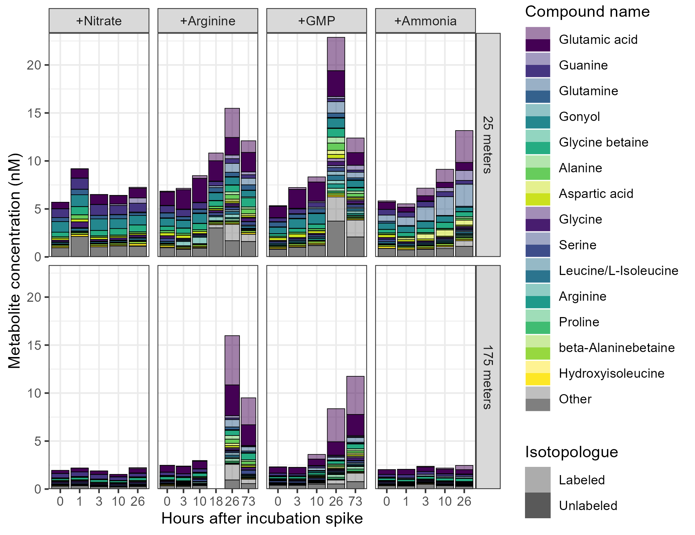
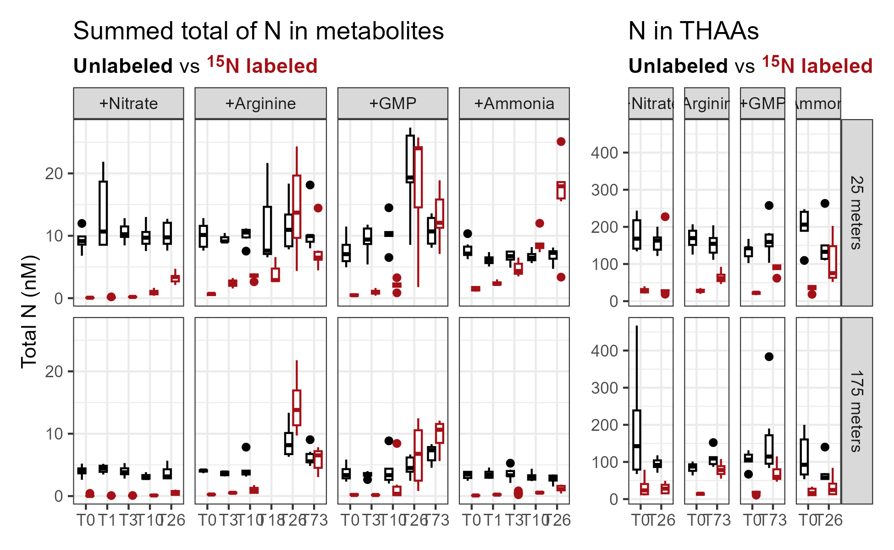
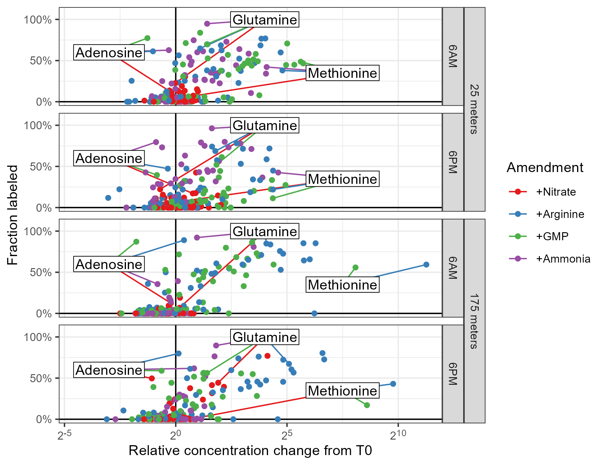
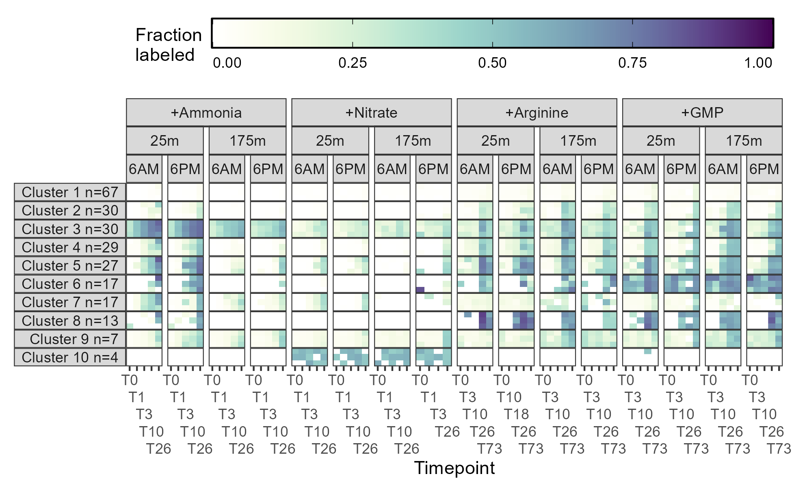

```{r setup, echo=FALSE, include=FALSE}
knitr::opts_chunk$set(echo = FALSE, message=FALSE, warning=FALSE, eval=FALSE)
library(tidyverse)
library(ggh4x)
library(patchwork)
library(ggtext)
library(minpack.lm)
library(RaMS)
library(ggpattern)
options(pillar.sigfig = 7)
options(pillar.print_min = 100)
```

```{r load data, eval=FALSE}
parametadata <- read_csv("metadata/parametadata.csv") %>%
  # filter(IS_type=="noIS") %>%
  filter(polarity=="pos") %>%
  filter(samp_type=="Smp" | samp_type=="Bad") %>%
  mutate(startime=factor(startime, levels=c("Morn", "Eve"))) %>%
  mutate(depth=factor(depth, levels=c("Surf", "Deep"))) %>%
  mutate(amendment=factor(amendment, levels=c("Amm", "Nit", "Arg", "GMP"))) %>%
  arrange(amendment, depth, timepoint_num, startime) %>%
  mutate(timepoint=factor(timepoint, levels=c("T0", "T1", "T3", "T10", "T18", "T26", "T73")))

all_stans <- read_csv("metadata/all_stans.csv")
aa_ncs <- all_stans %>%
  filter(compound_type=="Amino Acid") %>%
  mutate(compound_name=str_remove(compound_name, "^L-")) %>%
  distinct(compound_name, n_C, n_N) %>%
  add_row(compound_name="Phenylalanine", n_C=9, n_N=1)
stan_patched <- all_stans %>%
  filter(!compound_name=="beta-Glutamic acid") %>%
  mutate(compound_name=str_replace(compound_name, "L-Glutamic acid", "L-Glutamic acid/beta-Glutamic acid")) %>%
  filter(!compound_name=="L-Isoleucine") %>%
  mutate(compound_name=str_replace(compound_name, "L-Leucine", "L-Leucine/L-Isoleucine")) %>%
  filter(!compound_name=="L-Homoserine") %>%
  mutate(compound_name=str_replace(compound_name, "L-Threonine", "L-Threonine/L-Homoserine")) %>%
  filter(!compound_name=="Allopurinol") %>%
  mutate(compound_name=str_replace(compound_name, "Hypoxanthine", "Hypoxanthine/Allopurinol"))
maa_names <- c("Also Palythene/Usujirene?", "Shinorine?", "Mycosporine-glycine?", 
               "Palythine?", "Another Palythene/Usujirene?", "Porphyra-334?", 
               "Also Porphyra-334?", "Asterina-330?", "Palythene/Usujirene?",
               "Mycosporine-2-glycine?", "Mycosporine-alanine/Mycosporine-beta alanine?",
               "Mycosporine-methylamine:serine?", "Mycosporine-glutamine?",
               "Mycosporine glutaminol/Palythinol/Mycosporine-methylamine:threonine?", 
               "Palythenic acid?")
chosen_maas <- c("Mycosporine-glycine?", "Shinorine?", "Palythine?",
                 "Palythene/Usujirene?", "Also Palythene/Usujirene?", 
                 "Also Porphyra-334?")
nucleo_names <- c("5-Methylcytosine", "Adenosine", "Cytidine", "Adenine", "Guanosine",
                  "Cytosine", "Hypoxanthine/Allopurinol", "Guanine", "Deoxycytidine?",
                  "Deoxyadenosine", "Deoxyguanosine?")
betaine_names <- c("beta-Alaninebetaine", "Glycine betaine", "Homarine", "Trigonelline",
                   "Choline", "Glycerophosphocholine", "Homoserine betaine?", 
                   "Threonine betaine?", "Proline betaine",
                   "(3-Carboxypropyl)trimethylammonium", "O-Acetylcarnitine", 
                   "Betonicine", "Acetylcholine", "Phosphocholine")
non_n_names <- c("Dimethylsulfonioacetate", "Dimethylsulfoniopropionate",
                 "Arsenobetaine", "Dimethylsulfoxonium propionate?", "Gonyol",
                 "2-O-alpha-D-Glucosylglycerol")
aa_names <- c("Glutamine", "Aspartic acid", "Glutamic acid/beta-Glutamic acid",
              "Asparagine", "Alanine", "Methionine", "Arginine", "Proline",
              "Lysine", "Threonine/Homoserine", "Serine", "Glycine", "Histidine",
              "Leucine/Isoleucine", "Valine", "Arginine")
class_levels <- c("Glutamine", "Glutamic acid", "Aspartic acid", "Asparagine", "Arginine", 
                  "Other amino acids", "Theanine?", "Citrulline", "Ectoine", "Guanine", 
                  "Guanosine", "Other nucleic acids", "MAAs", "Betaines", "All others")
class_colors <- c("#08519C", "#2171B5", "#4292C6", "#6BAED6", "#8EBAD1", 
                  "#08306B", "#006D2C", "#319B4D", "#AB0022", "#6A51A3", 
                  "#AE9AD8", "#4E1F88", "#E0C174", "#4D2B01", "grey40")

heatmap_colorpal <- viridis::viridis(10, alpha=seq(0, 1, length.out=10), direction = -1)

samp_concs <- read_csv("targeted/clean_complete.csv")
labeled_fracs <- samp_concs %>%
  mutate(labeled_frac=1-area/sum(area), .by = c("shortname", "compound_name")) %>%
  select(compound_name, iso_name, shortname, labeled_frac) %>%
  filter(str_detect(iso_name, "13C0, 15N0")) %>%
  select(-iso_name) %>%
  filter(!is.na(labeled_frac))


cleaned_combined_peaks <- readRDS("untargeted/cleaned_combined_peaks.rds")
high_qual_feats <- cleaned_combined_peaks %>%
  filter(rtmed>120 & !rtmed%between%c(14*60, 14.5*60)) %>%
  left_join(parametadata %>% distinct(filename, samp_type)) %>%
  filter(samp_type=="Smp") %>%
  summarise(med_iso_cor=median(iso_cor), 
            med_snr=median(beta_snr),
            med_cor=median(beta_cor),
            .by=c(feature)) %>%
  filter(med_snr>-50*med_cor+50) %>%
  filter(med_iso_cor>0.8)
untarg_lab_fracs <- cleaned_combined_peaks %>%
  filter(feature%in%high_qual_feats$feature) %>%
  select(feature, filename, lab_area, unlab_area) %>%
  left_join(parametadata %>% distinct(filename, samp_type)) %>%
  filter(samp_type=="Smp") %>%
  slice_max(unlab_area, by=c(feature, filename), with_ties = FALSE) %>%
  mutate(labeled_frac=lab_area/(lab_area+unlab_area)) %>%
  left_join(parametadata %>% distinct(filename, shortname)) %>%
  select(feature, shortname, labeled_frac)

thaa_quant <- read_csv("thaas/quant_data.csv")
metathaa <- read_csv("thaas/metathaa.csv") %>%
  mutate(depth=factor(depth, levels=c("Surf", "Deep"))) %>%
  mutate(startime=factor(startime, levels=c("Morn", "Eve")))

splividis <- function(n, ...){
  vir <- viridis::viridis(n, ...)
  if(n%%2==0){
    vir[as.numeric(matrix(1:n, ncol=2, byrow = TRUE))]
  } else {
    index_vec <- suppressWarnings(as.numeric(matrix(1:n, ncol=2, byrow = TRUE)))
    vir[head(index_vec, -1)]
  }
}
```

# Abstract

```{r}
samp_concs %>%
  filter(compound_name%in%c("L-Glutamine", "Glycine betaine", "L-Glutamic acid/beta-Glutamic acid")) %>%
  left_join(parametadata %>% distinct(shortname, depth, amendment, timepoint)) %>%
  filter(depth=="Surf") %>%
  filter(amendment=="Amm") %>%
  arrange(timepoint) %>%
  mutate(lab_type=ifelse(str_detect(iso_name, "13C0, 15N0"), "Unlabeled", "Labeled")) %>%
  summarise(all_iso_nm=sum(conc_nm_in_env), .by=c(shortname, timepoint, compound_name, lab_type)) %>%
  summarise(mean_nm=mean(all_iso_nm), .by=c(timepoint, compound_name, lab_type)) %>%
  pivot_wider(names_from=lab_type, values_from=mean_nm) %>%
  arrange(compound_name, timepoint)
```


Nitrogen (N) availability limits the growth of many surface ocean microbial communities, particularly in the ocean gyres. Yet, even before growth is limited, some metabolic pathways or specific taxa may experience lower than optimal N flux due to cellular allocation and competition for various forms of N. Here, we present a stable isotope probing metabolomics study that illustrates the metabolic pathways taken by four different forms of nitrogen: ammonia, nitrate, arginine, and guanosine monophosphate. In the morning and evening, we followed isotope labeled substrates through metabolic pathways for either 26 hours (inorganic N additions) or 73 hours (organic N additions) in both surface (25m) and deep (175m) microbial communities in the North Pacific Subtropical Gyre. We found that nearly the entire surface glutamine pool (1-2 nM) is labeled by ammonia in less than an hour and goes on to label the metabolome more broadly after 24 hours, though abundant osmolytes like betaines (e.g. glycine betaine, 0.4-0.5 nM) had slow turnover rates (<5% in 24 hours). Nitrate amendments resulted in the labeling of only a small selection of molecules such as ultraviolet light absorbing compounds (mycosporine-like amino acids, or MAAs), whose incorporation patterns suggest that this form of nitrogen was available to a subset of the community, likely eukaryotes. The two organic nitrogen amendments labeled the metabolome more slowly than the inorganic forms of nitrogen and showed similar usage at 25 meters and 175 meters, hinting at the major role that heterotrophic bacteria play in cycling organic matter. The organic nitrogen added was mostly converted into glutamate after 24 hours rather than used as intact substrates, though labeled arginine was incorporated into protein directly and we were able to trace the carbon backbone from both arginine and GMP into several additional metabolites. We also show that nitrogen assimilation and use was largely the same between morning and evening with the exception of MAAs. These measurements reveal the forms and fluxes of nitrogen in the natural environment and provide constraints on biogeochemical models that require characterizing the transformations between organic and inorganic nitrogen.

# Introduction

In most of the surface ocean primary productivity is limited by the availability of nitrogen, an element with a complex and incompletely characterized biogeochemical cycle [@Bronk2008; @Moore2013; @Hutchins2022]. Organic nitrogen in particular is often treated as a black box despite substantial variability in its bioavailability and chemical nature. Turnover times for labile organic compounds like urea and amino acids can be orders of magnitude shorter than semi-labile or refractory DOM [@Benner2015; @Bronk2024]. Additionally, the availability of the precious nitrogen atom is determined not only by the form of the organic material it composes but also the environment in which it's found.

While extensive work has been done to characterize the forms and fluxes of nitrogen within the inorganic pool, the equivalent for the organic pool is woefully underdeveloped [@Zehr2011; @Bronk2008]. This is largely due to the difficulty of comprehensively measuring the many organic molecules that contain nitrogen in the marine environment [@Boysen2018; @Moran2022]. Recently, however, we have improved our understanding of community composition via genomics and transcriptomics and made progress in our ability to characterize organic matter via proteomics and metabolomics. These advancements, paired with the increased availability of pure and isotope-labeled substrates, mean that we can now apply metabolically resolved isotope tracing to resolve how organic nitrogen is transformed in the marketplace of metabolites that powers the surface ocean [@Heal2021; @McParland2021; @Moran2022].

Nitrogen assimilation is a well-documented process in the ocean after decades of research and demonstrates how our understanding of non-marine organisms can be applied to the ocean [@Mulholland2008]. Central to the process is ammonia, which can be directly taken up from the environment by all organisms and combined with glutamate. This forms glutamine, which is then combined with alpha-ketoglutarate to form two glutamate molecules that can then be used as a nitrogen source throughout the cell [@Walker2016]. Nitrate, on the other hand, must first be reduced to ammonia in a metabolically expensive process that some organisms have stripped from their genomes [@Partensky2010; @Zehr2011]. 

Unlike the relatively well-resolved pathways for inorganic nitrogen, the use of organic nitrogen remains underexplored in the marine environment. Organic nitrogen is generally thought to be accessible to most organisms but the high levels of DON make it clear that this is highly substrate-specific [@Antia1991; @Bronk2007; @Aluwihare2008; @Zehr2011; @Bronk2024]. Additionally, many of the transformations possible are only active in specific communities or times of day [@Bender2012]. Linking the transformations that nitrogen undergoes to known molecular pathways from other environments or axenic cultures is a particularly promising way to understand what we observe on the global scale.

The lack of a comprehensive understanding of nitrogen's fate after it is assimilated makes molecular modeling difficult and undermines our ability to connect the community to the organic nitrogen it produces [@Jones2024; @Gonsior2022]. Here, we trace the uptake and use of labeled ammonia, nitrate, arginine, and guanosine monophosphate in a natural community from the North Pacific Subtropical Gyre at multiple depths and diel conditions. Our application of metabolomics to these samples allows us to map the pathways and restructuring that organic nitrogen experiences in the largest biomes on the planet, quantifying the pool sizes and turnover rates for various low molecular weight compounds that serve as building blocks and intermediates of cell biology.

# Results

Samples were collected from 25 meters and 175 meters during the 2021 SCOPE PARAGON cruise (KM2112, July 23rd - August 5th) near Station ALOHA that targeted a bloom within an anticyclonic eddy. The bloom was initially dominated by the diatom genus *Hemiaulus* with a large surface chlorophyll signal that decayed into a more typical North Pacific Subtropical Gyre community composed mostly of *Prochlorococcus* and SAR11. Community composition at our sampling depth below the deep chlorophyll maximum (DCM) was fairly typical of ALOHA, with a prokaryotic community dominated by SAR11, SAR282, and SAR 406, low levels of picoeukaryotes, and a microeukaryotic community equally distributed between diatoms, haptophytes, and dinoflagellates (Figure 1).

Samples collected from 25 meters were within the mixed layer and had PAR levels of 20-35% of the surface light while the 175 meter samples had a PAR level between 0.05 and 0.1%. Nitrate, nitrite, and ammonia data indicated that inorganic N was low in the surface (<0.01 µM), while the deeper samples at 175 meters were collected in the middle of the nutricline, with a clear DCM at 125 meters, an ammonia maximum at 150 meters, and a nitrite max at 160-165 meters. Environmental nitrate concentrations were about 0.5 µM at 175 meters (Figure 1).

We performed the incubations in succession, with the nitrate incubations first, followed by arginine, then guanosine monophosphate and finally ammonia. 6AM and 6PM data was always collected the same day and we alternated days between the surface and deep sampling depths to allow for reasonable sample processing times (Figure 1).

```{r cruise metadata prep}
sum_names <- c("station", "cast", "month", "day", "year", "time", 
               "lat_deg", "lat_min", "lat_dir", 
                "lon_deg", "lon_min", "lon_dir", "max_depth", "bottles")
sum_data <- "https://scope.soest.hawaii.edu/data/scope2021/paragon1.sum" %>%
  read_table(skip = 3, col_names = sum_names) %>%
  mutate(datetime = strptime(paste(month, day, year, time), "%b %d %Y %H:%M:%S", tz = "UTC")) %>%
  mutate(datetime = as.POSIXct(datetime)) %>%
  mutate(lat_dec=(lat_deg+lat_min/60)*ifelse(lat_dir=="N", 1, -1)) %>%
  mutate(lon_dec=(lon_deg+lon_min/60)*ifelse(lon_dir=="E", 1, -1)) %>%
  select(station, cast, datetime, lat_dec, lon_dec, max_depth, bottles) %>%
  filter(station==2)
sum_data %>%
  ggplot(aes(x=lon_dec, y=lat_dec, color=datetime)) +
  geom_point() +
  geom_path()

gof_names <- c("station", "cast", "rosette", "lat", "lon", "pressure", "temp",
              "sal", "ctd_oxy", "ctd_chl", "theta", "sigma", "oxy_um", "dic", "alk", "ph",
              "po4_um", "no23_um", "sio4_um", "LLN", "LLP", "PC", "PN", "PP",
              "PSi", "chl_ug", "phaeo_ug", "het_abund", 
              "pro_abund", "syn_abund", "euk_abund",
              "q1", "q2", "q3", "q4")
qual_names <- setdiff(gof_names, c(head(gof_names, 6), tail(gof_names, 4)))
gofReader <- function(filename){
  raw_gof <- read_table(filename, skip = 4, col_names = gof_names,
                        col_types = cols(.default = col_double()))
  qual_df <- select(raw_gof, matches("^q\\d+$")) %>%
    unite("value", sep = "") %>%
    separate(sep = "", col = "value", into = c(NA, qual_names)) %>%
    mutate(across(everything(), as.numeric))
  raw_gof[,qual_names][qual_df!=2] <- NA
  raw_gof %>% select(-matches("^q\\d+$"))
}
chl_data <- gofReader("https://scope.soest.hawaii.edu/FTP/scope/water/paragon1.gof") %>%
  filter(station==2) %>%
  filter(pressure<200) %>%
  select(cast, depth=pressure, value=ctd_chl) %>%
  mutate(name="ctd_chl")
chl_data %>%
  left_join(sum_data) %>%
  ggplot(aes(x=value, y=-depth, color=datetime, group=cast)) +
  geom_point() +
  geom_path()
# gof_data %>%
#   filter(station==2) %>%
#   filter(pressure<200) %>%
#   ggplot(aes(x=datetime, y=-pressure, fill=ctd_chl)) +
#   geom_point(size = 5, color="black", pch=21) +
#   scale_fill_viridis_c(limits=c(0, NA)) +
#   theme_bw()


n_levels <- c("N+N", "TDN", "DON", "NH4", "NO2")
nut_data <- "metadata/Karl_PAR1_High-res_organic_and_inorganic_nutrients.xlsx" %>%
  readxl::read_excel(skip = 2) %>%
  drop_na() %>%
  mutate(cast=c(rep(10, 24), rep(43, 23))) %>%
  filter(Sample!="Sample") %>%
  select(depth=`Depth (m)`, cast, `N+N (uM)`:`Si (uM)`) %>%
  mutate(across(everything(), as.numeric)) %>%
  mutate(`NO3 (uM)`= `N+N (uM)`-`NO2 (uM)`) %>%
  pivot_longer(`NO2 (uM)`:`NO3 (uM)`)
nut_data %>%
  mutate(name=str_remove(name, " \\(uM\\)")) %>%
  # filter(nutrient%in%n_levels) %>%
  # mutate(nutrient=factor(nutrient, levels=n_levels)) %>%
  # filter(depth<150) %>%
  mutate(cast=factor(cast, levels=c(10, 43), labels = c("July 25", "August 3"))) %>%
  ggplot(aes(x=value, y=-depth, color=cast)) +
  geom_hline(yintercept = -c(25, 175)) +
  geom_vline(xintercept = 0) +
  geom_point() +
  geom_path() +
  facet_wrap(~name, scales="free_x")

fcm_data <- "metadata/20220131_Paragon-1_FCM.xlsx" %>%
  readxl::read_excel(skip = 6) %>%
  select(cast=`Cast*`, depth=`Depth*`, pro_mL=`Conc...13`, syn_mL=`Conc...15`, peuk_mL=`Conc...17`, het_mL=`Conc...19`) %>%
  slice(-1) %>%
  drop_na() %>%
  mutate(across(everything(), as.numeric)) %>%
  mutate(pro_mL=pro_mL/1000, het_mL=het_mL/1000) %>%
  pivot_longer(pro_mL:het_mL)
fcm_data %>%
  mutate(cast=factor(cast, levels = c(8, 24, 38), labels = c("July 25", "July 29", "Aug 2"))) %>%
  ggplot(aes(x=value, y=-depth, color=cast)) +
  geom_hline(yintercept = -c(25, 175)) +
  geom_vline(xintercept = 0) +
  geom_point() +
  geom_path() +
  facet_wrap(~name, scales="free_x", nrow=1)

cnp_data <- "metadata/P1&P2 WC CNP.xlsx" %>%
  readxl::read_excel(n_max=9) %>%
  drop_na() %>%
  select(depth=`Depth (m)`, PC_um=`TC value (µmol/L)`, PN_um=`N value (µmol/L)`, C2N=`C/N RATIO`) %>%
  mutate(cast=45) %>%
  filter(depth<250) %>%
  pivot_longer(c(PC_um, PN_um, C2N))
cnp_data %>%
  ggplot(aes(x=value, y=-depth)) +
  geom_hline(yintercept = -c(25, 175)) +
  geom_vline(xintercept = 0) +
  geom_point() +
  geom_path() +
  facet_wrap(~name, scales="free_x")

readxl::read_excel("metadata/Light Level at Depth as a Percentage of Surface Light.xlsx") %>%
  filter(depth%between%c(170, 180) | depth%between%c(20, 30)) %>%
  # filter(depth<100) %>%
  mutate(depth=ifelse(depth>100, "Deep", "Surf")) %>%
  ggplot() +
  geom_jitter(aes(y=light_level, x=time, color=depth), width = 0.5) +
  facet_wrap(~depth, nrow=1, scales="free_y")
```

```{r fig cruise metadata plots}
metadata_gp <- bind_rows(chl_data, cnp_data, fcm_data, nut_data) %>%
  left_join(sum_data) %>%
  filter(!name%in%c("TDP (uM)", "C2N", "NO2 (uM)", "TDN (uM)", "DOP (uM)")) %>%
  mutate(alpha_col=ifelse(name=="ctd_chl", "yes", "no")) %>%
  mutate(name=factor(name, levels=c(
    "ctd_chl", "PC_um", "PN_um", "DON (uM)",
    "NO3 (uM)", "NH4 (uM)", "SRP (uM)", "Si (uM)",
    "pro_mL", "syn_mL", "peuk_mL", "het_mL"
  ), labels = c(
    "CTD fluorescence", "Particulate C (uM)", "Particulate N (uM)", "Dissolved\norganic N (uM)", 
    "Nitrate (uM)", "Ammonia (uM)", "Phosphate (uM)", "Silicate (uM)",
    "Prochlorococcus\n(cells / uL)", "Synechococcus\n(cells / mL)", "Picoeukaryotes\n(cells / mL)", "Het. bacteria\n(cells / uL)"
  ))) %>%
  ggplot(aes(x=value, y=depth, group=cast, color=datetime, alpha=alpha_col)) +
  geom_hline(yintercept = c(25, 175), linetype = 2) +
  geom_path() +
  geom_point() +
  facet_wrap(~name, scales="free_x", ncol=4) +
  scale_y_reverse() +
  scale_x_continuous(expand = expansion(mult = c(0.05, 0.1)), n.breaks = 4, limits = c(0, NA)) +
  scale_alpha_manual(values=c(1, 0.5), breaks = c("no", "yes"), guide="none") +
  labs(x=NULL, y="Depth (meters)", color=NULL) +
  theme_bw() +
  theme(
    legend.position = "top", 
    legend.key.width = unit(1, "null"),
    legend.box.spacing = unit(0, "in")
  )
metadata_gp


treatments <- expand_grid(
  amendment=c("Nitrate", "Ammonia", "Arginine", "Guanosine"),
  depth=c("25m", "175m"),
  sunlight=c("Morning", "Evening"),
  timepoint=c(0, 1, 3, 10, 26, 73)
) %>%
  filter(!(amendment%in%c("Arginine", "Guanosine")&timepoint==1)) %>%
  filter(!(amendment%in%c("Nitrate", "Ammonia")&timepoint==max(timepoint)))

start_days <- treatments %>% 
  distinct(amendment, depth) %>%
  arrange(match(amendment, c("Nitrate", "Arginine", "Guanosine", "Ammonia"))) %>%
  add_column(start_day=c(paste("Jul", c(24:27, 29, 31)), paste("Aug", 1:2))) %>%
  mutate(start_day=strptime(start_day, "%b %d"))

depthstartime_levels <- rev(c("25m Morning", "25m Evening", "175m Morning", "175m Evening"))
schedule_df <- left_join(treatments, start_days, by=c("amendment", "depth")) %>%
  mutate(start_time=if_else(sunlight=="Morning", start_day+hours(7), start_day+hours(19))) %>%
  mutate(sample_time=start_time+hours(timepoint)) %>%
  mutate(depthstartime=factor(paste(depth, sunlight), levels=depthstartime_levels)) %>%
  mutate(depthstart_min=as.numeric(depthstartime)-ifelse(amendment%in%c("Ammonia", "Arginine"), 0.4, -0.4)) %>%
  mutate(depthstart_max=as.numeric(depthstartime)) %>%
  group_by(amendment, depth, sunlight) %>%
  mutate(sample_time=lead(sample_time)) %>%
  drop_na() %>%
  mutate(timepoint=factor(timepoint, levels=rev(c(0, 1, 3, 10, 26, 73)))) %>%
  arrange(timepoint) %>%
  mutate(amendment=factor(amendment, levels=c("Nitrate", "Arginine", "Guanosine", "Ammonia")))
lighting_seq <- seq(as.POSIXct("2025-07-24"), as.POSIXct("2025-08-05"), 60*60) %>%
  data.frame(start=.) %>%
  mutate(end=lead(start)) %>%
  drop_na() %>%
  mutate(sintime=sin(as.numeric(format(start, "%H"))/24*2*pi-pi/2))
day_seq <- seq(as.POSIXct("2025-07-24"), as.POSIXct("2025-08-05"), 60*60*24)
day_lab <- gsub("^0", "", format(day_seq, "%m/%d"))

sample_plan_gp <- ggplot() +
  geom_rect(aes(xmin=start, xmax=end, ymin=0.5, ymax=4.5, fill=sintime), data=lighting_seq) +
  geom_hline(yintercept = seq(0.5, 4.5)) +
  geom_rect(aes(ymin=depthstart_min, ymax=depthstart_max,
                xmin=start_time, xmax=sample_time, color=amendment),
            fill="white", lwd=0.4, data=schedule_df) +
  scale_y_continuous(breaks = 1:4, labels = rep(c("6PM start", "6AM start"), 2),
                     expand = c(0, 0), limits = c(NA, 5.2)) +
  scale_color_brewer(palette = "Set1") +
  scale_x_datetime(limits = range(day_seq), breaks = day_seq, labels = day_lab, expand = c(0, 0)) +
  scale_fill_gradient2(low = "grey80", mid = "grey90", high = "white", guide = NULL) +
  annotate("text", x = as.POSIXct("2025-07-24 12:00:00"), y=4.6, label="Nitrate (3 µM)",
           color=RColorBrewer::brewer.pal(4, "Set1")[1], vjust=0, hjust=0.2) +
  annotate("text", x = as.POSIXct("2025-07-27 12:00:00"), y=4.6, label="GMP (50 nM)",
           color=RColorBrewer::brewer.pal(4, "Set1")[2], vjust=0, hjust=0.2) +
  annotate("text", x = as.POSIXct("2025-07-30 18:00:00"), y=4.6, label="Arginine (50 nM)",
           color=RColorBrewer::brewer.pal(4, "Set1")[3], vjust=0, hjust=0.2) +
  annotate("text", x = as.POSIXct("2025-08-03 00:00:00"), y=4.6, label="Ammonia (3 µM)",
           color=RColorBrewer::brewer.pal(4, "Set1")[4], vjust=0, hjust=0.2) +
  annotate("segment", x=min(lighting_seq$start), xend=min(lighting_seq$start),
           y=0.5, yend=4.5) +
  annotate("segment", x=max(lighting_seq$start), xend=max(lighting_seq$start),
           y=0.5, yend=4.5) +
  theme_bw() +
  theme(legend.position = "none", 
        panel.grid = element_blank(),
        axis.title = element_blank(), 
        panel.border = element_blank(),
        axis.text.x = element_blank(),
        axis.ticks.x=element_blank(), 
        plot.margin = margin())
sample_plan_gp


combined_plot <- sample_plan_gp / metadata_gp + plot_layout(heights = c(0.25, 0.75))
combined_plot
ggsave("manuscript/figures/cruise_metadata.png", combined_plot, width = 6.5, height = 5)
```



*Figure 1: Biogeochemical and community composition data collected during the PARAGON cruise alongside the incubation sampling plan. The top plot shows the start and end times of each incubation as rectangles aligned with the dates of the cruise in the middle color bar, with each rectangle representing a biological triplicate sacrificed at the given time. Grey shading in the background denotes light levels with grey corresponding to nighttime. The four amendments are shown as different colors. The lower panels show various biogeochemical and flow cytometry measurements colored by the date they were collected during the cruise. Note that Prochlorococcus and heterotrophic bacteria (Het. bacteria) are reported in cells per microliter while Synechococcus and picoeukaryotes are reported per milliliter. The 25 meter and 175 meter sampling depths have been added as dashed lines. C = carbon, N = nitrogen, GMP = guanosine monophosphate.*

## Differences in nitrogen labeling at the surface between amendments

```{r gln numbers}
labeled_fracs %>%
  filter(compound_name=="L-Glutamine") %>%
  left_join(parametadata %>% filter(IS_type=="noIS")) %>%
  filter(timepoint%in%c("T0", "T26")) %>%
  filter(depth=="Surf") %>%
  filter(amendment=="Amm") %>%
  summarise(frac=mean(labeled_frac), .by=c(compound_name, timepoint))
samp_concs %>%
  filter(compound_name=="L-Glutamine") %>%
  left_join(parametadata %>% filter(IS_type=="noIS")) %>%
  filter(depth=="Surf") %>%
  filter(amendment=="Amm") %>%
  ggplot(aes(x=tripl, y=area, fill=iso_name)) +
  geom_col(color="black") +
  facet_grid(startime~timepoint)
samp_concs %>%
  filter(compound_name%in%c("L-Glutamine")) %>%
  left_join(parametadata %>% filter(IS_type=="noIS")) %>%
  filter(depth=="Surf") %>%
  filter(amendment=="Amm") %>%
  summarise(conc=mean(conc_nm_in_env), .by=c(compound_name, timepoint)) %>%
  arrange(timepoint)

samp_concs %>%
  filter(compound_name%in%c("L-Glutamine", "L-Glutamic acid/beta-Glutamic acid")) %>%
  left_join(parametadata %>% filter(IS_type=="noIS")) %>%
  filter(depth=="Surf") %>%
  filter(amendment=="Amm") %>%
  ggplot(aes(x=tripl, y=conc_nm_in_env, fill=iso_name)) +
  geom_col(color="black") +
  facet_nested(compound_name+startime~timepoint)
samp_concs %>%
  filter(iso_name%in%c("L-Glutamine, 13C0, 15N2", "L-Glutamic acid, 13C0, 15N1")) %>%
  left_join(parametadata %>% filter(IS_type=="noIS")) %>%
  filter(depth=="Surf") %>%
  filter(amendment=="Amm") %>%
  ggplot(aes(x=timepoint, y=conc_nm_in_env, color=iso_name)) +
  geom_boxplot() +
  ggpubr::stat_compare_means(label = "p.format")
```

We observed significant differences in ^15^N labeling patterns resulting from incubation with different forms of nitrogen (Figure 2). Ammonia incubations resulted in very rapid labeling, with glutamine more than 75% labeled even at the T0 timepoint, corresponding to the amount of time required to spike and immediately filter the 2 liters of seawater (~15 minutes). The dominant labeling pattern at T0 was a single ^15^N, though all later timepoints showed more doubly-^15^N labeled glutamine than singly-labeled. After 24 hours, glutamine was more than 95% singly and doubly labeled and had approximately doubled in pool size (initially ~0.3 nM becoming 0.8 nM).

```{r fig grouped metab heatmap}
xamend_metab_gp <- labeled_fracs %>%
  left_join(parametadata %>% distinct(shortname, samp_type, timepoint, timepoint_num, depth, startime, amendment, tripl)) %>%
  filter(samp_type!="Bad") %>%
  filter(depth=="Surf") %>%
  mutate(compound_name=str_remove_all(compound_name, "^L-")) %>%
  mutate(compound_name=str_remove(compound_name, "/beta-Glutamic acid")) %>%
  mutate(compound_class=case_when(
    compound_name%in%c("Glutamine", "Aspartic acid", "Asparagine", "Glutamic acid", "Ectoine", "Theanine?", "Citrulline", "Guanine", "Guanosine", "Arginine") ~ compound_name,
    compound_name%in%maa_names~"MAAs",
    compound_name%in%aa_names~"Other amino acids",
    compound_name%in%nucleo_names~"Other nucleic acids",
    compound_name%in%betaine_names~"Betaines",
    TRUE~"All others"
  )) %>%
  mutate(compound_class=factor(compound_class, levels=class_levels)) %>%
  summarise(avg_frac=mean(labeled_frac), .by = c(compound_class, amendment, timepoint, tripl)) %>%
  mutate(amendment=factor(amendment, levels=c("Amm", "Nit", "Arg", "GMP"),
                          labels=c("+Ammonia", "+Nitrate", "+Arginine", "+GMP"))) %>%
  ggplot() +
  geom_raster(aes(x=timepoint, y=tripl, fill=avg_frac)) +
  geom_vline(xintercept = c(1.5:5.5), color="grey80") +
  facet_nested(compound_class~amendment, scales = "free_x", switch="y", 
               strip=strip_nested(text_y = elem_list_text(color=class_colors, 
                                                          face=rep("bold", length(class_colors))))) +
  scale_fill_gradientn(colours = heatmap_colorpal,
                       limits=c(0, 1), breaks=c(0, 0.25, 0.5, 0.75, 1),
                       labels=c("Fully unlabeled", "", "50% labeled", "", "Fully labeled")) +
  scale_x_discrete(expand = expansion()) +
  scale_y_discrete(expand = expansion()) +
  labs(x=NULL, y=NULL, fill=NULL) +
  theme_bw() +
  theme(panel.spacing.x=unit(0.5, "lines"), 
        panel.spacing.y = unit(0, "lines"),
        axis.text.x = element_text(angle=90, hjust=1, vjust=0.5),
        axis.text.y = element_blank(),
        axis.ticks.y = element_blank(),
        strip.text.y.left = element_text(angle=0, hjust = 1),
        strip.background.y = element_rect(fill=NA, color=NA),
        panel.grid.major = element_blank(), 
        panel.grid.minor = element_blank(),
        legend.position = "top", 
        legend.key.width = unit(1, "null"),
        text=element_text(size=15)) +
  guides(
    fill=guide_colorbar(theme=theme(
      legend.frame = element_rect(color = "black"),
      legend.ticks = element_line(color="black"),
      legend.text = ggtext::element_markdown(hjust=c(0, 0, 0.5, 1, 1))),
      text=element_text(size=12)
    )
  )
xamend_metab_gp
ggsave("xamend_metab_gp.png",plot = xamend_metab_gp, device = "png", path = "manuscript/figures",
       width = 6.5, height = 4.5, units = "in", dpi = 300)
```



*Figure 2: Fraction of each metabolite or metabolite group containing at least one ^15^N label during the surface seawater amendments with various substrates after the number of hours shown on the x-axis. Darker colors indicate a larger percentage of the compound signal was isotopically labeled. Three biological replicates are stacked vertically at each timepoint and the categories with multiple entries have been averaged. MAA = mycosporine-like amino acids, GMP = guanosine monophosphate.*

```{r gluaspcit numbers}
labeled_fracs %>%
  filter(compound_name%in%c("L-Glutamic acid/beta-Glutamic acid", "L-Aspartic acid",
                            "Citrulline", "L-Arginine", "Theanine?")) %>%
  left_join(parametadata %>% filter(IS_type=="noIS")) %>%
  filter(timepoint=="T1") %>%
  filter(depth=="Surf") %>%
  filter(amendment=="Amm") %>%
  summarise(frac=mean(labeled_frac), .by=c(compound_name))
samp_concs %>%
  filter(compound_name%in%c("L-Glutamic acid/beta-Glutamic acid", "L-Aspartic acid",
                            "Citrulline", "L-Arginine")) %>%
  left_join(parametadata %>% filter(IS_type=="wIS")) %>%
  filter(timepoint=="T1") %>%
  filter(depth=="Surf") %>%
  filter(amendment=="Amm") %>%
  summarise(conc=mean(conc_nm_in_env), .by=c(compound_name))
```

```{r theanine annotation check}
# Check theanine annotation and numbers
cleaned_combined_peaks %>% 
  filter(mzmed%between%pmppm(175.1077, 10)) %>%
  left_join(parametadata) %>%
  filter(amendment=="Amm") %>%
  filter(depth=="Surf") %>%
  summarise(mzmed=unique(mzmed), rtmed=unique(rtmed)/60, into=mean(into),
            beta_snr=median(beta_snr), beta_cor=median(beta_cor), 
            .by=feature)
arrow::open_dataset("tmzMLs/pqds") %>%
  filter(amendment=="Amm") %>%
  filter(samp_type=="Smp") %>%
  filter(polarity=="pos") %>%
  filter(mz%between%pmppm(175.1077, 10) | mz%between%pmppm(176.1047, 10)) %>%
  filter(rt%between%c(7.2, 8.5)) %>%
  dplyr::collect() %>%
  mutate(mz=round(mz)) %>%
  slice_max(int, by=c(filename, mz, rt)) %>%
  arrange(rt) %>%
  summarise(area=trapz(rt, int), .by=c(filename, mz)) %>%
  pivot_wider(names_from=mz, values_from=area) %>%
  mutate(labeled_frac=`176`/(`175`+`176`)) %>%
  left_join(parametadata %>% filter(IS_type=="noIS")) %>%
  filter(depth=="Surf") %>%
  ggplot() +
  geom_boxplot(aes(x=timepoint, y=labeled_frac, color=startime))
```

The ^15^N was then quickly propagated to glutamate and aspartate, creating a metabolite pool 40-50% labeled for each of these after a single hour. Aspartate was labeled slightly faster than glutamate, likely as a result of its smaller pool size (0.2 nM Asp versus 0.5 nM Glu). Also rapidly labeled was citrulline, reaching 20% labeled after a single hour, though arginine was not labeled until much later despite its location immediately downstream of this metabolite. Untargeted detection of other molecular features revealed an additional metabolite that was 30% labeled at the one hour timepoint with an *m/z* value of 175.1077 and a retention time of 8.2 minutes which we have putatively identified as theanine (N5-ethyl glutamine) based on *m/z* match and labeling pattern (Figure 2).

```{r betaine and nucleo numbers}
labeled_fracs %>%
  filter(compound_name%in%nucleo_names) %>%
  left_join(parametadata %>% filter(IS_type=="noIS")) %>%
  filter(timepoint=="T26") %>%
  filter(amendment=="Nit") %>%
  filter(depth=="Surf") %>%
  summarise(frac=mean(labeled_frac), .by=c(compound_name)) %>%
  mutate(nuc_type=case_when(
    compound_name%in%c("Cytosine", "Adenine", "Guanine", "Hypoxanthine/Allopurinol")~"Nucleobase",
    compound_name%in%c("Cytidine", "Adenosine", "Guanosine")~"Nucleoside",
    compound_name%in%c("Deoxycytidine?", "Deoxyadenosine", "Deoxyguanosine?")~"Deoxy"
  )) %>%
  mutate(nuc_shortname=str_extract(tolower(compound_name), tolower("Cy|Ad|Gu|Hy"))) %>%
  select(nuc_shortname, nuc_type, frac) %>%
  pivot_wider(names_from=nuc_type, values_from=frac) %>%
  select(nuc_shortname, Nucleoside, Nucleobase, Deoxy)

samp_concs %>%
  filter(compound_name%in%nucleo_names) %>%
  left_join(parametadata %>% filter(IS_type=="noIS")) %>%
  filter(timepoint=="T26") %>%
  filter(amendment=="Amm") %>%
  filter(depth=="Surf") %>%
  mutate(iso_name=str_remove(iso_name, ".*?, ")) %>%
  # filter(iso_name!="13C0, 15N0") %>%
  ggplot() +
  geom_col(aes(x=tripl, y=area, fill=iso_name), position="fill", color="black") +
  facet_wrap(~compound_name)
```

```{r betaine pool sizes}
labeled_fracs %>%
  filter(compound_name%in%betaine_names) %>%
  left_join(parametadata %>% filter(IS_type=="noIS")) %>%
  filter(timepoint=="T26") %>%
  filter(amendment=="Amm") %>%
  filter(depth=="Surf") %>%
  summarise(frac=mean(labeled_frac), .by=c(compound_name))

samp_concs %>%
  filter(compound_name%in%betaine_names) %>%
  left_join(parametadata, relationship = "many-to-many") %>%
  summarise(nM=mean(conc_nm_in_env), .by=c(compound_name, depth, amendment, timepoint, startime)) %>%
  pivot_wider(names_from=depth, values_from=nM) %>%
  ggplot() +
  geom_abline(slope=1) +
  geom_point(aes(x=Surf, y=Deep, color=compound_name)) +
  facet_wrap(~amendment) +
  scale_y_log10() +
  scale_x_log10()

samp_concs %>%
  filter(compound_name%in%betaine_names) %>%
  filter(!str_detect(iso_name, "13C0, 15N0")) %>%
  left_join(parametadata %>% distinct(shortname, depth, timepoint, amendment)) %>%
  filter(depth=="Surf") %>%
  summarise(pM=mean(conc_nm_in_env, na.rm = TRUE)*1000, .by = c(compound_name, timepoint)) %>%
  arrange(timepoint, desc(pM)) %>%
  pivot_wider(names_from=timepoint, values_from=pM)

# samp_concs %>% 
#   filter(compound_name%in%betaine_names) %>%
#   left_join(parametadata %>% distinct(shortname, depth, startime, timepoint, amendment, tripl)) %>%
#   filter(depth=="Surf") %>%
#   mutate(iso_name=str_extract(iso_name, "13C.*")) %>%
#   filter(iso_name!="13C0, 15N0") %>%
#   ggplot() +
#   geom_col(aes(x=tripl, y=conc_nm_in_env, fill=iso_name), color="black") +
#   facet_grid(compound_name~amendment+depth+startime+timepoint, scales="free")
```

Other amino acids and nucleobases/nucleosides had trace amounts of labeling after 3 hours and were extensively labeled (>25%) after 24 hours (Figure 2). Cytidine (42.2% labeled) and adenosine (59.9% labeled) were more heavily ^15^N labeled than their nucleobase derivatives at T26 (22.9% for cytidine and 42.1% for adenosine), corresponding to the expected synthesis pathway. Guanine, however, had the inverse trend with guanosine being 44.9% labeled while guanine was only 30% labeled. The deoxyribose forms were in all cases less completely labeled than their ribose counterparts (deoxycytidine = 18.9%, deoxyadenosine = 20.3%, and deoxyguanosine = 17.2%). In each case, the fully ^15^N labeled nucleobase was the dominant constituent of the isotope envelope (^15^N~3~ for cytosine and ^15^N~5~ for adenine and guanine). Other compounds, including betaines (here restricted to quaternary amines with a carboxylic acid group) and choline derivatives showed very little labeling at all (<10%).

Amendments with ^15^NO~3~ showed a significantly different labeling pattern with very few metabolites incorporating the ^15^N label at the surface even after 24 hours. Only trace amounts of glutamine were labeled by the added nitrate even after 24 hours. The most heavily labeled compound was guanine, which saw trace amounts of label at the T10 timepoint and was ~40% labeled at T26. Adenine and adenosine were both ~15% labeled, while deoxyadenosine, deoxyguanosine, deoxycytidine, and guanosine were all 5% labeled or less. The only other group of compounds that did see compelling degrees of label incorporation from nitrate were the mycosporine-like amino acids (MAAs), a group of compounds whose primary function is thought to be protection from UV light (see below). These compounds, like guanine, were labeled in excess of the bulk glutamate/amino acid pool from which their nitrogen is sourced.

```{r arg numbers}
samp_concs %>%
  filter(compound_name=="L-Arginine") %>%
  left_join(parametadata %>% filter(IS_type=="noIS")) %>%
  filter(depth=="Surf") %>%
  filter(amendment=="Arg") %>%
  mutate(lab_type=ifelse(str_detect(iso_name, "13C0, 15N0"), "Unlabeled", "Labeled")) %>%
  summarise(total_lab=sum(conc_nm_in_env), .by=c(lab_type, compound_name, shortname)) %>%
  left_join(parametadata %>% filter(IS_type=="noIS")) %>%
  summarise(conc=mean(total_lab), .by=c(compound_name, timepoint, lab_type)) %>%
  arrange(timepoint) %>%
  pivot_wider(names_from=lab_type, values_from = conc) %>%
  mutate(frac_labeled=Labeled/(Labeled+Unlabeled))
labeled_fracs %>%
  filter(compound_name=="L-Arginine") %>%
  left_join(parametadata %>% filter(IS_type=="noIS")) %>%
  filter(depth=="Surf") %>%
  filter(amendment=="Arg") %>%
  summarise(frac=mean(labeled_frac), .by=c(compound_name, timepoint)) %>%
  arrange(timepoint)
```

The organic nitrogen amendments also showed labeling patterns distinct from the ammonia incubations, though a large fraction of the nitrogen was clearly remineralized into ammonia/glutamate and used to label a similar suite of compounds (Figure 2). At least 50 picomoles of fully C and N labeled (^13^C~6~, ^15^N~4~) arginine was taken up at the T0 timepoint (within 20 minutes, creating an arginine pool 30% labeled), and 80-90% of the pool was fully labeled after 12 hours with a maximum arginine concentration of 0.73 nM. Surprisingly, the fraction of arginine labeled decreased from this point, with the T26 and T73 timepoints dropping to 74% and 48% labeled, respectively, as the total amount of both labeled and unlabeled arginine dropped back to initial concentrations (~0.08 nM). This labeling rapidly propagated into citrulline, likely via the urea cycle, indicating that labeled urea (^13^C~1~, ^15^N~2~) was probably created and available in the system, though we were unable to measure this directly. Glutamate and glutamine were labeled much more slowly, reaching 10% labeled after 10 hours and a maximum of 66% labeled after 24 hours. Much of this nitrogen was then cycled very quickly among other compounds which also saw an abrupt increase in fraction labeled at 24 hours. This was particularly true for other amino acids and the nucleobases/nucleosides and unlike the inorganic N incubations guanine was not labeled more in excess of the other nucleobases. Mycosporine-like amino acids and betaines were unlabeled above background even after 3 days of incubation.

```{r gmp numbers}
labeled_fracs %>%
  filter(compound_name%in%c("Guanosine", "Guanine")) %>%
  left_join(parametadata %>% filter(IS_type=="noIS")) %>%
  filter(depth=="Surf") %>%
  filter(amendment=="GMP") %>%
  summarise(frac=mean(labeled_frac), .by=c(compound_name, timepoint)) %>%
  pivot_wider(names_from=compound_name, values_from=frac) %>%
  arrange(timepoint)
samp_concs %>%
  filter(compound_name%in%c("Guanosine", "Guanine", "Adenine", "Adenosine", "Hypoxanthine/Allopurinol")) %>%
  left_join(parametadata %>% filter(IS_type=="noIS")) %>%
  filter(amendment=="GMP") %>%
  filter(depth=="Surf") %>%
  mutate(iso_name=str_remove(iso_name, ".*?, ")) %>%
  # filter(iso_name!="13C0, 15N0") %>%
  ggplot() +
  geom_col(aes(x=tripl, y=area, fill=iso_name), position="fill", color="black") +
  facet_grid(compound_name~timepoint)
```

The guanosine monophosphate (GMP) incubations showed a pattern very similar to the arginine incubations in the identity, timing, and magnitude in which metabolites were labeled (Figure 2). While we were unable to measure GMP directly we saw clear labeling of fully C and N labeled guanosine (^13^C~10~, ^15^N~5~) after 3 hours that increased to a maximum of 75% after 24 hours before decreasing slightly to 64% labeled at the end of the three-day incubation. A small part of this signal was reflected in guanine, with ^13^C~5~, ^15^N~5~ guanine representing about 10% of the signal at T3 and reaching a maximum of 40% at T26. At T26 we also saw extensive labeling in adenine, adenosine, and hypoxanthine though their dominant labeling patterns (^13^C~0~ ^15^N~5~, ^13^C~5~ ^15^N~5~, and ^13^C~0~ ^15^N~4~ respectively, Supplemental Figure 1) suggested that the adenine and hypoxanthine were synthesized from glutamate and that the ribose pool had been swamped by guanosine cleavage. Here, unlike the arginine incubations, we also saw some MAA labeling at the end of the 3 day incubation.

```{r thaa tables}
total_nM_CN_thaas <- thaa_quant %>%
  filter(!str_detect(iso_name, "2H")) %>%
  left_join(metathaa) %>%
  filter(samp_type=="Smp") %>%
  filter(depth=="Surf") %>%
  left_join(aa_ncs) %>%
  select(filename, depth, compound_name, iso_name, env_conc_nm, n_C, n_N) %>%
  mutate(n_N_lab=as.numeric(str_extract(iso_name, "(?<=15N)\\d+"))) %>%
  mutate(n_N_unlab=n_N-n_N_lab) %>%
  mutate(nM_N_lab=env_conc_nm*n_N_lab, nM_N_unlab=env_conc_nm*n_N_unlab) %>%
  mutate(n_C_lab=as.numeric(str_extract(iso_name, "(?<=13C)\\d+"))) %>%
  mutate(n_C_unlab=n_C-n_C_lab) %>%
  mutate(nM_C_lab=env_conc_nm*n_C_lab, nM_C_unlab=env_conc_nm*n_C_unlab) %>%
  select(filename, depth, compound_name, iso_name, nM_N_lab, nM_N_unlab, nM_C_lab, nM_C_unlab) %>%
  pivot_longer(c(nM_N_lab, nM_N_unlab, nM_C_lab, nM_C_unlab)) %>%
  summarise(total_uM=sum(value)/1000, .by=c(filename, depth, name)) %>%
  left_join(metathaa) %>%
  mutate(amendment=ifelse(timepoint=="T0", "T0", amendment)) %>%
  mutate(amendment=factor(amendment, levels = c("T0", "Amm", "Nit", "Arg", "GMP"),
                          labels=c("Initial (T0)", "+Ammonia", "+Nitrate", "+Arginine", "+GMP")))
  
total_nM_CN_thaas %>%
  filter(timepoint=="T0") %>% filter(str_detect(name, "unlab")) %>% 
  summarise(mean_uM=mean(total_uM), sd_uM=sd(total_uM), n=n(), .by=name) %>%
  left_join(data.frame(
    name=c("nM_N_unlab", "nM_C_unlab"),
    total_part=c(0.36, 2.84)
  )) %>%
  mutate(perc_mean=round(mean_uM/total_part*100, 2), perc_sd=round(sd_uM/total_part*100, 2))


thaa_avgs <- thaa_quant %>%
  filter(!str_detect(iso_name, "2H")) %>%
  left_join(metathaa) %>%
  filter(samp_type=="Smp") %>%
  filter(depth=="Surf") %>%
  select(compound_name, iso_name, amendment, timepoint, depth, startime, env_conc_nm) %>%
  summarise(thaa_nM=mean(env_conc_nm), .by = c(compound_name, iso_name, amendment, timepoint)) %>%
  mutate(compound_name=case_when(
    compound_name%in%c("Aspartic acid")~"Aspartate + asparagine",
    compound_name%in%c("Glutamic acid")~"Glutamate + glutamine",
    compound_name%in%c("Leucine", "Isoleucine")~"Leucine + isoleucine",
    TRUE~compound_name
  )) %>%
  mutate(iso_name=str_remove(iso_name, ".*(?=13)")) %>%
  summarise(thaa_nM=sum(thaa_nM), .by=c(compound_name, iso_name, amendment, timepoint))
metab_avgs <- samp_concs %>%
  mutate(compound_name=str_remove_all(compound_name, "L-")) %>%
  mutate(iso_name=str_remove(iso_name, ".*(?=13)")) %>%
  filter(compound_name%in%aa_names) %>%
  filter(!compound_name%in%c("Methionine", "Valine", "Lysine")) %>%
  mutate(compound_name=case_when(
    compound_name%in%c("Asparagine", "Aspartic acid")~"Aspartate + asparagine",
    compound_name%in%c("Glutamine", "Glutamic acid/beta-Glutamic acid")~"Glutamate + glutamine",
    compound_name=="Threonine/Homoserine"~"Threonine",
    compound_name=="Leucine/Isoleucine"~"Leucine + isoleucine",
    TRUE~compound_name
  )) %>%
  summarise(nM_labeled=sum(conc_nm_in_env), .by = c(compound_name, iso_name, shortname)) %>%
  left_join(parametadata %>% filter(IS_type=="noIS")) %>%
  filter(depth=="Surf") %>%
  mutate(final_timepoint=ifelse(amendment%in%c("Amm", "Nit"), "T26", "T73")) %>%
  filter(timepoint%in%c("T0", final_timepoint)) %>%
  select(compound_name, iso_name, amendment, timepoint, depth, startime, nM_labeled) %>%
  summarise(metab_nM=mean(nM_labeled), .by = c(compound_name, iso_name, amendment, timepoint))

free_nM_cols <- metab_avgs %>%
  filter(!(amendment%in%c("Arg", "GMP") & timepoint=="T26")) %>%
  mutate(timepoint=ifelse(timepoint=="T0", "T0", "Tfinal")) %>%
  summarise(total_nM=sum(metab_nM), .by=c(compound_name, amendment, timepoint)) %>%
  summarise(mean_free=mean(total_nM), .by=c(compound_name, timepoint))
thaa_nM_cols <- thaa_avgs %>%
  filter(!(amendment%in%c("Arg", "GMP") & timepoint=="T26")) %>%
  mutate(timepoint=ifelse(timepoint=="T0", "T0", "Tfinal")) %>%
  summarise(total_nM=sum(thaa_nM), .by=c(compound_name, amendment, timepoint)) %>%
  summarise(mean_thaa=mean(total_nM), .by=c(compound_name, timepoint))
tribble_data <- left_join(thaa_nM_cols, free_nM_cols) %>%
  filter(!is.na(mean_free))
```

We also explored the degree of labeling incorporation into proteins by measuring the total hydrolyzable amino acids (THAAs) at both the start of each incubation and the end (Figure 3). THAAs come from protein (which can be in living biomass or detritus) and include minor contributions from free amino acids as well as metabolites and peptides with hydrolyzable amino acid moieties (e.g. MAAs and glutathione). THAAs were 26% (±6.5%, SD, n=24) of the total surface particulate carbon pool (PC = 2.84 µM in mixed layer) at T0 and 55% (±14.3%, SD, n=24) of the particulate nitrogen (PN = 0.36 µM in mixed layer) at the start of the incubations. Free amino acids composed between 0.2% and 14% of the total hydrolyzable fractions with the highest contributions from free glutamate (Table 1).

```{r thaa table maker, eval=TRUE}
tribble(
  ~compound_name, ~timepoint, ~mean_thaa, ~mean_free, ~perc_free,
  "Glutamate + glutamine", "Tfinal", 29.40748, 4.035590, 13.72,
  "Glutamate + glutamine", "T0", 19.57030, 1.658094, 8.47,
  "Histidine", "Tfinal", 2.762330, 0.07120770, 2.58,
  "Histidine", "T0", 2.530030, 0.04021933, 1.59,
  "Arginine", "Tfinal", 8.146141, 0.2048679, 2.51,
  "Arginine", "T0", 6.874896, 0.07773887, 1.13,
  "Aspartate + asparagine", "T0", 14.54340, 0.3323115, 2.28,
  "Aspartate + asparagine", "Tfinal", 20.93463, 0.4768357, 2.28,
  "Alanine", "Tfinal", 20.79397, 0.4621025, 2.22,
  "Alanine", "T0", 15.24471, 0.1659578, 1.09,
  "Proline", "Tfinal", 8.472549, 0.1577695, 1.86,
  "Proline", "T0", 7.218644, 0.04039485, 0.56,
  "Serine", "Tfinal", 21.25465, 0.2692930, 1.27,
  "Serine", "T0", 20.25602, 0.2115936, 1.04,
  "Glycine", "Tfinal", 29.28480, 0.3379695, 1.15,
  "Glycine", "T0", 29.56709, 0.1731074, 0.59,
  "Leucine + isoleucine", "Tfinal", 26.94596, 0.3025389, 1.12,
  "Leucine + isoleucine", "T0", 22.48716, 0.1756525, 0.78,
  "Threonine", "Tfinal", 14.70700, 0.05560959, 0.38,
  "Threonine", "T0", 12.05852, 0.02710304, 0.22
) %>%
  mutate(perc_free=round(mean_free/mean_thaa*100, digits=2)) %>%
  mutate(mean_thaa=round(mean_thaa, digits=2), mean_free=round(mean_free, digits=2)) %>%
  arrange(desc(perc_free)) %>%
  mutate(compound_name=fct_inorder(compound_name)) %>%
  arrange(compound_name) %>%
  mutate(timepoint=factor(timepoint, levels=c("T0", "Tfinal"))) %>%
  arrange(timepoint) %>%
  pivot_wider(names_from=timepoint, values_from = c(mean_thaa, mean_free, perc_free)) %>%
  mutate(spacer_col="  ") %>%
  mutate(perc_free_T0=paste0(perc_free_T0, "%")) %>%
  mutate(perc_free_Tfinal=paste0(perc_free_Tfinal, "%")) %>%
  select(compound_name, mean_thaa_T0, mean_free_T0, perc_free_T0, spacer_col, mean_thaa_Tfinal, 
         mean_free_Tfinal, perc_free_Tfinal) %>%
  set_names(c("Amino acid", "THAA (T0)", "Free (T0)", "% free (T0)", " ", 
              "THAA (final)", "Free (final)", "% free (final)")) %>%
  knitr::kable(align = "r")
```

*Table 1: Concentrations of 13 amino acids detected in both the total hydrolyzable (THAA) and dissolved free (DFAA) pools for unlabeled data in the surface averaged across all treatments. Values are reported in nanomoles per liter (nM).*

There were also differences in THAA labeling patterns between the amendments (Figure 3). Despite their shorter incubation time (26 hours vs 73 hours), the inorganic nitrogen amendments had approximately equal fractions of labeled protein. The nitrate amendments in particular were surprisingly heavily labeled given the minimal signal seen in free metabolites.

```{r fig thaa data}
all_thaa_plot <- thaa_quant %>%
  filter(filename!="240627_Smp_Nit-Deep-Eve-T26-C.mzML") %>%
  filter(filename!="240627_Smp_Amm-Deep-Morn-T0-B.mzML") %>%
  filter(!str_detect(iso_name, "2H")) %>%
  left_join(metathaa) %>%
  filter(samp_type=="Smp") %>%
  filter(depth=="Surf") %>%
  left_join(aa_ncs) %>%
  select(filename, depth, compound_name, iso_name, env_conc_nm, n_C, n_N) %>%
  mutate(n_N_lab=as.numeric(str_extract(iso_name, "(?<=15N)\\d+"))) %>%
  mutate(n_N_unlab=n_N-n_N_lab) %>%
  mutate(nM_N_lab=env_conc_nm*n_N_lab, nM_N_unlab=env_conc_nm*n_N_unlab) %>%
  select(filename, depth, compound_name, iso_name, nM_N_lab, nM_N_unlab) %>%
  pivot_longer(c(nM_N_lab, nM_N_unlab)) %>%
  summarise(total_uM=sum(value)/1000, .by=c(filename, depth, name)) %>%
  left_join(metathaa) %>%
  mutate(amendment=ifelse(timepoint=="T0", "T0", amendment)) %>%
  mutate(amendment=factor(amendment, levels = c("T0", "Amm", "Nit", "Arg", "GMP"),
                          labels=c("Initial (T0)", "+Ammonia", "+Nitrate", "+Arginine", "+GMP"))) %>%
  summarise(total_uM=mean(total_uM), .by=c(depth, amendment, timepoint, name)) %>%
  mutate(name=factor(name, levels=c("nM_N_unlab", "nM_N_lab"), labels = c("Unlabeled", "Labeled"))) %>%
  mutate(depth=factor(depth, levels=c("Surf", "Deep"), labels=c("25m", "175m"))) %>%
  ggplot(aes(x=depth, y=total_uM, fill=name, pattern=depth)) +
  geom_col_pattern(color="black", width=0.9, pattern_fill="white", pattern_color=NA,
                   pattern_density = 0.5, pattern_spacing=0.05, pattern_angle=45) +
  geom_hline(yintercept = 0) +
  theme_bw() +
  facet_wrap(~amendment, nrow=1, strip.position="bottom") +
  # scale_x_discrete(expand = expansion(mult = c(0.05))) +
  scale_y_continuous(expand = expansion(mult=c(0, 0.05))) +
  scale_fill_manual(breaks = c("Unlabeled", "Labeled"), values=c("grey80", "grey20"),
                    guide=guide_legend(override.aes = list(pattern_fill="#FFFFFF00"))) +
  scale_pattern_manual(breaks=c("25m", "175m"), values = c(NA, "stripe"), guide="none") +
  labs(x=NULL, y="Total µM N in THAAs      ", fill=NULL, pattern=NULL) +
  theme(legend.key.size = unit(0.26, 'in'),
        panel.spacing.x = unit(0, "lines"),
        axis.text.x = element_blank(),
        axis.ticks.x = element_blank(),
        strip.background = element_blank())


plot_iso_levels <- c(
  "Unlabeled", 
  "<sup>15</sup>N<sub>1</sub>", 
  "<sup>15</sup>N<sub>2</sub>", 
  "<sup>15</sup>N<sub>3</sub>", 
  "Entirely <sup>15</sup>N",
  "<sup>13</sup>C<sub>1</sub>", 
  "<sup>13</sup>C<sub>1</sub><sup>15</sup>N<sub>1</sub>",
  "<sup>13</sup>C<sub>4</sub><sup>15</sup>N<sub>1</sub>", 
  "<sup>13</sup>C<sub>5</sub><sup>15</sup>N<sub>3</sub>",
  "Entirely <sup>13</sup>C<br>and <sup>15</sup>N", 
  "Other labels")
plot_iso_colors <- c(
  "grey80","#e0ecf6","#97bfe0","#377EB8","#285b84","#ffb4b5","#AE9AD8",
  "#E0C144","#319B4D","#5A4193","grey30"
)
thaa_spec_cmpds <- c("Glutamine + Glutamate", "Arginine", "Proline", "Histidine", "Phenylalanine", "Tyrosine")
thaa_plot_data <- thaa_quant %>%
  left_join(metathaa) %>%
  filter(samp_type=="Smp") %>%
  mutate(amendment=ifelse(timepoint=="T0", "T0", amendment)) %>%
  summarise(avg_env_conc_nm=mean(env_conc_nm, na.rm=TRUE), .by=c(compound_name, iso_name, amendment, timepoint)) %>%
  mutate(compound_name=ifelse(compound_name=="Glutamic acid", "Glutamine + Glutamate", compound_name)) %>%
  mutate(compound_name=factor(compound_name, levels = thaa_spec_cmpds)) %>%
  filter(!is.na(compound_name)) %>%
  mutate(plot_iso_name=case_when(
    str_detect(iso_name, "13C0, 15N0")~"Unlabeled",
    str_detect(iso_name, "13C0, 15N1")~"<sup>15</sup>N<sub>1</sub>",
    str_detect(iso_name, "13C0, 15N2")~"<sup>15</sup>N<sub>2</sub>",
    str_detect(iso_name, "Histidine, 13C0, 15N3")~"Entirely <sup>15</sup>N",
    str_detect(iso_name, "13C0, 15N3")~"<sup>15</sup>N<sub>3</sub>",
    str_detect(iso_name, "Arginine, 13C0, 15N4")~"Entirely <sup>15</sup>N",
    str_detect(iso_name, "13C1, 15N0")~"<sup>13</sup>C<sub>1</sub>",
    str_detect(iso_name, "13C1, 15N1")~"<sup>13</sup>C<sub>1</sub><sup>15</sup>N<sub>1</sub>",
    str_detect(iso_name, "Glutamic acid, 13C5, 15N1")~"Entirely <sup>13</sup>C<br>and <sup>15</sup>N",
    str_detect(iso_name, "Proline, 13C5, 15N1")~"Entirely <sup>13</sup>C<br>and <sup>15</sup>N",
    str_detect(iso_name, "Arginine, 13C6, 15N4")~"Entirely <sup>13</sup>C<br>and <sup>15</sup>N",
    iso_name=="Tyrosine, 13C4, 15N1"~"<sup>13</sup>C<sub>4</sub><sup>15</sup>N<sub>1</sub>",
    iso_name=="Phenylalanine, 13C4, 15N1"~"<sup>13</sup>C<sub>4</sub><sup>15</sup>N<sub>1</sub>",
    iso_name=="Histidine, 13C5, 15N3"~"<sup>13</sup>C<sub>5</sub><sup>15</sup>N<sub>3</sub>",
    TRUE~"Other labels"
  )) %>%
  mutate(plot_iso_name=factor(plot_iso_name, levels=plot_iso_levels)) %>%
  mutate(amendment=factor(amendment, levels = c("T0", "Amm", "Nit", "Arg", "GMP")))
arg_glut_thaa_plot <- ggplot(thaa_plot_data) +
  geom_col(aes(x=amendment, y=avg_env_conc_nm, fill=plot_iso_name, label=iso_name),
           position="fill",
           color="black", width=1, lwd=0.2) +
  facet_wrap(~compound_name) +
  theme_bw() +
  scale_x_discrete(expand = expansion()) +
  scale_y_continuous(labels=scales::label_percent(), breaks=c(0, 0.5, 1),
                     expand = expansion()) +
  scale_fill_manual(breaks = plot_iso_levels, values = plot_iso_colors) +
  labs(x=NULL, y="Fraction of THAA labeled", fill=NULL) +
  theme(
    # axis.text.x=element_text(angle=90, hjust=1, vjust = 0.5),
    legend.text = element_markdown()
  )
total_thaa_gp <- all_thaa_plot / arg_glut_thaa_plot + plot_layout(heights = c(0.3, 0.7))
total_thaa_gp
ggsave("total_thaa_gp.png", total_thaa_gp, device = "png", path = "manuscript/figures",
       width = 6.5, height = 5, units = "in", dpi = 300)
```



*Figure 3: Stacked bar plots showing the fraction of various total hydrolyzable amino acids (THAAs) labeled at the end of the incubations (26 hours for nitrate and ammonia, 73 hours for guanosine monophosphate (GMP) and arginine) across the four amendments. Total µM nitrogen (N) in the protein pool is shown in the top plot while the fraction of individual amino acids labeled is shown in the rows below. Colors denote specific labeling patterns detected in the THAAs.*

In the THAAs we were able to see the carbon backbone from the organics propagate into other compounds, resulting in ^13^C labeling in excess of natural abundance. Proline and glutamate both had detectable ^13^C~5~ ^15^N~1~ labels in the arginine treatments. We also saw histidine ^13^C~5~ ^15^N~3~ synthesized during the guanosine monophosphate treatment, with the ^15^N~3~ pattern indicating that glutamate, glutamine, and adenine were also heavily ^15^N labeled. Finally, both phenylalanine and tyrosine had significant ^13^C~4~ ^15^N~1~ labeling in the GMP amendments (Figure 3, Supplemental Figure 2).

However, this increase in THAA abundance was not reflected in the the osmolytes (Figure 4). Instead, osmolytes showed small amounts of labeling as a whole and did not increase in concentration over the course of the experiment with the exception of proline and glycine, which were ~50% labeled after 24 hours in the ammonia, arginine, and GMP additions. Ectoine also saw extensive labeling at T26 in all amendments.

```{r fig 4 osmolyte concs vs label}
osmo_ids <- c("L-Proline", "Glycine", "Ectoine", "Taurine", "Trimethylamine N-oxide", "Glycerophosphocholine", "Glycine betaine", "beta-Alaninebetaine", "Proline betaine", "Trigonelline")
samp_concs %>%
  filter(compound_name%in%osmo_ids) %>%
  mutate(lab_type=ifelse(str_detect(iso_name, "13C0, 15N0"), "Unlabeled", "Labeled")) %>%
  summarise(conc_nm_in_env=sum(conc_nm_in_env), .by = c(shortname, compound_name, lab_type)) %>%
  pivot_wider(names_from = lab_type, values_from=conc_nm_in_env) %>%
  mutate(frac_labeled=Labeled/(Unlabeled+Labeled), total_nM=Labeled+Unlabeled) %>%
  left_join(parametadata%>%filter(IS_type=="noIS")) %>%
  filter(samp_type!="Bad") %>%
  filter(timepoint!="T18") %>%
  filter(total_nM>0) %>%
  mutate(compound_name=case_when(
    compound_name=="L-Proline"~"Proline",
    compound_name=="Glycine betaine"~"GBT",
    compound_name=="Trimethylamine N-oxide"~"TMAO",
    TRUE~compound_name
  )) %>%
  mutate(amendment=factor(amendment, levels=c("Amm", "Nit", "Arg", "GMP"),
                          labels=c("+Ammonia", "+Nitrate", "+Arginine", "+GMP"))) %>%
  ggplot(aes(x=total_nM, y=frac_labeled, fill=compound_name)) +
  geom_point(color="black", size=2, pch=21) +
  # geom_smooth(method = glm, formula=y~x, method.args=list(family=quasibinomial)) +
  scale_x_log10(breaks=c(0.001, 0.03, 1), labels=c("1 pM", "30 pM", "1 nM")) +
  scale_y_continuous(limits = c(0, 1), labels = scales::label_percent(), breaks=c(0, 0.5, 1)) +
  # scale_shape_manual(breaks=c("Surf", "Deep"), values=c(24, 25), labels=c("25 meters", "175 meters")) +
  facet_nested(timepoint~amendment) +
  theme_bw() +
  theme(legend.position = "top", legend.byrow = TRUE) +
  labs(x="Metabolite concentration (unlabeled + labeled)", y="Fraction labeled", fill=NULL, shape="Sampling depth") +
  guides(fill=guide_legend(override.aes = list(shape=21, size=5)))
ggsave("manuscript/figures/osmo_conc_vs_label.png", width = 6.5, height = 6.5, dpi = 600)
```


## Minimal diel signal observed except in the UV-absorbing mycosporine-like amino acids

```{r maa numbers}
labeled_fracs %>%
  filter(compound_name%in%chosen_maas) %>%
  left_join(parametadata %>% filter(IS_type=="noIS")) %>%
  filter(timepoint%in%c("T0", "T10")) %>%
  filter(depth=="Surf") %>%
  filter(startime=="Morn") %>%
  filter(amendment=="Amm") %>%
  summarise(frac=mean(labeled_frac), .by=c(compound_name, timepoint))
```

We performed experiments with each of the 4 forms of nitrogen at both 6AM and at 6PM to test for any diel effects in labeling patterns. Very few compounds showed a detectable difference between the 6AM start time and the 6PM start time with the exception being the mycosporine-like amino acids (MAAs, Figure 5). Shinorine and palythine were confirmed via MS^2^ fragments while the other annotations remain putative, though their presence exclusively in the surface is compelling. During the ammonia incubations, six MAAs showed clear ^15^N incorporation while exposed to sunlight, with the labeled fraction increasing sharply over the first 10 hours in the incubations started at 6AM. Incubations started at 6PM showed very little labeling from ammonia until a full 24 hours had passed. Shinorine, mycosporine-glycine, palythine, porphyra-334 were all clearly labeled (>20% ^15^N) as well as two of three molecular features detected at an *m/z* of 285.1445 likely corresponding to palythene and usujirene.

```{r fig MAA labeling new}
all_maa_data <- labeled_fracs %>%
  filter(compound_name%in%maa_names) %>%
  mutate(compound_name=factor(compound_name, levels=maa_names)) %>%
  arrange(compound_name) %>%
  mutate(compound_name=str_remove(compound_name, "\\?$")) %>%
  mutate(compound_name=str_replace(compound_name, "Also Palythene/Usujirene", "Palythene or\n usujirene")) %>%
  mutate(compound_name=str_replace(compound_name, "Palythene/Usujirene", "Usujirene or\n palythene")) %>%
  mutate(compound_name=str_remove(compound_name, "Also ")) %>%
  mutate(compound_name=str_replace(compound_name, "-glycine", "-\nglycine")) %>%
  mutate(compound_name=fct_inorder(compound_name)) %>%
  left_join(parametadata, relationship = "many-to-many") %>%
  filter(samp_type=="Smp") %>%
  filter(IS_type=="noIS") %>%
  filter(amendment%in%c("Amm", "Nit", "Arg", "GMP")) %>%
  mutate(amendment=factor(amendment, levels=c("Amm", "Nit", "Arg", "GMP"), labels=c("+Ammonia", "+Nitrate", "+Arginine", "+GMP"))) %>%
  mutate(clock_time=ifelse(startime=="Morn", 6+timepoint_num, 18+timepoint_num)) %>%
  mutate(startime=factor(startime, levels=c("Morn", "Eve"), labels=c("6AM start", "6PM start")))

# All MAA data in supplement

chosen_maa_data <- labeled_fracs %>%
  filter(compound_name%in%chosen_maas) %>%
  mutate(compound_name=factor(compound_name, levels=chosen_maas)) %>%
  arrange(compound_name) %>%
  mutate(compound_name=str_remove(compound_name, "\\?$")) %>%
  mutate(compound_name=str_replace(compound_name, "Also Palythene/Usujirene", "Palythene or\n usujirene")) %>%
  mutate(compound_name=str_replace(compound_name, "Palythene/Usujirene", "Usujirene or\n palythene")) %>%
  mutate(compound_name=str_remove(compound_name, "Also ")) %>%
  mutate(compound_name=str_replace(compound_name, "-glycine", "-\nglycine")) %>%
  mutate(compound_name=fct_inorder(compound_name)) %>%
  left_join(parametadata, relationship = "many-to-many") %>%
  filter(samp_type=="Smp") %>%
  filter(IS_type=="noIS") %>%
  filter(amendment%in%c("Amm", "Nit")) %>%
  mutate(amendment=factor(amendment, levels=c("Amm", "Nit"), labels=c("+Ammonia", "+Nitrate"))) %>%
  mutate(clock_time=ifelse(startime=="Morn", 6+timepoint_num, 18+timepoint_num)) %>%
  mutate(startime=factor(startime, levels=c("Morn", "Eve"), labels=c("6AM start", "6PM start")))
chosen_maa_gp <- ggplot(chosen_maa_data) +
  annotate("rect", xmin=-Inf, xmax = 6, ymin=-Inf, ymax=Inf, fill="grey80") +
  annotate("rect", xmin=18, xmax = 30, ymin=-Inf, ymax=Inf, fill="grey80") +
  annotate("rect", xmin=42, xmax = Inf, ymin=-Inf, ymax=Inf, fill="grey80") +
  geom_hline(yintercept = c(0.25, 0.5, 0.75, 1), color="grey90") +
  geom_smooth(aes(x=clock_time, y=labeled_frac, color=startime),
              method=nlsLM, formula="y~a*x^b+d", se = FALSE,
              method.args=list(start=list(a=1, b=2, d=1),
                               control=nls.lm.control(maxiter = 500))) +
  geom_point(aes(x=clock_time, y=labeled_frac, shape=startime, fill=startime),
             color="black", size=2, alpha=0.7) +
  facet_nested(compound_name~amendment) +
  scale_x_continuous(breaks = c(6, 18, 30, 42), labels = c("6AM", "PM", "AM", "PM")) +
  scale_y_continuous(labels = scales::label_percent(),
                     limits = c(0, 1), breaks = c(0, 0.5, 1)) +
  scale_shape_manual(values=c(24, 25), breaks = c("6AM start", "6PM start")) +
  scale_fill_manual(values=c("#f4bb23", "#0b505c"), breaks = c("6AM start", "6PM start"),
                    aesthetics = c("color", "fill")) +
  labs(x=NULL, color=NULL, shape=NULL, fill=NULL, y="Fraction of MAA containing at least one <sup>15</sup>N atom") +
  theme_bw() +
  theme(axis.text.y = element_markdown(vjust=c(0, 0.5, 1)),
        axis.title.y = element_markdown(),
        axis.title.x = element_blank(),
        legend.position = "inside",
        legend.margin = margin(0.1,0.25,0.1,0.1, unit="lines"),
        legend.position.inside = c(1, 1),
        legend.justification = c(1, 1), 
        legend.key.spacing.y = unit(-0.2, "lines"),
        legend.background = element_rect(fill="#FFFFFFAA", color="black", linewidth = 0),
        panel.spacing.x = unit(0.5, "lines")) +
  guides(shape=guide_legend(override.aes = list(size=3, stroke=1.2, alpha=1, linetype=0)))
chosen_maa_gp
ggsave(plot = chosen_maa_gp, filename = "MAA_curves.png", device = "png", 
       path = "manuscript/figures", width = 3, height = 6, units = "in", dpi = 300)
```



*Figure 5: Fraction of UV-absorbing mycosporine-like amino acids (MAAs) containing at least one ^15^N label over one day during the treatments amended with ^15^N labeled ammonia or nitrate. Incubations started at 6AM are shown in yellow while incubations started at 6PM are shown in blue, with grey background regions highlighting nighttime. Three replicates are included at each of the 5 timepoints and best-fit power law curves have been fit behind the data.*

Nitrate data showed similar degrees of labeling which was again surprising given the reduced amount of bulk metabolite labeling in those amendments, though the synthesis of MAAs from nitrate appeared less clearly diel. Shinorine and porphyra-334 were particularly well-labeled under nitrate, approaching the values achieved in the ammonia incubations. Very little MAA labeling was observed during the arginine and GMP amendments until the 73 hour timepoint, though at that point the fraction labeled was approximately equivalent to the inorganic amendments and slightly higher for GMP than arginine (Supplemental Figure 3).

## Ammonia more bioavailable at surface, organics equally bioavailable at 25m and 175m

```{r surfdeep nums}
labeled_fracs %>%
  # filter(compound_name%in%c("L-Glutamic acid/beta-Glutamic acid", "L-Aspartic acid", "L-Asparagine", "Theanine?")) %>%
    # filter(compound_name%in%c("Guanine", "Guanosine", "Cytosine", "Cytidine", "Adenine", "Adenosine")) %>%
  filter(compound_name%in%c("Glycine betaine", "Homarine", "Trigonelline", "Choline")) %>%
  left_join(parametadata %>% filter(IS_type=="noIS")) %>%
  filter(amendment=="Amm") %>%
  summarise(frac=mean(labeled_frac), .by=c(compound_name, timepoint, depth)) %>%
  pivot_wider(names_from=depth, values_from=frac) %>%
  summarise(Surf/Deep, .by=c(compound_name, timepoint)) %>%
  arrange(compound_name)

samp_concs %>%
  filter(compound_name=="Adenine") %>%
  left_join(parametadata %>% filter(IS_type=="noIS")) %>%
  filter(timepoint=="T26") %>%
  mutate(iso_name=str_remove(iso_name, ".*?, ")) %>%
  # filter(iso_name!="13C0, 15N0") %>%
  ggplot() +
  geom_col(aes(x=tripl, y=area, fill=iso_name), position="fill", color="black") +
  facet_grid(depth~amendment)
```

We also performed the four nitrogen amendments at both the surface (25 meters) and below the euphotic zone (175 meters, <0.1% PAR) to investigate the effect of depth on organic and inorganic nitrogen use. We found that ammonia was used much more readily at the surface as measured by the fraction of metabolite labeled, with ^15^N incorporation for amino acids 5-25% greater in the surface than at depth (Figure 6). Glutamate, theanine, aspartate, and asparagine were among the most different with glutamate and theanine surface values about 10 times those at depth while ^15^N aspartate was undetectable until hour 3 of the incubation and ^15^N asparagine was never detected. In contrast, glutamine labeling was similar between the two depths, with the fraction labeled 10-20 percentage points higher at the surface across all timepoints; a trend which was clearly not propagated to glutamate or other amino acids and instead must have represented accumulation or protein incorporation.

```{r fig surface vs deep labeling rates}
surfdeep_demo_cmpd_gp <- labeled_fracs %>%
  mutate(compound_name=str_remove_all(compound_name, "^L-")) %>%
  mutate(compound_name=str_remove(compound_name, "/beta-Glutamic acid")) %>%
  mutate(compound_class=case_when(
    compound_name%in%c("Glutamine", "Aspartic acid", "Asparagine", "Glutamic acid", "Ectoine", "Theanine?", "Citrulline", "Guanine", "Guanosine", "Arginine") ~ compound_name,
    compound_name%in%aa_names~"Other amino acids",
    compound_name%in%nucleo_names~"Other nucleic acids",
    compound_name%in%betaine_names~"Betaines",
    TRUE~"All others"
  )) %>%
  mutate(compound_class=factor(compound_class, levels=setdiff(class_levels, "MAAs"))) %>%
  left_join(parametadata %>% distinct(shortname, timepoint_num, depth, startime, amendment, tripl)) %>%
  filter(timepoint_num!=18) %>%
  filter(compound_name=="Glutamic acid" & amendment=="Amm" |
           compound_name=="Arginine" & amendment=="Arg" |
           compound_name=="Guanosine" & amendment=="GMP") %>%
  mutate(timepoint_num=ifelse(timepoint_num==0, 0.3, timepoint_num)) %>%
  mutate(amendment=factor(amendment, levels=c("Amm", "Arg", "GMP"),
                          labels=c("+Ammonia", "+Arginine", "+GMP"))) %>%
  select(-shortname) %>%
  summarise(mean_label=mean(labeled_frac), .by=c(compound_class, amendment, timepoint_num, depth)) %>%
  pivot_wider(names_from=depth, values_from=mean_label) %>%
  ggplot(aes(x=timepoint_num, color=compound_class, shape=compound_class)) +
  geom_segment(aes(xend=timepoint_num, y=Surf, yend=Deep), lwd=1) +
  geom_point(aes(y=Surf), fill="grey80", size=3, stroke=1) +
  geom_point(aes(y=Deep), fill="grey20", size=3, stroke=1) +
  stat_summary(aes(y=Surf, label=paste0(round(Surf-Deep, 2)*100, "%"), vjust=-sign(Surf-Deep)*1.5+0.75), 
               geom = "text", fun = mean) +
  facet_wrap(~amendment, nrow=1) +
  scale_color_manual(breaks=class_levels, values = class_colors) +
  scale_x_log10(breaks=c(0.3, 3, 30), labels=c("0.3", "3", "30"), expand=expansion(0.15)) +
  scale_y_continuous(labels=scales::label_percent(), expand=expansion(mult=c(0, 0.1)),
                     breaks=c(0, 0.5, 1), limits = c(0, 1)) +
  scale_shape_manual(breaks=c("Glutamic acid", "Arginine", "Guanosine"), values=c(22, 25, 21)) +
  labs(x="Hours after <sup>15</sup>N spike", color=NULL, fill=NULL, shape=NULL,
       y="Percent metabolite\nlabeled") +
  theme_bw() +
  theme(
    axis.title.x = element_blank(),
    axis.text.x = element_blank(),
    legend.position = "none"
  )

surfdeep_all_cmpd_gp <- labeled_fracs %>%
  left_join(parametadata %>% distinct(shortname, timepoint, timepoint_num, depth, startime, amendment, tripl)) %>%
  filter(timepoint_num!=18) %>%
  filter(!compound_name%in%maa_names) %>%
  mutate(compound_name=str_remove_all(compound_name, "^L-")) %>%
  mutate(compound_name=str_remove(compound_name, "/beta-Glutamic acid")) %>%
  mutate(compound_class=case_when(
    compound_name%in%c("Glutamine", "Aspartic acid", "Asparagine", "Glutamic acid", "Ectoine", "Theanine?", "Citrulline", "Guanine", "Guanosine", "Arginine") ~ compound_name,
    compound_name%in%aa_names~"Other amino acids",
    compound_name%in%nucleo_names~"Other nucleic acids",
    compound_name%in%betaine_names~"Betaines",
    TRUE~"All others"
  )) %>%
  mutate(compound_class=factor(compound_class, levels=class_levels)) %>%
  summarise(avg_frac=mean(labeled_frac), .by = c(compound_class, amendment, timepoint_num, depth, tripl)) %>%
  filter(amendment!="Nit") %>%
  summarise(avg_label=mean(avg_frac), .by=c(compound_class, amendment, depth, timepoint_num)) %>%
  pivot_wider(names_from = depth, values_from=avg_label) %>%
  mutate(timepoint_num=ifelse(timepoint_num==0, 0.3, timepoint_num)) %>%
  mutate(amendment=factor(amendment, levels=c("Amm", "Arg", "GMP"),
                          labels=c("+Ammonia", "+Arginine", "+GMP"))) %>%
  ggplot(aes(x=timepoint_num, y=Surf-Deep, color=compound_class, 
             fill=compound_class, shape=compound_class)) +
  geom_line(lwd=0.8) +
  geom_point(color="black", size=3) +
  geom_hline(yintercept = 0) +
  facet_wrap(~amendment, nrow=1) +
  scale_x_log10(breaks=c(0.3, 3, 30), labels=c("0.3", "3", "30"), expand=expansion(0.15)) +
  scale_y_continuous(labels=scales::label_percent()) +
  scale_shape_manual(breaks=setdiff(class_levels, "MAAs"), values = rep(21:25, length.out=14)) +
  scale_color_manual(breaks=class_levels, values = class_colors, aesthetics = c("color", "fill")) +
  labs(x="Hours after <sup>15</sup>N spike", color=NULL, fill=NULL, shape=NULL,
       y="Percent metabolite labeled at 25m\nminus percent labeled at 175m") +
  theme_bw() +
  theme(
    # axis.title.x = element_markdown(),
    axis.title.x = element_blank(),
    axis.text.x = element_blank(),
    strip.text = element_blank(),
    strip.background = element_blank()
  )


surfdeep_all_cmpd_boxplot_gp <- labeled_fracs %>%
  left_join(parametadata %>% distinct(shortname, timepoint_num, depth, startime, amendment, tripl)) %>%
  filter(timepoint_num!=18) %>%
  filter(!compound_name%in%maa_names) %>%
  filter(amendment!="Nit") %>%
  mutate(timepoint_num=ifelse(timepoint_num==0, 0.3, timepoint_num)) %>%
  summarise(labeled_frac=mean(labeled_frac), .by=c(timepoint_num, compound_name, depth, amendment)) %>%
  ggplot(aes(x=timepoint_num, y=labeled_frac, group=interaction(timepoint_num, depth), fill=depth)) +
  geom_boxplot(color="black", outlier.shape=21) +
  facet_wrap(~amendment, nrow=1) +
  scale_x_log10(breaks=c(0.3, 3, 30), labels=c("0.3", "3", "30"), expand=expansion(0.15/2)) +
  scale_y_continuous(labels = scales::label_percent(), breaks=c(0, 0.5, 1)) +
  scale_fill_manual(breaks=c("Surf", "Deep"), values=c("grey90", "grey30"), labels=c("25 meters", "175 meters")) +
  labs(x="Hours after <sup>15</sup>N spike", color=NULL, fill=NULL, shape=NULL,
       y="Percent metabolite\nlabeled") +
  theme_bw() +
  theme(
    axis.title.x = element_markdown(),
    strip.text = element_blank(),
    strip.background = element_blank()
  )


surfdeep_gp <- surfdeep_demo_cmpd_gp / surfdeep_all_cmpd_gp / surfdeep_all_cmpd_boxplot_gp + plot_layout(guides = "collect", heights = c(0.3, 0.5, 0.2))

surfdeep_gp
ggsave(filename = "deep_vs_surf_labeling.png", surfdeep_gp, device = "png", 
       path = "manuscript/figures", width = 6.5, height = 6.5, units = "in", dpi = 300)
```



*Figure 6: Plots of the metabolite fraction labeled at the surface (25 meters) and the fraction labeled at 175 meters. Incubations with added ammonia, arginine, and guanosine monophosphate (GMP) are shown. Top row of plots show the calculation of % labeled at 25 meters minus % labeled at 175 meters for three example compounds. All compounds are shown in the middle row of plots, grouped by chemical similarity and labeling pattern where positive values indicate increased synthesis in the surface samples relative to those at depth. Finally, the bottom row of plots shows the relative difference between the surface and deep as boxplots for all compounds without aggregating. Points in the first two rows are the average of six biological replicates (incubations started in the morning and the evening are combined here for additional power) while points in the bottom row denote metabolites with labeled fractions falling outside 1.5 times the interquartile range.*

Other metabolites varied in their degree of labeling (Figure 6). Nucleobases and nucleosides were much more heavily labeled from ammonia at the surface, with maximum labeling 3-10 times more extensive around T3 and T10 if the isotope was measurable at both depths and infinitely more so if not. Betaines and other nitrogen-containing metabolites, however, were almost entirely unlabeled at 175 meters until the 24 hour mark, at which time the fraction labeled in both was 5-20 times higher at the surface. An important exception to this rule is the osmolyte ectoine, an aspartate derivative that nonetheless was synthesized with nitrogen from ammonia at depth with the fraction labeled equal to or exceeding that of the surface in an equal amount of time.

We were unfortunately unable to present the data collected from the 175 meter labeled nitrate incubations here due to our inability to confidently connect data to the correct timepoint for those samples but the raw numbers are provided in the supplement (Supplemental Figure 1, Supplemental Figure 5).

^15^N use from the organic nitrogen substrates was similar between the 25 meter and 175 meter samples aside from the direct products added to incubations. In both cases, uptake and use of the labeled substrate was equal or slightly higher at depth for a majority of the metabolites measured. Exceptions to this were theanine, which was 20-30 percentage points more heavily labeled at the surface by the end of the incubations, and ectoine, which was synthesized more at depth even to a larger degree than it was during the ammonia treatments, reaching nearly 50 percentage points more labeled at 175 meters than it was at 25 meters.

At 175 meters, the difference between organic and inorganic amendments also becomes apparent (Figure 7). Organic compounds result in increases in absolute metabolite concentration and fraction labeled while the inorganic substrates are essentially unused. This is in direct contrast to the surface data, where ammonia also resulted in an increased metabolite load likely corresponding to overall growth. Much of the labeling at 175 meters appears to be in the less-abundant compounds. Glutamine (~1 nM) was almost entirely labeled after 24 hours and half the glutamate pool (3-5 nM) had been synthesized from the ^15^N in arginine and GMP, while the other 7 most abundant compounds were not nearly as heavily labeled. The less-abundant compounds, however, were also on average 50% labeled, representing an additional 1-2 nanomoles of ^15^N label incorporation per liter (Supplemental Figure 4).

```{r fig absolute quant depth comparison}
draw_key_splitrect <- function(data, params, size) {
  if(!is.null(data$note) && data$note=="custom"){
    grid::rectGrob(gp = grid::gpar(
      col = NA, 
      fill = fill_alpha(data$fill %||% data$colour %||% "grey20", data$alpha), 
      lty = data$linetype %||% 1
    ))
  } else {
    grid::grobTree(
      grid::rectGrob(
        y = unit(0.75, "npc"), height = unit(0.5, "npc"),
        gp = grid::gpar(fill = alpha(data$fill, 0.5), col = NA)
      ),
      grid::rectGrob(
        y = unit(0.25, "npc"), height = unit(0.5, "npc"),
        gp = grid::gpar(fill = data$fill, col = NA)
      ),
      grid::rectGrob(
        width = unit(1, "npc"), height = unit(1, "npc"),
        gp = grid::gpar(fill = NA, col = "white", lwd = 1)
      )
    )
  }
}

top_cmpds <- samp_concs %>%
  mutate(compound_name=str_remove_all(compound_name, "^L-|/L-")) %>%
  mutate(compound_name=str_remove(compound_name, "/beta-Glutamic acid")) %>%
  summarise(total_nm=sum(conc_nm_in_env, na.rm=TRUE), .by=compound_name) %>%
  filter(total_nm>0) %>%
  arrange(desc(total_nm)) %>%
  pull(compound_name)
abs_metab_conc_gp <- samp_concs %>%
  left_join(parametadata %>% distinct(shortname, samp_type)) %>%
  filter(samp_type=="Smp") %>%
  mutate(compound_name=str_remove_all(compound_name, "^L-|/L-")) %>%
  mutate(compound_name=str_remove(compound_name, "/beta-Glutamic acid")) %>%
  mutate(lab_stat=ifelse(str_detect(iso_name, "13C0, 15N0"), "Unlabeled", "Labeled")) %>%
  summarise(conc_nm=sum(conc_nm_in_env, na.rm=TRUE), .by=c(compound_name, lab_stat, shortname)) %>%
  mutate(compound_name=ifelse(compound_name%in%top_cmpds[1:9], compound_name, "Other")) %>%
  summarise(total_nm=sum(conc_nm), .by=c(compound_name, lab_stat, shortname)) %>%
  mutate(compound_name=factor(compound_name, levels=c(top_cmpds[1:9], "Other"))) %>%
  left_join(parametadata %>% distinct(shortname, amendment, depth, startime, timepoint, tripl),
            by = join_by(shortname)) %>%
  group_by(compound_name, lab_stat, amendment, depth, timepoint) %>%
  summarise(mean_nm=mean(total_nm)) %>%
  ungroup() %>%
  arrange(timepoint) %>%
  mutate(timepoint=fct_inorder(str_remove(timepoint, "^T"))) %>%
  mutate(amendment=factor(amendment, levels=c("Nit", "Arg", "GMP", "Amm"),
                          labels=c("+Nitrate", "+Arginine", "+GMP", "+Ammonia"))) %>%
  mutate(depth=factor(depth, levels=c("Surf", "Deep"), labels=c("25 meters", "175 meters"))) %>%
  ggplot() +
  geom_col(aes(x=timepoint, y=mean_nm, fill=compound_name, alpha=lab_stat), color="black", 
           linewidth=0.2, key_glyph=draw_key_splitrect) +
  facet_grid(depth~amendment, scales="free_x") +
  scale_fill_manual(breaks=c(top_cmpds[1:9], "Other"), values = c(splividis(9), "grey50")) +
  scale_alpha_manual(breaks=c("Labeled", "Unlabeled"), values = c(0.5, 1)) +
  scale_y_continuous(expand = expansion(mult = c(0, 0.02))) +
  theme_bw() +
  guides(alpha=guide_legend(override.aes = list(note="custom"))) +
  labs(x="Hours after incubation spike", y="Metabolite concentration (nM)", fill="Compound name",
       alpha="Isotopologue")
abs_metab_conc_gp
ggsave("manuscript/figures/abs_metab_concs.png", abs_metab_conc_gp, width=6.5, height=5, dpi = 300)
```



*Figure 7: Quantified metabolite concentrations in nanomolar throughout the incubations for the 9 most abundant metabolites as distinguished by color. Concentrations have been broken down by whether they are fully unlabeled or contain any amount of ^15^N (or ^13^C in the case of the arginine and GMP amendments). Compounds other than the top 9 have been averaged and are shown in grey. Totals for all four amendments are shown here in the order they were done during the cruise, with separate panels for the 25 meter samples and the 175 meter samples. Biological triplicates from both 6AM and 6PM have been averaged here to produce the single value with an n of 6 except for the 25 meter arginine incubations where the morning T3 timepoint was filtered after 18 hours instead for an n of 3 at T3 and T18.*

We explored this further by investigating the total amount of nitrogen contained within the metabolites and THAAs in the experiments. We saw that the absolute amount of ^14^N remained relatively constant around 10 nM at the surface and 5 nM at 175 meters, while the absolute amount of ^15^N increased smoothly. The same pattern was observed in the THAAs, where ^14^N concentrations hovered around 150-200 nM at the surface and ~100 nM at 175 meters while the ^15^N concentrations jumped up between the initial and final timepoints for arginine and GMP after the three day incubation while the increase was only observed for ammonia at the surface.

```{r total nM in metabs and THAAs}
total_lab_metab_gp <- samp_concs %>%
  left_join(parametadata %>% distinct(shortname, amendment, depth, startime, timepoint, samp_type)) %>%
  filter(samp_type!="Bad") %>%
  mutate(lab_type=ifelse(!str_detect(iso_name, "13C0, 15N0"), "Labeled", "Unlabeled")) %>%
  mutate(lab_type=factor(lab_type, levels=c("Unlabeled", "Labeled"))) %>%
  mutate(depth=factor(depth, levels=c("Surf", "Deep"), labels=c("25 meters", "175 meters"))) %>%
  mutate(amendment=factor(amendment, levels=c("Nit", "Arg", "GMP", "Amm"),
                          labels=c("+Nitrate", "+Arginine", "+GMP", "+Ammonia"))) %>%
  left_join(stan_patched %>% distinct(compound_name, n_N)) %>%
  mutate(nM_N=conc_nm_in_env*n_N) %>%
  group_by(amendment, shortname, depth, timepoint, startime, lab_type) %>%
  summarise(total_nM_N_lab=sum(nM_N, na.rm = TRUE)) %>%
  ggplot() +
  geom_boxplot(aes(x=timepoint, y=total_nM_N_lab, color=lab_type)) +
  facet_grid(depth~amendment, scales="free_x", space="free_x") +
  scale_color_manual(breaks = c("Labeled", "Unlabeled"), values=c("#a41118", "black")) +
  theme_bw() +
  theme(strip.text.y = element_blank(), strip.background.y = element_blank(),
        # legend.position = "inside", legend.position.inside = c(0.02, 0.45),
        legend.justification = c(0, 1), legend.background = element_rect(color="black", fill="#FFFFFFAA"),
        legend.position="none", plot.subtitle = element_markdown()) +
  labs(x=NULL, y="Total N (nM)", title="Summed total of N in metabolites",
       subtitle = "<strong>Unlabeled</strong> vs <span style='color:#a41118'><strong><sup>15</sup>N labeled</strong></span>")

total_lab_thaa_gp <- thaa_quant %>%
  filter(filename!="240627_Smp_Nit-Deep-Eve-T26-C.mzML") %>%
  filter(filename!="240627_Smp_Amm-Deep-Morn-T0-B.mzML") %>%
  filter(!str_detect(iso_name, "2H")) %>%
  left_join(metathaa) %>%
  filter(samp_type=="Smp") %>%
  mutate(lab_type=ifelse(!str_detect(iso_name, "13C0, 15N0"), "Labeled", "Unlabeled")) %>%
  mutate(lab_type=factor(lab_type, levels=c("Unlabeled", "Labeled"))) %>%
  mutate(depth=factor(depth, levels=c("Surf", "Deep"), labels=c("25 meters", "175 meters"))) %>%
  mutate(amendment=factor(amendment, levels=c("Nit", "Arg", "GMP", "Amm"),
                          labels=c("+Nit", "+Arg", "+GMP", "+Amm"))) %>%
  left_join(aa_ncs %>% distinct(compound_name, n_N)) %>%
  mutate(nM_N=env_conc_nm*n_N) %>%
  group_by(amendment, filename, depth, timepoint, startime, lab_type) %>%
  summarise(total_nM_N_lab=sum(nM_N, na.rm = TRUE)) %>%
  ggplot() +
  geom_boxplot(aes(x=timepoint, y=total_nM_N_lab, color=lab_type)) +
  facet_nested(depth~amendment, scales="free_x") +
  scale_color_manual(breaks = c("Labeled", "Unlabeled"), values=c("#a41118", "black")) +
  theme_bw() +
  theme(legend.position = "none", plot.subtitle = element_markdown()) +
  labs(x=NULL, y=NULL, title="Total N in THAAs",
       subtitle = "<strong>Unlabeled</strong> vs <span style='color:#a41118'><strong><sup>15</sup>N labeled</strong></span>")

thaa_metab_lab_concs_gp <- total_lab_metab_gp + total_lab_thaa_gp + plot_layout(widths = c(0.7, 0.3))

ggsave("manuscript/figures/thaa_metab_lab_concs.png", thaa_metab_lab_concs_gp, width=7.5, height=4.5, dpi = 300)
```



*Figure 8: Quantified metabolite concentrations in nanomolar throughout the incubations for both metabolites and THAAs. Colors denote whether they are fully unlabeled or contain any amount of ^15^N (or ^13^C in the case of the arginine and GMP amendments). Totals for all four amendments are shown here in the order they were done during the cruise.*

```{r methionine quant}
samp_concs %>%
  filter(compound_name=="L-Methionine") %>%
  mutate(lab_type=ifelse(str_detect(iso_name, "13C0, 15N0"), "Unlabeled", "Labeled")) %>%
  summarise(total_nM=sum(conc_nm_in_env), .by=c(shortname)) %>%
  left_join(parametadata %>% distinct(shortname, amendment, depth, startime, timepoint)) %>%
  filter(timepoint%in%c("T0", "T26")) %>%
  summarise(mean_pM=mean(total_nM, na.rm=TRUE)*1000, .by=c(amendment, depth, timepoint)) %>%
  pivot_wider(names_from=timepoint, values_from=mean_pM)
```

Finally, to investigate what fraction of this labeling was due to net synthesis or metabolite turnover for the metabolome as a whole, we plotted the relative concentration change between the initial timepoint and T26 against the fraction of the metabolite labeled (Figure 9). While most metabolites increased their labeling in sync with their total increase in abundance, two metabolites stood out in particular. The amino acid methionine experienced large amounts of synthesis and jumped from below the limit of detection at T0 (a few pM) to hundreds of picomolar. This did not occur in the 175 meter ammonia or nitrate incubations, and the 25 meter nitrate incubation's methionine concentration actually decreased between T0 and T26. Unlike methionine and most other compounds, adenosine also stood out for its high levels of turnover without much increase in abundance (Figure 9). Adenosine concentrations consistently decreased after 24 hours despite accumulating large amounts of label (40-80%), indicating high turnover and use of this metabolite even in the GMP incubation where a similar nucleoside was abundant in the environment. This pattern was especially unique because the nucleobase adenine did not follow this pattern and instead mapped onto most other metabolites with simultaneous synthesis and labeling, as did the other nucleosides guanosine and cytidine.

```{r targeted zimmermann plot}
rel_synth_df <- samp_concs %>%
  # filter(compound_name=="Cytidine") %>%
  # filter(str_detect(filename, "GMP-.*-Morn")) %>%
  left_join(parametadata %>% distinct(shortname, samp_type, timepoint, amendment, depth, startime)) %>%
  filter(samp_type=="Smp") %>%
  summarise(total_nM=sum(conc_nm_in_env), .by=c(compound_name, shortname, timepoint, amendment, depth, startime)) %>%
  summarise(time_total=mean(total_nM), .by=c(compound_name, timepoint, amendment, depth, startime)) %>%
  pivot_wider(names_from=timepoint, values_from=time_total) %>%
  pivot_longer(T1:last_col(), names_to="timepoint", values_to="time_mean") %>%
  mutate(rel_change=log2(time_mean/T0)) %>%
  select(compound_name, amendment, depth, startime, timepoint, rel_change) %>%
  left_join(parametadata %>% distinct(timepoint, timepoint_num)) %>%
  mutate(change_per_hour=rel_change/timepoint_num)

frac_labeled_df <- labeled_fracs %>%
  # filter(compound_name=="Glycine betaine") %>%
  # filter(str_detect(shortname, "Amm-Surf-Morn")) %>%
  # filter(compound_name=="Guanine") %>%
  left_join(parametadata %>% distinct(shortname, timepoint, timepoint_num, amendment, depth, startime)) %>%
  summarise(labeled_frac=mean(labeled_frac), .by=c(compound_name, amendment, depth, startime, timepoint, timepoint_num)) %>%
  mutate(label_per_hour=labeled_frac/timepoint_num) %>%
  filter(timepoint!="T0")

# # Direct zimmermann comparison
# left_join(rel_synth_df, frac_labeled_df) %>%
#   filter(!(amendment%in%c("Amm", "Nit") & timepoint=="T73")) %>%
#   filter(!(amendment%in%c("Arg", "GMP") & timepoint=="T1")) %>%
#   mutate(timepoint=factor(timepoint, levels=paste0("T", c(1,3,10,18,26,73)))) %>%
#   ggplot(aes(x=change_per_hour, y=label_per_hour, color=amendment, label=compound_name)) +
#   geom_hline(yintercept = 0) +
#   geom_vline(xintercept = 0) +
#   geom_text() +
#   scale_y_continuous(labels = scales::label_percent()) +
#   scale_x_continuous(labels = function(x)paste0("2<sup>", x, "</sup>")) +
#   labs(x="Relative concentration change from T<sub>0</sub> per hour", y="Fraction labeled per hour") +
#   theme_bw() +
#   theme(axis.text.x=element_markdown(),
#         axis.title = element_markdown())


# Broken down by env
zimm_data <- left_join(rel_synth_df, frac_labeled_df) %>%
  mutate(compound_name=str_remove_all(compound_name, "^L-")) %>%
  mutate(compound_name=str_remove(compound_name, "/beta-Glutamic acid")) %>%
  mutate(compound_class=case_when(
    compound_name%in%c("Glutamine", "Aspartic acid", "Asparagine", "Glutamic acid", "Ectoine", "Theanine?", "Citrulline", "Guanine", "Guanosine", "Arginine") ~ compound_name,
    compound_name%in%maa_names~"MAAs",
    compound_name%in%aa_names~"Other amino acids",
    compound_name%in%nucleo_names~"Other nucleic acids",
    compound_name%in%betaine_names~"Betaines",
    TRUE~"All others"
  )) %>%
  filter(timepoint=="T26") %>%
  # filter(compound_name=="Ectoine") %>%
  filter(!(amendment%in%c("Amm", "Nit") & timepoint=="T73")) %>%
  filter(!(amendment%in%c("Arg", "GMP") & timepoint=="T1")) %>%
  # filter(if_any(everything(), is.na))
  mutate(timepoint=factor(timepoint, levels=paste0("T", c(1,3,10,18,26,73)))) %>%
  mutate(amendment=factor(amendment, levels=c("Nit", "Arg", "GMP", "Amm"),
                          labels=c("+Nitrate", "+Arginine", "+GMP", "+Ammonia"))) %>%
  mutate(depth=factor(depth, levels=c("Surf", "Deep"), labels=c("25 meters", "175 meters"))) %>%
  mutate(startime=factor(startime, levels=c("Morn", "Eve"), labels=c("6AM", "6PM")))
zimm_labs <- zimm_data %>%
  filter(compound_name%in%c("Glutamine", "Methionine", "Adenosine")) %>%
  select(compound_name, amendment, depth, startime, rel_change, labeled_frac) %>%
  mutate(lab_placement_x=case_when(
    compound_name=="Glutamine"~4,
    compound_name=="Methionine"~7.5,
    compound_name=="Adenosine"~-3
  )) %>%
  mutate(lab_placement_y=case_when(
    compound_name=="Glutamine"~1,
    compound_name=="Methionine"~0.35,
    compound_name=="Adenosine"~0.6
  ))
  
zimm_mimic_gp <- zimm_data %>%
  ggplot(aes(x=rel_change, y=labeled_frac, color=amendment, label=compound_name)) +
  geom_hline(yintercept = 0) +
  geom_vline(xintercept = 0) +
  geom_segment(aes(xend=lab_placement_x, yend=lab_placement_y), data=zimm_labs) +
  geom_point() +
  geom_label(aes(x=lab_placement_x, y=lab_placement_y), color="black", 
             label.r = unit(0, "in"), label.padding = unit(0.1, "lines"),
             data=zimm_labs %>% distinct(compound_name, lab_placement_x, lab_placement_y)) +
  scale_y_continuous(labels = scales::label_percent(), expand=expansion(mult = c(0.05, 0.15)),
                     breaks = c(0, 0.5, 1)) +
  scale_x_continuous(labels = function(x)paste0("2<sup>", x, "</sup>"), expand=expansion(mult=c(0.15, 0.05))) +
  # scale_color_manual(breaks=class_levels, values = class_colors) +
  scale_color_brewer(palette = "Set1") +
  facet_nested(depth+startime~.) +
  labs(x="Relative concentration change between T0 and T26", y="Fraction labeled", color="Amendment") +
  theme_bw() +
  theme(axis.text.x=element_markdown())

zimm_mimic_gp <- zimm_data %>%
  ggplot(aes(x=rel_change, y=labeled_frac, label=compound_name)) +
  geom_hline(yintercept = 0) +
  geom_vline(xintercept = 0) +
  geom_segment(aes(xend=lab_placement_x, yend=lab_placement_y), data=zimm_labs) +
  geom_point(aes(fill=startime, shape=depth), color="black") +
  geom_label(aes(x=lab_placement_x, y=lab_placement_y), color="black", size=3,
             label.r = unit(0, "in"), label.padding = unit(0.1, "lines"),
             data=zimm_labs %>% distinct(compound_name, lab_placement_x, lab_placement_y)) +
  scale_y_continuous(labels = scales::label_percent(), expand=expansion(mult = c(0.05, 0.15)),
                     breaks = c(0, 0.5, 1)) +
  scale_x_continuous(labels = function(x)paste0("2<sup>", x, "</sup>"), expand=expansion(mult=c(0.15, 0.05))) +
  # scale_color_manual(breaks=class_levels, values = class_colors) +
  # scale_color_brewer(palette = "Set1") +
  scale_fill_manual(breaks=c("6AM", "6PM"), values=c("grey90", "grey30")) +
  scale_shape_manual(breaks=c("25 meters", "175 meters"), values=c(24, 25)) +
  facet_wrap(~amendment) +
  labs(x="Relative concentration change between T0 and T26", y="Fraction labeled", 
       fill="Start time", shape="Depth") +
  theme_bw() +
  theme(axis.text.x=element_markdown()) +
  guides(fill=guide_legend(override.aes = list(pch=22, size=5)),
         shape=guide_legend(override.aes = list(size=4, stroke=1)))


# left_join(rel_synth_df, frac_labeled_df) %>%
#   select(compound_name, amendment, depth, startime, timepoint, timepoint_num, rel_change, labeled_frac) %>%
#   pivot_longer(c(rel_change, labeled_frac)) %>%
#   mutate(compound_name=str_remove_all(compound_name, "^L-")) %>%
#   filter(compound_name%in%c("Methionine", "Adenosine", "Glutamine", "Guanine", "Glycine betaine", "Ectoine")) %>%
#   filter(!is.na(value)) %>%
#   ggplot(aes(x=timepoint_num, y=value, color=compound_name, shape=depth, fill=startime)) +
#   geom_hline(yintercept = 0) +
#   geom_line() +
#   geom_point() +
#   facet_nested(name~amendment, scales="free_y") +
#   scale_x_log10() +
#   scale_shape_manual(breaks=c("Surf", "Deep"), values = c(24, 25)) +
#   scale_fill_manual(breaks=c("Morn", "Eve"), values = c("grey80", "grey30")) +
#   theme_bw()

zimm_mimic_gp

ggsave("zimm_mimic.png", zimm_mimic_gp, path="manuscript/figures",
       width=6.5, height=5, units = "in")
```



*Figure 9: Turnover vs new synthesis of metabolites after ~24 hours. Points correspond to individual metabolites with the x-coordinate indicating the log<sub>2</sub>-fold change difference between the compound's initial concentration and its final amount and the y-coordinate indicating the fraction of the metabolite labeled at T26. Points near zero on the x-axis but with large y-axis values underwent significant turnover without much synthesis, while values sloping up to the right are the result of net growth. Grey fills denote the start time (either 6AM or 6PM) and the shape denotes the depth from which the incubation community was taken. The three consistently outermost metabolites have been manually labeled, though zero methionine signal was detected at T0 for the 175 meter samples in the 6AM nitrate and ammonia incubations as well as the 6PM ammonia incubation, so no points can be annotated.*

## Untargeted methods reveal widespread labeling throughout the metabolome

```{r make feat_shape_df}
lmtest_output <- cleaned_combined_peaks %>%
  arrange(feature) %>%
  select(feature, filename, into) %>%
  left_join(parametadata) %>%
  filter(samp_type=="Smp") %>%
  mutate(timepoint_num=ifelse(timepoint_num==0, 0.3, timepoint_num)) %>%
  nest(data=-feature) %>%
  filter(sapply(data, nrow)>2) %>%
  mutate(lm_test=map(data, ~broom::tidy(lm(log10(.x$into)~log10(.x$timepoint_num))),
                     .progress = TRUE)) %>%
  unnest(lm_test) %>%
  filter(term=="log10(.x$timepoint_num)") %>%
  mutate(p_adj=p.adjust(p.value, method = "fdr"))
feat_shape_df <- cleaned_combined_peaks %>%
  summarise(mzmed=unique(mzmed),
            rtmed=unique(rtmed),
            med_iso_cor=median(iso_cor), 
            med_snr=median(beta_snr),
            med_cor=median(beta_cor),
            .by=feature) %>%
  left_join(lmtest_output %>% select(feature, estimate, p_adj)) %>%
  mutate(peak_qual=ifelse(med_snr>-50*med_cor+50, "Good", "Bad")) %>%
  mutate(peak_qual=ifelse(rtmed<2*60 | between(rtmed, 14*60, 14.5*60), 
                          "Solvent artifact", peak_qual)) %>%
  mutate(is_iso=ifelse(med_iso_cor>0.8, "Is iso", "Not iso")) %>%
  mutate(time_trend=ifelse(p_adj<0.001& estimate>0, "Increases", "No change"))


# Repeat analysis across amendments to get additional numbers
lmtest_xamend <- cleaned_combined_peaks %>%
  arrange(feature) %>%
  select(feature, filename, into) %>%
  mutate(samp_type=str_extract(filename, "Smp|Blk|Poo")) %>%
  filter(samp_type=="Smp") %>%
  mutate(timepoint=as.numeric(str_extract(filename, "(?<=T)\\d+"))) %>%
  mutate(timepoint=ifelse(timepoint==0, 0.3, timepoint)) %>%
  mutate(amendment=str_extract(filename, "Amm|GMP|Arg|Nit")) %>%
  mutate(depth=str_extract(filename, "Surf|Deep")) %>%
  nest(data=-c(feature, amendment)) %>%
  filter(sapply(data, nrow)>2) %>%
  mutate(lm_test=map(data, ~broom::tidy(lm(log10(.x$into)~log10(.x$timepoint))), 
                     .progress = TRUE)) %>%
  unnest(lm_test) %>%
  filter(term=="log10(.x$timepoint)") %>%
  mutate(p_adj=p.adjust(p.value, method = "fdr"))
feat_shape_df_xamend <- cleaned_combined_peaks %>%
  mutate(amendment=str_extract(filename, "Amm|GMP|Arg|Nit")) %>%
  summarise(mzmed=unique(mzmed),
            rtmed=unique(rtmed),
            med_iso_cor=median(iso_cor), 
            med_snr=median(beta_snr),
            med_cor=median(beta_cor),
            .by=c(feature, amendment)) %>%
  left_join(lmtest_xamend %>% select(feature, amendment, estimate, p_adj)) %>%
  mutate(peak_qual=ifelse(med_snr>-50*med_cor+50, "Good", "Bad")) %>%
  mutate(peak_qual=ifelse(rtmed<2*60 | between(rtmed, 14*60, 14.5*60), 
                          "Solvent artifact", peak_qual)) %>%
  mutate(is_iso=ifelse(med_iso_cor>0.8, "Is iso", "Not iso")) %>%
  mutate(time_trend=ifelse(p_adj<0.001& estimate>0, "Increases", "No change"))
```

```{r count categories as a whole and by amendment}
feat_shape_df_xamend %>%
  bind_rows(feat_shape_df %>% mutate(amendment="Overall")) %>%
  filter(!is.na(time_trend)) %>%
  count(peak_qual, is_iso, time_trend, amendment) %>%
  pivot_wider(names_from = amendment, values_from=n, values_fill = 0)
```

After a heuristic compound discovery approach revealed that the putatively identified compounds theanine, deoxyguanosine, deoxycytidine, and MAAs had interesting labeling patterns, we decided to perform a fully untargeted analysis to detect additional compounds that were labeled over the course of the incubations. Fairly lax peakpicking settings for xcms returned nearly 10,000 chromatographic peaks in each of the ~280 samples across the four LC runs used, one for each amendment sample set. At this point we noted that the nitrate amendment samples had an unusually large number of peaks detected due to the inclusion of a contaminant suite, likely plastic, which fortunately eluted before many of our compounds of interest. Correspondence requiring the presence of a peak in all three biological triplicates for a given treatment/timepoint combination reduced that number to approximately 5,000 unique features. Random inspection revealed that the majority of these features were noise so we calculated additional peak quality metrics as well as reintegrated each peak and its predicted isotope (see Methods). Of the initial 5,602 features, over half (2,956) failed quality control and an additional 1,690 either eluted within the first two minutes or were likely adducts of bisulfate (eluting between 14 and 14.5 minutes) and were removed from downstream analysis as well.

```{r write out the best labels for manual annotation}
best_labeled <- feat_shape_df %>%
  filter(peak_qual=="Good" & is_iso=="Is iso" & time_trend=="Increases") %>%
  arrange(feature) %>%
  select(feature, mzmed, rtmed, med_iso_cor, med_snr, med_cor, p_adj)
psb_stans <- all_stans %>%
  filter(polarity=="pos") %>%
  summarise(compound_name=paste(compound_name, collapse = "/"), .by = mz) %>%
  rowwise() %>%
  mutate(N15_mz_lower=pmppm(mz+0.997035, 10)[1]) %>%
  mutate(N15_mz_upper=pmppm(mz+0.997035, 10)[2]) %>%
  select(compound_name, N15_mz_lower, N15_mz_upper)
best_labeled %>%
  left_join(psb_stans, join_by(between(x$mzmed, y$N15_mz_lower, y$N15_mz_upper))) %>%
  select(-N15_mz_lower, -N15_mz_upper) %>%
  mutate(compound_name=ifelse(duplicated(compound_name)&!is.na(compound_name), "Isocytosine", compound_name)) %>%
  mutate(compound_name=ifelse((mzmed-lag(mzmed))%between%c(0.996, 0.998), "iso_prev?", compound_name)) %>%
  mutate(rtmed=rtmed/60) %>%
  select(feature, mzmed, rtmed, compound_name) %>%
  write_csv("untargeted/best_labeled_anno.csv")
```

Of the 219 features that remained, the majority (150) had a ^15^N isotope with the correct *m/z* value and a chromatographic similarity score between the unlabeled and labeled data above 0.8 (see Methods). 80 of these 150 also showed linear increases in peak area across the timepoints, denoting likely ^15^N-labeled metabolites. We manually inspected each of these 80 metabolites and were able to identify the majority as either compounds in our list of authentic standards (19/80), an isotope of a known compound (39/80), or an in-source fragment of a known compound (12/80, consisting of fragments from proline (70.0658), glutamic acid/glutamate (84.0449, 102.0550, and 130.0499), and the loss of ribose from nucleosides). Five compounds were putatively identified using isotope labeling patterns and literature searches, four additional compounds could not be putatively identified but had plausible molecular formulae, and one feature we were unable to annotate at all (Supplemental Table 3).

To derive biological meaning from the untargeted analysis, we performed a k-means clustering of the features across all the treatments and timepoints and included our targeted data in the clustering. Clear patterns of isotope incorporation emerged in 6 of the 10 clusters we used (Figure 10). Cluster 1, the largest with 64 molecular features, contained many of the unlabeled compounds including those without any nitrogen and all of the betaines. Cluster 2 contained most of the amino acids and beta-alanine. Cluster 3 contained the nucleobases other than cytosine and the ribose nucleosides as well as asparagine and proline, while cluster 5 contained the deoxyribose nucleosides and cytosine which did not get labeled as rapidly in the ammonia treatment. Cluster 4 contained 27 rapidly-labeled compounds including glutamine, glutamic acid, and aspartic acid. The sole known compound in cluster 6 was guanosine, with heavy labeling in the GMP incubations and mild labeling elsewhere. Cluster 7 consisted exclusively of the MAAs and their isotopes. Finally, cluster 8 contained arginine, citrulline, ectoine, theanine, and N-acetyllysine, all of which had significant labeling in the arginine amendment. None of the 7 compounds in clusters 9 or 10 had known metabolites and these appear to be largely noise signals with 50% or more labeled at T0 (Figure 10, Supplemental Figure 5).

```{r run kmeans and save heatmap and save clusters}
untarg_lab_mat <- untarg_lab_fracs %>%
  bind_rows(labeled_fracs %>% rename(feature=compound_name)) %>%
  pivot_wider(names_from = "feature", values_from = "labeled_frac", values_fill=0) %>%
  column_to_rownames("shortname") %>%
  data.matrix()

set.seed(123)

# sapply(1:20, function(n_clust){
#   replicate(10, {
#     kmeans_out <- kmeans(t(untarg_lab_mat), centers = n_clust)
#     kmeans_out$betweenss / kmeans_out$totss * 100
#   })
# }) %>%
#   boxplot()

n_clust <- 10
untarg_kmeans <- untarg_lab_mat %>%
  t() %>%
  kmeans(centers = n_clust)
kmeans_df <- data.frame(cluster=1:n_clust, n=untarg_kmeans$size) %>%
  arrange(desc(n)) %>%
  mutate(cluster_name=paste0("Cluster ", row_number(), " n=", n)) %>%
  mutate(cluster_name=fct_inorder(cluster_name)) %>%
  left_join(data.frame(cluster=untarg_kmeans$cluster, feature=names(untarg_kmeans$cluster))) %>%
  select(cluster_name, feature)

# Plot clusters as heatmap
untarg_heatmap <- untarg_lab_fracs %>%
  bind_rows(labeled_fracs %>% rename(feature=compound_name)) %>%
  left_join(kmeans_df) %>%
  summarise(labeled_frac=mean(labeled_frac), .by = c(cluster_name, shortname)) %>%
  left_join(parametadata) %>%
  mutate(amendment=factor(amendment, levels=c("Amm", "Nit", "Arg", "GMP"),
                          labels = c("+Ammonia", "+Nitrate", "+Arginine", "+GMP"))) %>%
  mutate(depth=factor(depth, levels=c("Surf", "Deep"), labels=c("25m", "175m"))) %>%
  mutate(startime=factor(startime, levels=c("Morn", "Eve"), labels=c("6AM", "6PM"))) %>%
  ggplot() +
  geom_raster(aes(x=timepoint, y=tripl, fill=labeled_frac)) +
  scale_fill_gradientn(colours = heatmap_colorpal,
                       limits=c(0, 1), breaks=c(0, 0.25, 0.5, 0.75, 1),
                       labels=c("Fully unlabeled", "", "50% labeled", "", "Fully labeled")) +
  facet_wrap(cluster_name~amendment+depth+startime) +
  scale_y_discrete(expand=expansion()) +
  scale_x_discrete(guide = guide_axis(n.dodge = 5), expand=expansion()) +
  facet_nested(cluster_name~amendment+depth+startime, scales = "free_x", switch="y", 
               strip=strip_nested(size = "variable")) +
  labs(x="Timepoint", y=NULL, fill="Fraction\nlabeled") +
  theme_bw() +
  theme(panel.spacing.x=unit(0.2, "lines"), 
        panel.spacing.y = unit(0, "lines"),
        axis.text.y = element_blank(),
        axis.ticks.y = element_blank(),
        strip.text.y.left = element_text(angle=0, hjust = 1),
        panel.grid.major = element_blank(), 
        panel.grid.minor = element_blank(),
        legend.position = "top", 
        legend.key.width = unit(1, "null")) +
  guides(
    fill=guide_colorbar(theme=theme(
      legend.frame = element_rect(color = "black"),
      legend.ticks = element_line(color="black"),
      legend.text = ggtext::element_markdown(hjust=c(0, 0.5, 0.5, 0.5, 1)))
    )
  )
ggsave("untarg_heatmap.png", untarg_heatmap, path="manuscript/figures",
       width=6.5, height=4, units = "in")

# Export as CSV
kmeans_df %>%
  filter(!startsWith(feature, "FT")) %>%
  arrange(cluster_name, feature) %>%
  split(.$cluster_name) %>%
  map(function(df_i){
    df_i %>% add_row(cluster_name="", feature="")
  }) %>%
  bind_rows() %>%
  write_csv("untargeted/cluster_assignments.csv")
```



*Figure 10: Fraction of each cluster containing at least one ^15^N label during the surface seawater amendments with various substrates after the number of hours shown on the x-axis. Darker colors indicate a larger percentage of the feature signal was isotopically labeled. Three biological replicates are stacked vertically at each timepoint and the labeling within each clusters has been averaged across all the composing features. The number of features in each cluster is specified by the n in the facet name. GMP = guanosine monophosphate.*

```{r}
kmeans_df %>%
  filter(str_detect(cluster_name, "Cluster 7")) %>%
  left_join(feat_shape_df) %>%
  select(feature, mzmed, rtmed) %>%
  left_join(stan_patched %>% rename(feature=compound_name)) %>%
  mutate(mzmed=ifelse(is.na(mzmed), mz, mzmed)) %>%
  mutate(rtmed=ifelse(is.na(rtmed), rt*60, rtmed)) %>%
  arrange(mzmed)

open_dataset("tmzMLs/pqds") %>%
  filter(amendment=="Amm") %>%
  filter(polarity=="pos") %>%
  filter(samp_type=="Smp") %>%
  filter(mz%between%pmppm(247.1072, 10)) %>%
  filter(rt%between%c(10, 11.5)) %>%
  collect() %>%
  left_join(parametadata) %>%
  qplotMS1data(color_col = "timepoint") +
  facet_grid(depth~startime)
```


# Discussion

## Contrasting the metabolic pathways taken by four forms of nitrogen

Ammonia was taken up immediately and resulted in extensive labeling of glutamine even within the first 20 minutes of the incubation at both 25 and 175 meters. This indicates that ammonia transporters and glutamine synthetase were present, despite low in-situ concentrations. This ^15^N signal rapidly propagated to the expected amino acids via well-established pathways, though much more slowly at depth. One surprise was the extensive labeling of citrulline, a central urea cycle metabolite, without the associated propagation to arginine and ornithine. This indicates that the ammonia was likely being processed into carbamoyl phosphate via the CPS (carbamoyl phosphate synthetase) enzyme instead of ornithine via the Arg* synthesis pathway, potentially as a detoxification mechanism to prevent the accumulation of ammonia to dangerous levels [@Armbrust2004; @Armbrust2009]. Also surprising to us was the rate at which nucleobases were labeled, most commonly with all nitrogens as ^15^N. This indicates that either nucleobase synthesis was already highly active or was triggered by the addition of ammonia. Notably, the deoxyribose forms of the nucleosides were labeled more slowly than the ribose forms, hinting at a slower turnover of DNA components than RNA.

In contrast, nitrate was available to only a subset of the community and did not result in widespread labeling either at the surface or at depth. Not all organisms are able to use nitrate, most notably absent in a majority of clades in the abundant cyanobacteria *Prochlorococcus* [@Berube2015; @Partensky2010; @Martiny2009]. Typically, nitrate amendments result in the growth of diatoms, with smaller contributions from haptophytes or pelagophytes [@Alexander2015; @Rii2018; @Seelen2024]. Diatoms are capable of nitrate reduction and we suspect that they are the primary source of the ^15^N labeling seen in the nitrate incubations. We see clear patterns of a community subset in the labeling patterns of guanine, MAAs, and the THAAs, all of which had a fraction labeled greater than the bulk glutamine/glutamate pool and is thus not possible with a homogeneously mixed pool. The extensive labeling of the THAAs in particular relative to the metabolite pool indicates that a majority of the protein synthesis was done by a subset of the community able to assimilate nitrate. Additionally, the MAAs are synthesized by adding amino acids to the 4-deoxygadusol core [@Wada2015], requiring that the glycine, serine, and threonine pools also be at least as heavily labeled as the MAAs they compose.

Importantly, the amount of nitrate added is massively in excess of the quantity normally available at the surface which likely resulted in a lag as nitrate-sensitive genes were turned on so it is possible that a longer incubation time would have resulted in additional labeling if translation time was a major limiting factor. However, we see similar results in @Zimmerman2023 who also observed significantly more labeling from ammonia than nitrate. The clear upward vertical propagation of increasingly reduced forms of nitrogen (ammonia max < nitrite max < nitrate max) also hints at the role the more oxidized forms may play as electron sinks in the surface ocean where light is abundant.

The two forms of organic nitrogen were used almost identically at both the surface and below the DCM as well as at 6AM and 6PM. In all eight circumstances, the first 10 hours showed essentially no labeling aside from the amended molecule and its direct products (e.g. citrulline & guanosine), then the fraction labeled spiked up at T26. This similarity leads us to believe that the heterotrophic community was responsible for most of the labeling that occurred in these incubations, in agreement with the general philosophy that heterotrophic bacteria are the primary sinks of DON [@Berthelot2021; @Bradley2010] despite clear evidence that autotrophs are capable of taking up and using organic substrates [@Munoz-Marin2020; @Antia1991; @Bronk2024]. The especially heavy labeling (>75% across the board) of the nucleobases and nucleosides from organic substrates indicate that their synthesis was a priority for the community. This, combined with the large amount of THAA synthesis indicates net synthesis of biomass, as seen in the majority of the metabolite concentrations also increasing over the experiment duration. 

Organic nitrogen additions may have relieved N limitation at the surface and C limitation at depth, allowing similar degrees of growth in both locations. This is supported by the reuse of the carbon backbone in the THAAs, with proline and glutamate both showing ^13^C~5~ ^15^N~1~ labels in the arginine treatments and histidine showing ^13^C~5~ ^15^N~3~ synthesized during the guanosine monophosphate treatment, confirming that the ribose pool must have been swamped with fully ^13^C labeled ribose cleaved from guanosine in order to enter the phosphoribosyl pyrophosphate pathway. The ^15^N~3~ pattern also indicates that for these communities, glutamate, glutamine, and adenine were also >50% labeled. Finally, both phenylalanine and tyrosine had significant ^13^C~4~ ^15^N~1~ labeling, likely from erythrose 4-phosphate via the pentose phosphate pathway indicating new synthesis through shikimate with nitrogen addition from a heavily labeled glutamate pool again. 

In contrast, the lack of corresponding osmolyte synthesis would indicate that total biomass did not increase enough to demand the synthesis of additional salinity-balancing metabolites. The concentration of major osmolytes in the cell is thought to be a function of cell volume and moderated by salinity [@Yancey2005], but we did not see significant labeling or net increases in most concentrations. The lack of correlation between the metabolite pool size and the fraction of it labeled indicates that cells are carefully allocating intracellular nitrogen. The exceptions to this were proline and glycine, which have many roles in the cell as amino acids, and ectoine, which is a metabolite thought to be produced almost exclusively by heterotrophic bacteria [@McParland2021]. Ectoine also showed unique labeling patterns with nearly equal amounts of labeling observed at the surface and 175 meters, reinforcing the idea that it's largely synthesized by heterotrophic bacteria to whom organic nitrogen is readily available.

The general patterns shown in the known metabolites were generally reflected in the unknown metabolome as well. Our list of standards covered a majority of the signals that were high quality, had a ^15^N isotope, and increased in peak area over the course of the incubation according to fairly strict cutoffs. Of the novel molecules with putative identifications, the deoxyribonucleic acids were interesting for their smaller fraction labeled relative to the ribonucleic acids, implying that significantly more ^15^N was allocated to RNA synthesis than DNA in good agreement with our general understanding of the relative DNA vs RNA turnover times. The deoxyribose forms did still show a large amount (~20%) labeling after 24 hours, however, so DNA synthesis was occurring and likely therefore DNA replication and cell division. Another interesting metabolite discovered by untargeted methods was theanine (N5-ethyl glutamine), best known for its role in tea flavoring [@Vuong2011] that has since been found in fungi and can be produced from bacterial enzymes [@Mu2015]. This metabolite was almost exclusively singly-labeled, indicating that the ethylamine pool was not heavily labeled as it is predominately synthesized from glutamate and ethylamine. Its labeling pattern also tracked closely with that of glutamate, however, hinting at active synthesis of this compound in the marine environment for unknown reasons. Finally, the labeling of nicotinamide could be a result of vitamin B3 synthesis or the broader synthesis of nicotinamide adenine dinucleotide (NAD+), the latter of which would also explain why adenosine turns over rapidly but does not increase in concentration throughout the incubations. However, we must note that the identification of these compounds remain putative and are based exclusively on MS^1^ data via *m/z* match and isotope incorporation patterns.

## Environmental context of the incubations

We collected water for the incubations from an anticyclonic eddy near Station ALOHA that was experiencing the decay of a surface diatom bloom, specifically *Hemiaulus*. *Hemiaulus* is known to be associated with the diazotroph *Richelia* and has been observed in blooms worldwide [@Carpenter1999; @Villareal1994; @White2018; @CastilloCieza2024]. Over the course of the incubations, we saw a return to typical Station ALOHA conditions with a well-defined deep chlorophyll maximum (DCM) and an ingrowth of *Synechococcus* and *Prochlorococcus* while the amount of heterotrophic bacteria decreased. Data from 175 meters was significantly more sparse, with only a few CTD casts that indicated relatively stable conditions below the DCM.

The incubations were amended with nitrate and ammonia in excess of environmental concentrations to ensure extensive labeling relative to the total pool and to ensure a detectable signal. The final 3 µM concentration is comparable to other recent incubations with nitrate and ammonia [@Rii2018; @Zimmerman2023; @Shilova2017] and for a comparable length of time. Fewer incubations have been done with organic nitrogen, particularly with a whole seawater community, but we estimate that the arginine and guanosine monophosphate (GMP) that we added (50 nM) was at least a hundred times the normal environmental concentration of these compounds and likely saturating transporters [@Boysen2022]. However, the 4-5 µM concentration of dissolved organic nitrogen (DON) was another hundred times the concentrations we used, so while we almost certainly swamped the arginine and GMP pools (and likely the labile organic pool as a whole) we did not exceed the total organic nitrogen available in the system. Additionally, our use of GMP instead of guanosine means that organisms may have taken up GMP for the phosphate, especially at the surface where environmental concentrations were <0.05 uM, though this part of the molecule was unlabeled and we were unable to trace it. 

We also did not measure the final concentrations of the amended molecules remaining in the dissolved phase at the end of the experiments. However, @Rii2018 reports nitrate and ammonia uptake rates in the hundreds of nanomolar per day indicating the excess DIN was likely available after the 26 hour incubations. We did see a sizable fraction of the organics used, however, with up to 25 nM ^15^N labeling in metabolites and nearly 100 nM concentrations of labeled THAAs at both depths. The fact that the summed quantity of label in the THAAs exceeds the initial concentration is a result of the amended molecule providing more than 1 mole of ^15^N per mole of substrate, with arginine containing 4 nitrogens and GMP containing 5 nitrogens for a final ^15^N concentration of 200 nM N and 250 nM N, respectively.

An important question when assessing the applicability of this study to in situ processes is the likelihood of a community shift during the incubation. While these incubations were relatively short (1 day for the inorganics and 3 days for the organics), prior studies have shown that a significant amount of diatoms, haptophytes, and pelagophytes are capable of growing in within a few days [@Rii2018; @Alexander2015; @McAndrew2007]. The heterotrophic bacteria appear to respond even more quickly, with @Shilova2017 observing a growth of Alteromonadaceae and picoeukaryotes and @Goldberg2017 detecting an extensive cascade of heterotrophic organisms during a one-week incubation. In contrast, @Zimmerman2023 found very few changes in community structure during their 11-hour incubations. Thus, the first few timepoints of our study likely reflected Station ALOHA conditions quite well, while the 1 day and 3 day incubations probably resulted in a community shift towards larger eukaryotes.

# Conclusion

Together, these results highlight the diverse strategies employed by marine microbial communities to obtain nitrogen under oligotrophic conditions. Ammonia was rapidly and broadly utilized, underscoring its high bioavailability and central role in nitrogen metabolism across depths. In contrast, nitrate uptake was limited to a smaller subset of the community, likely eukaryotic phytoplankton, and occurred more slowly. Organic nitrogen substrates, though used more slowly initially, were ultimately incorporated into a wide range of metabolites with striking similarity across depths and diel cycles, pointing to the central role of heterotrophic bacteria in dissolved organic nitrogen assimilation. These findings reinforce the view of the ocean’s nitrogen pool as a dynamic and structured marketplace, shaped not only by elemental availability but the form it is in and by the biochemical capabilities and ecological roles of distinct microbial players.

# Methods

## Cruise information

The PARAGON cruise (KM2112) departed Honolulu, HI on July 22nd, 2021 and returned on August 5th. Satellite chlorophyll and altimetry were used to target an anticyclonic eddy with a large bloom signal. Samples were collected during the CTD upcast between 21.4 °N, 155.1 °W and 25.5 °N, 156.6 °W.

## Biogeochemical data

Biogeochemical measurements were collected following protocols used by the HOT program (http://hahana.soest.hawaii.edu/hot/methods/results.html). Particulate carbon and particulate nitrogen were measured using an elemental analyzer. Nitrate + nitrite (N+N) was measured on an autoanalyzer. Soluble reactive phosphorus (phosphate, PO$_4^{3-}$) was measured on an autoanalyzer or following the magnesium induced coprecipitation method.

## Community composition data

Water column community composition was estimated for the initial community via flow cytometry (FCM), imaging flowcytobot (IFCB), and amplicon sequence variants (ASVs). FCM was done via XXX three times during the cruise on July 25th, July 29th, and August 2nd at six depths from 5 to 125 meters. Depth profiles from the IFCB were collected twice via XXX. The first IFCB profile took place on July 27th at nine depths from 5 to 300 meters and the second on August 5th at four depths from 5 to 125 meters. Annotation of the selected particles was done via a convolutional neural net. One ASV depth profile was collected during the PARAGON cruise on July 30th, also at nine depths from 5 meters down to 500 meters and processed according to the methods detailed in @Li2023.

## ^15^N incubations

Morning CTD casts were returned to the surface between 6:40 and 7:15AM, with amendments happening ~20 minutes after the CTD surfaced. Evening casts were sometimes delayed, with most incubations beginning between 7:15 and 7:45PM but the nitrate 175m cast amended at 9:30PM, the arginine 175m cast amended at 8:30PM, and the guanosine monophosphate 25m cast amended at 8:25PM. ~30 liters of water from multiple CTD bottles were distributed into 15 prewashed (3x DI, 3x with sampled seawater) polycarbonate 2L bottles (3x biological triplicates at each of 5 timepoints) for metabolites and 6 250 mL bottles for THAAs (3x triplicates of initial and final conditions). Clean 53 µm mesh was used when transferring from CTD to incubations bottles to exclude zooplankton and large aggregates from the incubations.

2L samples were given a 1 mL spike with 6 mM Na^15^NO~3~, 6 mM ^15^NH~4~Cl, 0.1 mM ^13^C~5~ ^15^N~4~ arginine, or ^13^C~10~ ^15^N~5~ guanosine monophosphate to obtain a 3 µM final concentration of the inorganics and a 50 nM final concentration of the organics. 250 mL samples were given a 125 µL spike to the same final concentrations. T0 samples were then immediately filtered using a peristaltic pump and Masterflex tubing onto 47 mm 0.2 µm Omnipore (PTFE) filters held by polycarbonate holders. We tried to filter the entire sample in less than 20 minutes (flow rate ~6 L/hour) but some samples took up to an hour. All 250 mL THAA samples finished within 5 minutes and were filtered onto Durapore (PVDF) instead. Filters were then removed using ethanol-washed tweezers and placed into pre-combusted foil packets before flash-freezing in liquid nitrogen and then stored at -80 °C until processing. 

Later timepoints followed the same process but were stored in flow-through incubators with blue shading to match mixed layer light and temperature conditions. Inorganic amendments were sampled after 1, 3, 10, and 26 hours to avoid sampling overlap with the next set. The organic amendments were sampled at 3, 10, 26, and 73 hours except for the arginine 25 meter 6AM samples, where the T3 timepoint was missed and sampled after 18 hours instead. 175 meter samples were stored in black trash bags to minimize light exposure during the incubations as well.

## Incubation sample processing

### Metabolite extractions

A modified Bligh & Dyer dichloromethane:water/methanol extraction was used as detailed in @Boysen2018. Sample filters were removed from the freezer and randomly assigned to PTFE centrifuge tubes with a 1:1 mix of 100 µm and 400 µm silica beads, approximately 2 mL -20 °C Optima-grade dichloromethane, and approximately 3 mL -20 °C 1:1 methanol/water solution (both also Optima-grade). Samples were then run through a bead-beater and had the aqueous layer removed and replaced three times. The aqueous fraction was then warmed and dried under clean nitrogen gas before reconstitution into 300 µL of Optima-grade water. 

At this point the samples were split into two 30 µL aliquot for analysis both with and without a full suite of isotope-labeled internal standards. Samples that received the internal standards were used for quantification of the unlabeled metabolite while those that did not were used to estimate the isotope distributions though they still received an internal standard mix of ^2^H~8~ phenylalanine and ^2^H~4~ taurine to ensure all samples were successfully injected. The full list of internal standards can be found in the Supplemental Table 2.

A pooled sample was created from 5-10 µL of each sample for a total volume of 300-600 µL that was used to assess matrix suppression and obscuring variation. We also ran samples of pure, unlabeled compounds split into two mixes in the pooled sample used to estimate the response factor of the instrument for quantification [@Boysen2018]. Samples were then placed directly into the autosampler for injection.

```{r supp table 1 standards list}
clean_stans_supp <- read_csv("../metadata/clean_stans.csv")
bmis_info <- read_csv("../targeted/made_data/BMIS_areas.csv") %>%
  distinct(compound_name, cruise, BMIS, polarity)

IS_table <- clean_stans_supp %>%
  filter(compound_type=="Internal Standard") %>%
  select(compound_name, formula, stan_mz, stan_rt, conc_um, date_added, polarity) %>%
  mutate(ms_run=case_when(
    date_added<180205~"All",
    date_added<=180821~"MESO-SCOPE Eddy Transect and HEE",
    date_added<=190715~"HEE only",
    TRUE~"None"
  )) %>%
  filter(ms_run!="None") %>%
  mutate(polarity=ifelse(polarity=="pos", "Positive", "Negative")) %>% 
  mutate(stan_type=case_when(
    compound_name%in%c("L-Cysteic acid, 2H3", "3-Sulfolactate, 13C3", "Sulfoacetic acid, 13C2", "Isethionic acid, 13C2", "Taurine, 2H4")~"Extraction",
    TRUE~"Internal"
  )) %>%
  arrange(stan_mz) %>%
  select(`Compound name`=compound_name, `Molecular formula`=formula,
         `m/z ratio`=stan_mz, `Retention time (min)`=stan_rt,
         `Concentration (uM)`=conc_um, `Polarity integrated`=polarity,
         `Which runs`=ms_run, `Extraction or internal`=stan_type)

Auth_table <- clean_stans_supp %>%
  mutate(ms_run=case_when(
    date_added<180205~"All",
    date_added<=180821~"MESO-SCOPE Eddy Transect and HEE",
    date_added<=190715~"HEE only",
    TRUE~"None"
  )) %>%
  filter(ms_run!="None") %>%
  left_join(raafay_notes) %>%
  left_join(bmis_info) %>%
  mutate(polarity=ifelse(polarity=="pos", "Positive", "Negative")) %>%
  arrange(stan_mz) %>%
  select(`Compound name`=compound_name, `Molecular formula`=formula,
         `m/z ratio`=stan_mz, `Retention time (min)`=stan_rt,
         `Concentration (uM)`=conc_um, `Polarity integrated`=polarity,
         `Standard mix`=mix, `Which runs`=ms_run, `Good quality`=in_samps,
         `MS run`=cruise, `Best-matched IS`=BMIS)

wb <- loadWorkbook("supplement/Supplemental Tables.xlsx")
addWorksheet(wb, sheetName = "Table XX Internal Standards")
writeData(x=IS_table, wb = wb, sheet = "Table XX Internal Standards")

addWorksheet(wb, sheetName = "Table XX Authentic Standards")
writeData(x=Auth_table, wb = wb, sheet = "Table XX Authentic Standards")

saveWorkbook(wb, file = "manuscript/supplement/Supplemental Tables.xlsx", overwrite = TRUE)
```

### Total hydrolyzable amino acid extractions

Amino acids were hydrolyzed as in @Fountoulakis1998 with minor modifications. Samples were heated at 120 °C for 20 hours instead of 110 °C for 20-24 hours. Initial recovery tests with bovine serum albumin (BSA) resulted in better recovery of the amino acids at 120 °C as compared to 110 °C. A shorter hydrolysis with BSA at 150 °C was also tried but recovery of amino acids was highest at 120 °C.

Filters were transferred into combusted 4 mL glass vials with enough 6N hydrochloric acid to cover the filter. Each sample was purged under nitrogen gas for 30 seconds before immediately sealing with a solvent rinsed cap.  The samples were then heated at 120 °C for 20 hours.  The acid was then transferred to a clean, combusted glass vial.  The original glass vial and filter were rinsed with approximately 500 µL of Optima grade water and transferred to the new glass vial. A rinsing step was repeated with an equal volume of Optima grade methanol.  The acid mixture was concentrated to dryness under nitrogen gas and medium heat. Once dried, approximately 500 µL of water was used to rinse each vial and samples were returned to the nitrogen gas. Dried samples were re-dissolved in 400 µL of Optima grade water and syringe filtered into LCMS vials.

Amino acids were derivatized as in @Gray2017 using the AccQ Tag Ultra derivatization kit from Waters. 10 µL of each sample was transferred into a new glass LCMS vial and 70 µL of borate buffer was added to each vial. After vortexing, 20 µL of AccQ Tag Ultra derivatizing agent was added to each sample and the vials were heated at 55 °C for 10 minutes before being cooled and transferred to the autosampler for injection.

### HPLC-MS methods

Separate LC-MS runs were used for each amendment experiment. Nitrate samples were run in August 2021, ammonia samples were run in September, and the organics were run in July 2022. Each run was treated as a single batch and injected in sequence while maintaining the randomization that had occurred during extraction to minimize chromatographic shifts from solvent or column switching.

For each run, a Waters Acquity I-Class UPLC with a SeQuant ZIC-pHILIC column (5 µm particle size, 2.1 mm x 150 mm, from Millipore) was used with 10 mM ammonium carbonate in 85:15 acetonitrile to water (Solvent A) and 10 mM ammonium carbonate in 85:15 water to acetonitrile (Solvent B) at a flow rate of 0.15 mL/min. The column was held at 100% A for 2 minutes, ramped to 64% B over 18 minutes, ramped to 100% B over 1 minute, held at 100% B for 5 minutes, and equilibrated at 100% A for 25 minutes (50 minutes total). The column was maintained at 30 °C. The injection volume was 2 µL for samples and standard mixes. When starting a batch, the column was equilibrated at the starting conditions for at least 30 minutes. To improve the performance of the HILIC column, we maintained the same injection volume, kept the instrument running water blanks between samples as necessary, and injected standards in a representative matrix (the pooled sample) in addition to standards in water. After each batch, the column was flushed with 10 mM ammonium carbonate in 85:15 water to acetonitrile for 20 to 30 minutes.

The Waters Acquity UPLC was coupled to a Thermo Q Exactive HF hybrid Orbitrap high resolution mass spectrometer equipped with a heated electrospray ionization source (H-ESI). Each metabolite sample was run on a full scan method three times: once from the vial with internal standards with polarity switching at a resolution of 60,000, once from the vial without internal standards at a resolution of 240,000 in positive mode, and once again from the vial without internal standards at a resolution of 240,000 in negative mode. During all injections we set a scan range of 60 to 900 *m/z* and with an AGC target of 1 million and a max injection time of 200 ms. The capillary temperature was set to 320 °C, the H-ESI spray voltage to 3.5 kV, and the auxiliary gas heater temperature to 90 °C. The S-lens RF level was 65. Sheath gas, auxiliary gas, and sweep gas flow rates were maintained at 16, 3, and 1, respectively. For the quality control pooled samples, both high-resolution MS scans and data dependent MS/MS scans were collected and separate injections were done for positive and negative ion modes (30,000 resolution and a dynamic exclusion time of 20 seconds for MS/MS data, top five most abundant ions in each cycle were fragmented, collision energies of 20, 35, and 50 eV). The MS/MS AGC target was set to 50,000 and the maximum injection time was 100 ms. The mass spectrometer was calibrated weekly in positive and negative mode using solutions provided by the manufacturer.

For analysis of derivatized amino acids, a Waters Acquity UPLC HSS T3 column (1.8 µm particle size, 2.1 mm x 150 mm) was used with 0.1% formic acid in water (Solvent A) and 0.1% formic acid in acetonitrile (Solvent B) at a flow rate of 0.6 mL/min.  The column was held at 4% B for 0.5 minutes, ramped to 10% B over 2 minutes, ramped 28% B over 2.5 minutes, ramped to 95% B over 0.5 minutes, held at 95% B for 1 minute, and equilibrated back to 4% B for 2.5 minutes (total run time is 9 minutes).  The column temperature was maintained at 45°C. A full scan method in positive ion mode was used with a scan range of 100 to 600 *m/z* and a resolution of 60,000 on a Thermo Scientific Q Exactive HF Orbitrap.  The capillary temperature was 320 °C, the H-ESI spray voltage was 3.8 kV, and the auxiliary gas heater temperature was 90 °C.  The S-lens RF level was 65.  Sheath gas, auxiliary gas, and sweep gas flow rates were maintained at 50, 15, and 1, respectively.

## Data analysis

Raw files were converted to mzML format via Proteowizard's MSConvert command line tool (version 3.0.25009, @Chambers2012) with vendor centroiding and separated into positive and negative mode files.

### Targeted analysis

We used the RaMS R package (version 1.4.3, @Kumler2022) to extract ion chromatograms from the samples without internal standards for each of the ~200 compounds for which we had a pure standard available. Each chromatogram was then visualized and the start and end retention times manually entered for each compound and MS run that had a high-quality mass feature that matched the pure standard in retention time. We then calculated all the possible isotopes for each known compound and extracted those EICs as well, using the same retention time bounds as for the unlabeled feature. We integrated each of those peak areas using a trapezoidal Riemann sum (`trapz` function in the RaMS package) if the unlabeled and labeled chromatograms shared more than 5 scans and had a correlation between the ^14^N and ^15^N peak intensities with a p-value below 0.01 to remove interfering ions. Samples which accidentally received isotope-labeled internal standards had the peak areas for that specific isotopologue set to zero. After the untargeted analysis we repeated this process for any compounds for which we were confident of an annotation (e.g. theanine and the MAAs).

The same process was used for the samples with internal standards except that the isotopes were not considered. These peak areas were then normalized to their best-matched internal standard [@Boysen2018] and quantified using the response factors estimated from the standards in the pooled sample. Samples that accidentally did not receive isotope-labeled internal standards had their peak areas interpolated as the average value of the samples immediately preceding and following.

### Untargeted analysis

We used the R package xcms (version 4.6.0, @Smith2006) to perform an untargeted analysis on the positive-mode pooled and environmental samples without internal standards across all four MS runs simultaneously (282 files). We used the CentWave algorithm [@Tautenhahn2008] with default settings except for `ppm` which was set to 5, `peakwidth` which was set to between 20 and 80, `prefilter` which was set to 5 scans above 10,000, `snthresh` which we set to 5, and `integrate` which we set to 2. We also enabled `verboseColumns` and `extendLengthMSW`. We did not perform retention time correction since manual inspection of the TIC and a few selected compounds did not reveal significant retention time drift. We then performed correspondence via peak density with each set of replicates counting as a sample group, the `bandwidth` set to 12, `minFraction` set to 1, `binSize` set to 0.001, and all other settings kept at their defaults. Finally, we filled peaks using the original `xcms` algorithm and default settings.

Once features were identified, we then re-integrated the individual peaks and used the same retention time bounds to integrate any data at a mass difference of -0.997035, in essence assuming that the peak detected by xcms was a ^15^N peak for which a ^14^N peak should exist to get high-quality isotope ratios. High quality features were those with a retention time above 2 minutes and a median `beta_snr` value larger than the median `beta_snr` value times -50 plus 50, thus drawing a diagonal line through the `med_snr`:`med_cor` space above which high quality features are more likely to be found [@Kumler2023]. Additionally, high-quality features were only considered to be isotopes if the correlation between the intensity values of the ^14^N and ^15^N peaks was above 0.8. We also removed peaks that eluted between 14 and 14.5 minutes because many of them appeared to be adducts or in-source transformations of bisulfate.

## Statistics

Statistics were run in R version 4.5.0 [@RCoreTeam2025]. We fit logistic regression curves to the fraction of the metabolite peak area labeled using R's `glm` function to model labeling fractions and error distributions except where only the final timepoint had signal, in which case we used a one-sample t-test to determine whether the labeling was significantly different from zero using only the final timepoint's data. When testing whether untargeted compounds were increased over time we used Type-I linear models (`lm` in R) with a false-discovery rate correction (`p.adjust`, @Benjamini1995) and log-scaled time and peak area. Analyses were performed on triplicate data points across the 5 timepoints for a sample size of 15 with the exception of the 175 meter 6PM nitrate incubations for which T10 was removed due to anomalous labeling patterns and unclear sampling timing (resulting in n=12) and replicate B in the 25 meter 6AM guanosine monophosphate amendments at T26 which was lost during sample processing (n=14). k-means clustering was performed via `kmeans` from the `stats` package with 10 clusters after no clear jump in variance explained was observed with other cluster numbers, indicating the labeling patterns likely exist as a gradient instead of discrete groups.

# Acknowledgements

We would like to acknowledge the captain and crew of the R/V *Kilo Moana* for making this science possible. We would also like to thank the other members of the Ingalls, White, and BEACH labs who provided assistance in sample processing, integration, and analysis. This work was supported by grants from the Simons Foundation (SCOPE Award ID 329108 to AI, SF Award ID 385428 to AI, and SCOPE Award ID 721264 to David Karl which supported BB).

The authors have no conflicts of interest to declare.

# Data availability

# References

```{r packages, eval=FALSE}
packages_used <- list.files(pattern = "*\\.R$|*\\.Rmd$", recursive = TRUE, full.names = TRUE) %>%
  str_subset("old|scripts", negate=TRUE) %>%
  map(function(file_name){
    v <- readLines(file_name)
    libs <- unique(str_extract(v, "(?<=library\\().*?(?=\\)|,)"))
    refs <- unique(str_extract(v, "[[:alnum:]]*(?=::)"))
    pkgs <- unique(c(na.omit(libs), na.omit(refs)))
  }, .progress = TRUE) %>% unlist() %>% unique()
knitr::write_bib(packages_used[nchar(packages_used)>0], file = "manuscript/r-packages.bib")
```

<div id="refs"></div>

# Supplemental Figures

```{r suppfig full heatmap}
cmpd_order <- labeled_fracs %>%
  left_join(parametadata, relationship = "many-to-many") %>%
  filter(amendment=="Amm") %>%
  filter(depth=="Surf") %>%
  filter(startime=="Morn") %>%
  summarise(mean_label=mean(labeled_frac, na.rm=TRUE), .by=compound_name) %>%
  arrange(desc(mean_label)) %>%
  pull(compound_name) %>%
  str_remove_all("^L-|(?<=/)L-") %>%
  c("5-Methylcytosine")

heatmap_gp <- labeled_fracs %>%
  left_join(parametadata, relationship = "many-to-many") %>%
  arrange(amendment, depth, timepoint_num, startime) %>%
  mutate(shortname=fct_inorder(shortname)) %>%
  mutate(amendment=factor(amendment, levels=c("Amm", "Nit", "Arg", "GMP"),
                          labels = c("+Ammonia", "+Nitrate", "+Arginine", "+GMP"))) %>%
  mutate(depth=factor(depth, levels=c("Surf", "Deep"), labels=c("25m", "175m"))) %>%
  mutate(compound_name=str_remove_all(compound_name, "^L-|(?<=/)L-")) %>%
  mutate(order_name=factor(compound_name, cmpd_order)) %>%
  mutate(compound_class=case_when(
    compound_name%in%maa_names~"MAA",
    compound_name%in%aa_names~"Amino\nacid",
    compound_name%in%nucleo_names~"Nucleic\nacid",
    compound_name%in%non_n_names~"N-free",
    compound_name%in%betaine_names~"Betaine",
    TRUE~"Other"
  )) %>%
  mutate(compound_class=factor(compound_class, levels=c("Amino\nacid", "Nucleic\nacid", "MAA", "Betaine", "N-free", "Other"))) %>%
  # filter(compound_class=="Other") %>%
  ggplot() +
  geom_raster(aes(x=timepoint, y=tripl, fill=labeled_frac)) +
  scale_fill_gradientn(colours = heatmap_colorpal, limits=c(0, 1), breaks=c(0, 0.25, 0.5, 0.75, 1), labels=c("0%<br>(Unlabeled)", "", "50%", "", "100%<br>(Fully labeled)")) +
  scale_y_discrete(expand=expansion()) +
  scale_x_discrete(guide = guide_axis(n.dodge = 5), expand=expansion()) +
  facet_nested(compound_class+compound_name~amendment+depth+startime, scales = "free_x", switch="y", strip=strip_nested(size = "variable")) +
  labs(x="Timepoint", y="Metabolite", fill="Fraction\nlabeled") +
  theme_bw() +
  theme(panel.spacing.x=unit(0.2, "lines"), 
        panel.spacing.y = unit(0, "lines"),
        axis.text.y = element_blank(),
        axis.ticks.y = element_blank(),
        # axis.ticks.length.x=unit(1:5, "lines"),
        # axis.text.x = element_markdown(vjust = -5:-1),
        strip.text.y.left = element_text(angle=0, hjust = 1),
        # strip.background.y = element_rect(fill=NA, color=NA),
        panel.grid.major = element_blank(), 
        panel.grid.minor = element_blank(),
        legend.position = "top", 
        legend.key.width = unit(1, "null")) +
  guides(
    fill=guide_colorbar(theme=theme(
      legend.frame = element_rect(color = "black"),
      legend.ticks = element_line(color="black"),
      legend.text = ggtext::element_markdown(hjust=c(0, 0.5, 0.5, 0.5, 1)))
    )
  )

ggsave(plot = heatmap_gp, "manuscript/supplement/supp_1_para_heatmap.png", device = "png",
       width = 10, height = 12)
```


```{r thaa supplement figures}
pdf("manuscript/supplement/supp_2_THAA_labeling.pdf", width=9, height = 5)
for(cmpd_i in setdiff(unique(thaa_quant$compound_name), c("Citrulline", "Ornithine", "Taurine"))){
  print(cmpd_i)
  gp <- thaa_quant %>%
    filter(compound_name==cmpd_i) %>%
    left_join(metathaa, by = join_by(filename)) %>%
    drop_na() %>%
    ggplot() +
    geom_col(aes(x=tripl, y=env_conc_nm, fill=iso_name), 
             position="fill",
             color="black", width=1) +
    facet_nested(depth+startime~amendment+timepoint) +
    scale_y_continuous(labels = scales::label_percent()) +
    theme_bw() +
    ggtitle(cmpd_i) +
    labs(x="Biological triplicate", y="Fraction labeled", fill="Isotopologue")
  print(gp)
}
dev.off()
```


```{r labeled thaa diff between amm and nit}
simp_thaa_df <- thaa_quant %>%
  select(filename, compound_name, iso_name, env_conc_nm) %>%
  left_join(metathaa %>% distinct(filename, amendment, timepoint)) %>%
  filter(amendment%in%c("Amm", "Nit")) %>%
  filter(timepoint=="T26") %>%
  filter(!str_detect(iso_name, "13C0, 15N0")) %>%
  summarise(total_label=sum(env_conc_nm), .by=c(filename, compound_name, amendment))
simp_thaa_df %>%
  ggplot() +
  geom_col(aes(x=filename, y=total_label, fill=compound_name), 
           position = "fill",
           color="black") +
  facet_wrap(~amendment, scales="free_x")

thaa_pca <- simp_thaa_df %>%
  filter(compound_name!="Lysine") %>%
  select(-amendment) %>%
  mutate(prop_each=total_label/sum(total_label), .by = "filename") %>%
  select(-total_label) %>%
  pivot_wider(names_from=compound_name, values_from=prop_each) %>%
  column_to_rownames("filename") %>%
  data.matrix() %>%
  prcomp()
biplot(thaa_pca)
round(thaa_pca$sdev/sum(thaa_pca$sdev)*100)

thaa_pca %>%
  pluck("x") %>%
  as.data.frame() %>%
  select(PC1, PC2) %>%
  rownames_to_column("filename") %>%
  left_join(metathaa) %>%
  mutate(shortname=str_remove_all(filename, "240627_Smp_|-[A-F].mzML")) %>%
  ggplot(aes(x=PC1, y=PC2, color=amendment, label=shortname)) +
  geom_text() +
  geom_point()
```

```{r all MAAs}
all_maa_gp <- ggplot(all_maa_data) +
  annotate("rect", xmin=-Inf, xmax = 6, ymin=-Inf, ymax=Inf, fill="grey80") +
  annotate("rect", xmin=18, xmax = 30, ymin=-Inf, ymax=Inf, fill="grey80") +
  annotate("rect", xmin=42, xmax = Inf, ymin=-Inf, ymax=Inf, fill="grey80") +
  geom_hline(yintercept = c(0.25, 0.5, 0.75, 1), color="grey90") +
  geom_smooth(aes(x=clock_time, y=labeled_frac, color=startime),
              method=nlsLM, formula="y~a*x^b+d", se = FALSE,
              method.args=list(start=list(a=1, b=2, d=1),
                               control=nls.lm.control(maxiter = 500))) +
  # geom_smooth(aes(x=clock_time, y=labeled_frac, group=startime),
  #             method=glm, formula = "y~x", method.args=list(family="quasibinomial"), 
  #             color="grey10", se=FALSE) +
  # geom_point(aes(x=clock_time, y=labeled_frac, shape=startime), color="black", 
  #            fill="white", size=3) +
  geom_point(aes(x=clock_time, y=labeled_frac, shape=startime, fill=startime),
             color="black", size=2, alpha=0.7) +
  facet_nested(compound_name~amendment, scales="free_x") +
  scale_x_continuous(breaks = c(6, 18, 30, 42), labels = c("6AM", "6PM", "6AM", "6PM")) +
  scale_y_continuous(labels = scales::label_percent(),
                     limits = c(0, 1), breaks = c(0, 0.5, 1)) +
  scale_shape_manual(values=c(24, 25), breaks = c("6AM start", "6PM start")) +
  scale_fill_manual(values=c("#f4bb23", "#0b505c"), breaks = c("6AM start", "6PM start"),
                    aesthetics = c("color", "fill")) +
  labs(x=NULL, color=NULL, shape=NULL, fill=NULL, y="Fraction of MAA containing at least one 15N atom") +
  theme_bw() +
  theme(axis.text.y = element_markdown(vjust=c(0, 0.5, 1)),
        axis.title.x = element_blank(),
        legend.position = "inside",
        legend.margin = margin(0.1,0.25,0.1,0.1, unit="lines"),
        legend.position.inside = c(1, 1),
        legend.justification = c(1, 1), 
        legend.background = element_rect(fill="#FFFFFFAA", color="black", linewidth = 0)) +
  guides(shape=guide_legend(override.aes = list(size=3, stroke=1.2, alpha=1, linetype=0)))
ggsave(plot = all_maa_gp, filename = "supp_3_MAA_curves.png", device = "png", 
       path = "manuscript/supplement", width = 6.5, height = 9, units = "in", dpi = 300)

```

![Supplemental Figure 3: Fraction of UV-absorbing mycosporine-like amino acids (MAAs) containing at least one ^15^N label over one day during the treatments amended with ^15^N labeled ammonia or nitrate. Incubations started at 6AM are shown in yellow while incubations started at 6PM are shown in blue, with grey background regions highlighting nighttime. Three replicates are included at each of the 5 timepoints and best-fit power law curves have been fit behind the data. GMP = guanosine monophosphate.](supplement/supp_MAA_curves.png)

```{r all quant concs}
samp_concs %>%
  mutate(compound_name=str_remove_all(compound_name, "^L-|/L-")) %>%
  mutate(compound_name=str_remove(compound_name, "/beta-Glutamic acid")) %>%
  mutate(lab_stat=ifelse(str_detect(iso_name, "13C0, 15N0"), "Unlabeled", "Labeled")) %>%
  summarise(conc_nm=sum(conc_nm_in_env, na.rm=TRUE), .by=c(compound_name, lab_stat, shortname)) %>%
  mutate(compound_name=ifelse(compound_name%in%top_cmpds[1:14], compound_name, "Other")) %>%
  summarise(total_nm=sum(conc_nm), .by=c(compound_name, lab_stat, shortname)) %>%
  mutate(compound_name=factor(compound_name, levels=c(top_cmpds[1:14], "Other"))) %>%
  left_join(parametadata %>% distinct(shortname, amendment, depth, startime, timepoint, tripl),
            by = join_by(shortname)) %>%
  mutate(amendment=factor(amendment, levels=c("Nit", "Arg", "GMP", "Amm"))) %>%
  ggplot() +
  geom_col(aes(x=tripl, y=total_nm, fill=compound_name, alpha=lab_stat), color="black", linewidth=0.2) +
  facet_nested(depth+startime~amendment+timepoint) +
  scale_fill_manual(breaks=c(top_cmpds, "Other"), values = c(splividis(14), "grey50")) +
  scale_alpha_manual(breaks=c("Labeled", "Unlabeled"), values = c(0.5, 1)) +
  theme_bw()
ggsave("manuscript/supplement/supp_4_top_cmpd_stackplot.png", width = 14, height = 10)
```

![Supplemental Figure 4: Quantified metabolite concentrations in nanomolar throughout the incubations for the 14 most abundant metabolites as distinguished by color. Concentrations have been broken down by whether they are fully unlabeled or contain any amount of ^15^N (or ^13^C in the case of the arginine and GMP amendments). Compounds other than the top 14 have been averaged and are shown in grey. Totals for all four amendments are shown here in the order they were done during the cruise, with separate panels for the 25 meter samples and the 175 meter samples as well as those started at 6AM vs 6PM. Lighter colors denote the isotopically labeled version of the compound.](supplement/top_cmpd_stackplot.png)

```{r supp fig heatmap of all high-quality feats}
untarg_heatmap <- untarg_lab_fracs %>%
  bind_rows(labeled_fracs %>% rename(feature=compound_name)) %>%
  complete(feature, shortname, fill=list(labeled_frac=0)) %>%
  left_join(kmeans_df) %>%
  left_join(parametadata %>% filter(IS_type=="noIS")) %>%
  ggplot() +
  geom_raster(aes(x=timepoint, y=tripl, fill=labeled_frac)) +
  scale_fill_gradientn(colours = heatmap_colorpal, limits = c(0, 1)) +
  scale_y_discrete(expand=expansion()) +
  scale_x_discrete(guide = guide_axis(n.dodge = 5), expand=expansion()) +
  facet_nested(cluster_name~feature~amendment+depth+startime, 
               scales = "free_x", switch="y", strip=strip_nested(size = "variable")) +
  labs(x="Timepoint", y=NULL, fill="Fraction\nlabeled") +
  theme_bw() +
  theme(panel.spacing.x=unit(0.2, "lines"), 
        panel.spacing.y = unit(0, "lines"),
        axis.text.y = element_blank(),
        axis.ticks.y = element_blank(),
        strip.text.y.left = element_text(angle=0, hjust = 1),
        panel.grid.major = element_blank(), 
        panel.grid.minor = element_blank(),
        legend.position = "top", 
        legend.key.width = unit(1, "null")) +
  guides(
    fill=guide_colorbar(theme=theme(
      legend.frame = element_rect(color = "black"),
      legend.ticks = element_line(color="black"),
      legend.text = ggtext::element_markdown(hjust=c(0, 0.5, 0.5, 0.5, 1)))
    )
  )
ggsave("manuscript/supplement/supp_5_untarg_heatmap.png", width = 10, height=36, units = "in")
```

![Supplemental Figure 5: Individual untargeted metabolites containing at least one ^15^N label during the surface seawater amendments with various substrates after the number of hours shown on the x-axis. Darker colors indicate a larger percentage of the feature signal was isotopically labeled. Three biological replicates are stacked vertically at each timepoint and the labeling within each clusters has been averaged across all the composing features. The number of features in each cluster is specified by the n in the facet name. GMP = guanosine monophosphate.](supplement/top_cmpd_stackplot.png)

# Supplemental Tables

```{r supplemental xlsx}
library(openxlsx)
wb <- createWorkbook(creator = "William Kumler, wkumler@uw.edu")
addWorksheet(wb, sheetName = "Table 1 Sample metadata")
addWorksheet(wb, sheetName = "Table 2 Standards")
addWorksheet(wb, sheetName = "Table 3 Untargeted features")

parametadata %>%
  writeData(wb = wb, sheet = "Table 1 Sample metadata")

stan_patched %>%
  writeData(wb=wb, sheet="Table 2 Standards")

cleaned_combined_peaks %>%
  distinct(feature, mzmed, rtmed) %>%
  left_join(
    readxl::read_excel("untargeted/best_labeled_anno.xlsx") %>%
      select(feature, compound_name, formula, `Final name`, Class)
  ) %>%
  left_join(kmeans_df) %>%
  filter(!is.na(cluster_name)) %>%
  arrange(feature) %>%
  writeData(wb=wb, sheet="Table 3 Untargeted features")

saveWorkbook(wb, file = "manuscript/supplement/PARAGON_supplement.xlsx", overwrite = TRUE)
```

Available as an Extended Data file. Captions reproduced here for clarity.

Table: Supplemental Table 1: Sample metadata

Table: Supplemental Table 2: Authentic and internal standards

Table: Supplemental Table 3: Untargeted feature identifications
