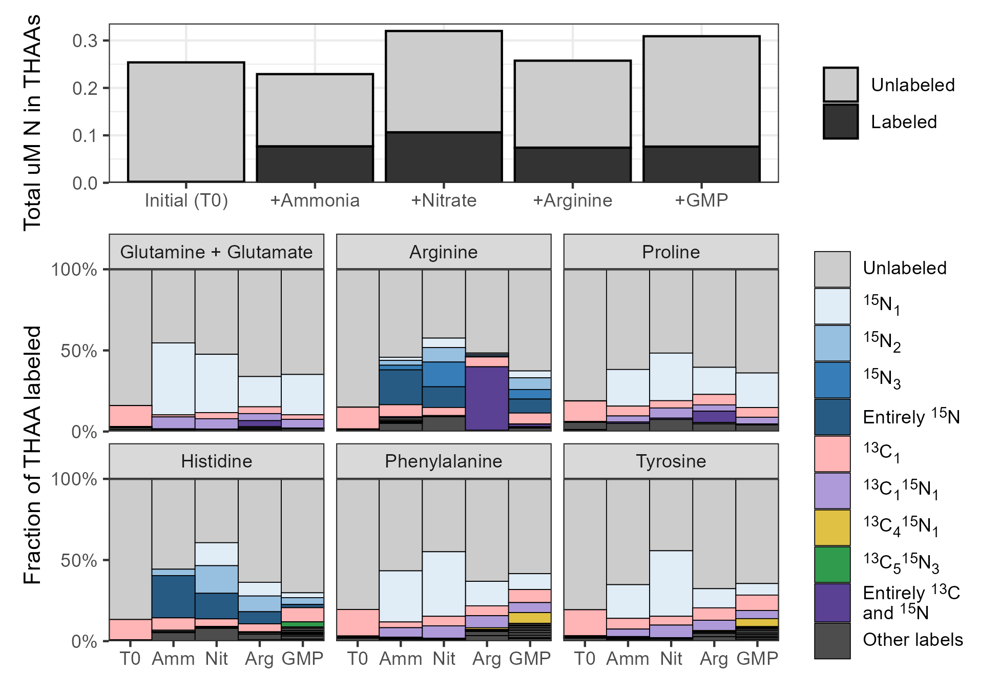

```{r Run analysis, include=FALSE}
# TBD
```

```{r setup, echo=FALSE}
knitr::opts_chunk$set(echo = FALSE, message=FALSE, warning=FALSE, eval=FALSE)
library(tidyverse)
library(ggh4x)
library(patchwork)
library(ggtext)
library(minpack.lm)
options(pillar.sigfig = 7)
options(pillar.print_min = 100)

parametadata <- read_csv("metadata/parametadata.csv") %>%
  # filter(IS_type=="noIS") %>%
  filter(polarity=="pos") %>%
  filter(samp_type=="Smp") %>%
  mutate(startime=factor(startime, levels=c("Morn", "Eve"))) %>%
  mutate(depth=factor(depth, levels=c("Surf", "Deep"))) %>%
  mutate(amendment=factor(amendment, levels=c("Amm", "Nit", "Arg", "GMP"))) %>%
  arrange(amendment, depth, timepoint_num, startime) %>%
  mutate(timepoint=fct_inorder(timepoint))
peak_areas <- read_csv("targeted/all_peak_areas_w_isos.csv") %>%
  left_join(parametadata %>% distinct(filename, shortname))
all_stans <- read_csv("metadata/all_stans.csv")
stan_patched <- all_stans %>%
  filter(!compound_name=="beta-Glutamic acid") %>%
  mutate(compound_name=str_replace(compound_name, "L-Glutamic acid", "L-Glutamic acid/beta-Glutamic acid")) %>%
  filter(!compound_name=="L-Isoleucine") %>%
  mutate(compound_name=str_replace(compound_name, "L-Leucine", "L-Leucine/L-Isoleucine")) %>%
  filter(!compound_name=="L-Homoserine") %>%
  mutate(compound_name=str_replace(compound_name, "L-Threonine", "L-Threonine/L-Homoserine")) %>%
  filter(!compound_name=="Allopurinol") %>%
  mutate(compound_name=str_replace(compound_name, "Hypoxanthine", "Hypoxanthine/Allopurinol"))
  
maa_names <- c("Also Palythene/Usujirene?", "Shinorine?", "Mycosporine-glycine?", 
               "Palythine?", "Another Palythene/Usujirene?", "Porphyra-334?", 
               "Also Porphyra-334?", "Asterina-330?", "Palythene/Usujirene?",
               "Mycosporine-2-glycine?")
nucleo_names <- c("5-Methylcytosine", "Adenosine", "Cytidine", "Adenine", "Guanosine",
                  "Cytosine", "Hypoxanthine/Allopurinol", "Guanine", "Deoxycytidine?",
                  "Deoxyadenosine", "Deoxyguanosine?")
betaine_names <- c("beta-Alaninebetaine", "Glycine betaine", "Homarine", "Trigonelline",
                   "Choline", "Glycerophosphocholine", "Homoserine betaine?", 
                   "Threonine betaine?", "Proline betaine",
                   "(3-Carboxypropyl)trimethylammonium", "O-Acetylcarnitine", 
                   "Betonicine", "Acetylcholine", "Phosphocholine")
non_n_names <- c("Dimethylsulfonioacetate", "Dimethylsulfoniopropionate",
                 "Arsenobetaine", "Dimethylsulfoxonium propionate?", "Gonyol",
                 "2-O-alpha-D-Glucosylglycerol")
aa_names <- c("Glutamine", "Aspartic acid", "Glutamic acid/beta-Glutamic acid",
              "Asparagine", "Alanine", "Methionine", "Arginine", "Proline",
              "Lysine", "Threonine/Homoserine", "Serine", "Glycine", "Histidine",
              "Leucine/Isoleucine", "Valine", "Arginine")
bad_cmpds <- c("Melamine", "Uridine", "Itaconic acid?", "Inosine", "Dexpanthenol", 
               "Choline sulfate", "5-Hydroxyectoine", "L-Tyrosine")
aa_ncs <- all_stans %>%
  filter(compound_type=="Amino Acid") %>%
  mutate(compound_name=str_remove(compound_name, "^L-")) %>%
  distinct(compound_name, n_C, n_N) %>%
  add_row(compound_name="Phenylalanine", n_C=9, n_N=1)

samp_areas <- parametadata %>%
  filter(samp_type=="Smp") %>%
  distinct(shortname, depth) %>%
  left_join(peak_areas) %>%
  mutate(shortname=fct_inorder(shortname)) %>%
  filter(!compound_name%in%bad_cmpds) %>%
  filter(!(depth=="Deep" & compound_name%in%maa_names)) %>%
  select(-depth)
labeled_fracs <- samp_areas %>%
  mutate(labeled_frac=1-area/sum(area), .by = c("shortname", "compound_name")) %>%
  select(compound_name, iso_name, shortname, labeled_frac) %>%
  filter(str_detect(iso_name, "13C0, 15N0")) %>%
  select(-iso_name)
log_coef_df <- labeled_fracs %>%
  filter(!compound_name%in%maa_names) %>%
  left_join(parametadata %>% distinct(shortname, amendment, depth, timepoint_num)) %>%
  nest(data=c(shortname, timepoint_num, labeled_frac)) %>%
  mutate(log_fit=map(data, ~glm(.x$labeled_frac~.x$timepoint_num, family="quasibinomial")),
         coefs=map(log_fit, function(x)broom::tidy(x))) %>%
  unnest(coefs) %>%
  select(compound_name, amendment, depth, term, estimate) %>%
  pivot_wider(names_from = term, values_from = estimate) %>%
  rename(intercept=`(Intercept)`, slope=`.x$timepoint_num`) %>%
  mutate(half_max=-intercept/slope, scale=1/slope) %>%
  mutate(frac_at_T24 = 1/(1+exp(-(intercept+slope*24))))

splividis <- function(n, ...){
  vir <- viridis::viridis(n, ...)
  if(n%%2==0){
    vir[as.numeric(matrix(1:n, ncol=2, byrow = TRUE))]
  } else {
    index_vec <- suppressWarnings(as.numeric(matrix(1:n, ncol=2, byrow = TRUE)))
    vir[head(index_vec, -1)]
  }
}
```


# Abstract

Nitrogen availability controls productivity in much of the surface ocean. The form of this nitrogen controls who it is available to and how it is used. Here, we explored how four different forms of nitrogen (ammonia, nitrate, arginine, and guanosine monophosphate) were taken up and transformed in the North Pacific Subtropical Gyre using stable isotope labeling metabolomics. We repeated these experiments both at the surface and at the base of the euphotic zone as well as in the morning and evening. We found that ammonia is converted into glutamate in less than 20 minutes and results in labeling throughout the metabolome, though osmolytes like betaines had slow turnover rates. This process was slower at depth but independent of time of day. Nitrate amendments resulted in the labeling of only a small subset of molecules such as mycosporine-like amino acids, whose incorporation patterns suggest that this form of nitrogen was available to a subset of the community, likely eukaryotes. The two organic nitrogen amendments labeled the metabolome more slowly than the inorganic forms of nitrogen and were primarily converted into glutamate rather than used as intact substrates. They also showed the same usage at depth as they did at the surface, hinting at the major role that heterotrophic bacteria likely play in their uptake and use. These measurements reveal the forms and fluxes of organic nitrogen in the natural environment to provide constraints on biogeochemical models and better characterize the transformations between organic and inorganic nitrogen.

# Introduction

Marine carbon is fixed into biomass very quickly. In most of the surface ocean this flux is controlled by the availability of nitrogen, an element with a complex and incompletely characterized biogeochemical cycle [@Capone2008; @Moore2013; @Hutchins2022]. Organic nitrogen in particular is often treated as a black box despite substantial variability in its bioavailability and chemical nature. While extensive work has been done to characterize the forms and fluxes of nitrogen within the inorganic pool, the equivalent for the organic pool is woefully underdeveloped [@ref, prob NME2008 or Hansell2024, maybe @Hutchins2022 for visual?]. This is largely due to the difficulty of comprehensively measuring the many organic molecules that contain nitrogen in the marine environment [@Boysen2018; @Moran2022]. The bioavailability of the nitrogen atom is in the environment is largely determined by the form of the organic material it composes.

The mechanisms by which dissolved nitrogen becomes biomass and vice versa are major factors in our ability to predict ecosystem productivity and therefore carbon fixation and export. Traditionally, the conversion of inorganic material into organic substrate was thought to be limited to autotrophs while remineralization was performed by the heterotrophic community. Today, it’s known that many photosynthetic organisms are able to take up and use organic nitrogen [@Anita1991; @Morando2018; @Hugo2021] and that only a select subset of phototrophs are capable of nitrate reduction or nitrogen fixation [@ref], while inorganic nitrogen is directly accessible to heterotrophs as well. This means that the transformations possible for a given N-containing compound are a function of the microbial community and its environment while the microbial community is in turn also expected to be a function of the N-containing molecules available. This creates a recursive network that’s difficult to untangle and cannot necessarily be extrapolated from axenic culture studies.

One way to reveal the pathways and transformations that marine N undergoes in a natural community is via 15N labeling paired with metabolomics. Metabolites that incorporate the labeled nitrogen can then be separated on the mass spectrometer and quantified separately from the unlabeled pool. Here, we trace the uptake and use of labeled ammonia, nitrate, arginine, and guanosine monophosphate in a natural community from the NPSG at multiple depths and diel conditions. Our application of metabolomics to these samples allows us to map out the pathways and restructuring that organic nitrogen experiences in the largest biomes on the planet, quantifying the pool sizes and turnover rates for various low molecular weight compounds that serve as building blocks and intermediates of cell biology.

## Other things to maybe discuss:

  -	mention the expected differences with depth and diel effects
  -	detail which compounds we chose and why?
  -	expand on DON-PON interactions and importance?
  - Extracellular enzymes, organic use as ammonia vs as-is?
  -	expand on the importance of biogeochemical models and why we need pathways mapped out?
  -	mention basic biosynthetic pathways (maybe better suited to discussion?)
  -	new (nitrate) vs regenerated (ammonia and DON) production (maybe also discussion?)

## Other soundbites:
  - It is assumed that most fixed nitrogen becomes protein, presumably based on the large fraction of cell nitrogen in protein and previous research showing how quickly it enters the (free?) amino acid pool. However, 1) important intermediates molecules 2) doesn’t explain where biounavailable N comes from 3) makes gene-based molecular modeling really difficult.
  - In each case, assimilation into organic matter is typically done via the glutamine synthetase (GS)/glutamate synthase (GOGAT) or glutamate dehydrogenase (GDH) pathways to produce glutamate from α-ketoglutarate [@ref, see bronk chapter]. Glutamate then serves as a nitrogen supply in an enormous number of biochemical pathways in both primary and secondary metabolism [@Walker2016].
  - nitrate amendments typically resulting in diatom blooms while ammonia incubations favor cyanobacteria [@Glibert2016].
  - Communities to distinguish are 1) surface (largely regenerated production) and 2) 175m (largely new production(??))
  - use of organics vs synthesis of organics
  - Compounds such as non-proteinogenic amino acids (e.g., ornithine, citrulline, creatine, MAAs), osmolytes like betaines, nucleobases, and sulfur-containing molecules like taurine represent significant but poorly quantified pools. Understanding the rates and pathways by which these compounds are utilized is crucial, as they form the fundamental unit linking genetic potential to elemental cycling in biogeochemical models.
  - Nitrogen use varies significantly between the sunlit surface where productivity is largely regenerated through recycling of ammonia and organic nitrogen, and deeper waters near the base of the euphotic zone, where nitrate supports “new” production. Quantifying rates of nitrogen assimilation into ammonia and downstream products across these gradients is therefore essential for predicting marine productivity and nutrient cycling.
  - Nonetheless, how the community uses a substrate is arguably more important than whether it can. 

# Results

## Environmental context of PARAGON cruise

PARAGON synthesis paper isn't out yet and I'm not sure it will be anytime soon

Particulate carbon and nitrogen numbers for PARAGON I (from Matt(?))


Data from Rhea showing ammonia/nitrite concentrations - I sampled at 25m and 175m (nitrite max, below ammonia max). Does this mean I was getting a lot of AOA users?


Angel's IFCB data showing Hemiaulus disappearing over the course of the cruise (most of the Bacillariophyceae are Hemiaulus and she shows that in another plot)


Fuyan reports the abundances of various bacterial groups (with the caveat that the SASVs have to have been found in the 4000m depth traps?)


## Universal bioavailability of ammonia at surface

The most rapid and extensive labeling was obtained during the ammonia-amended incubations of surface seawater. We observed significant labeling of glutamine, [and others] even at the T0 timepoint, indicating turnover times shorter than the time required to filter and flash-freeze the samples in liquid nitrogen (~20 minutes).

DISCUSSION: the speed at which ammonia labeling happens hints at a high flux, low concentration ammonia cycle in the surface ocean since uptake was too fast and too widespread to be a transcriptional response, indicating that they have ammonia transporters plus GS/GOGAT/GDH always active.

Synthesis rates, especially for betaines?

Aspartate labeled faster than glutamate - discuss pool sizes

Slow labeling of osmolytes - discuss pool sizes

```{r fig small heatmap compound groups}
class_levels <- c("Glutamine", "Glutamic acid", "Aspartic acid", "Asparagine", "Other amino acids", "Theanine?", "Citrulline", "Ectoine", "Guanine", "Other nucleic acids", "MAAs", "Betaines", "All others")

labeled_fracs %>%
  left_join(parametadata %>% distinct(shortname, timepoint, timepoint_num, depth, startime, amendment)) %>%
  filter(amendment=="Amm") %>%
  mutate(compound_name=str_remove_all(compound_name, "^L-")) %>%
  mutate(compound_name=str_remove(compound_name, "/beta-Glutamic acid")) %>%
  mutate(compound_class=case_when(
    compound_name%in%class_levels ~ compound_name,
    compound_name%in%maa_names~"MAAs",
    compound_name%in%aa_names~"Other amino acids",
    compound_name%in%nucleo_names~"Other nucleic acids",
    compound_name%in%betaine_names~"Betaines",
    TRUE~"All others"
  )) %>%
  mutate(compound_class=factor(compound_class, levels=class_levels)) %>%
  summarise(avg_frac=mean(labeled_frac), .by = c(compound_class, timepoint_num, startime, depth)) %>%
  mutate(color_group=paste(depth, startime)) %>%
  ggplot(aes(x=timepoint_num, y=avg_frac, color=color_group, fill=color_group)) +
  geom_smooth(method = "glm", formula = y~x, method.args = list(family = "quasibinomial"),
              fill="grey80") +
  geom_point(pch=21, color="black") +
  facet_wrap(~compound_class, ncol=5) +
  scale_y_continuous(labels = scales::label_percent(), breaks = c(0, 0.5, 1)) +
  scale_x_continuous(breaks = c(0.3, 1, 3, 10, 26), labels = c(0.3, 1, 3, 10, 26)) +
  scale_color_manual(breaks = c("Surf Morn", "Surf Eve", "Deep Morn", "Deep Eve"),
                     values = c("#FFD53D", "#DBA20A", "#256A76", "#003743")) +
  scale_fill_manual(breaks = c("Surf Morn", "Surf Eve", "Deep Morn", "Deep Eve"),
                     values = c("#FFD53D", "#DBA20A", "#256A76", "#003743")) +
  labs(x="Hours after 15N added", y="Fraction of metabolite labeled", color=NULL) +
  theme_bw() +
  guides(color = guide_legend(nrow = 2, override.aes = list(linewidth=2)),
         fill = "none") +
  theme(legend.position = "inside",
        legend.position.inside = c(0.8, 1/6),
        legend.location = "plot")

labeled_fracs %>%
  left_join(parametadata %>% distinct(shortname, timepoint, timepoint_num, depth, startime, amendment, tripl)) %>%
  filter(amendment=="Amm") %>%
  mutate(depth=factor(depth, levels=c("Surf", "Deep"), labels=c("Surface seawater (25 meters)", "Seawater from below DCM (175m)"))) %>%
  mutate(startime=factor(startime, levels=c("Morn", "Eve"), labels=c("6AM start", "6PM start"))) %>%
  mutate(compound_name=str_remove_all(compound_name, "^L-")) %>%
  mutate(compound_name=str_remove(compound_name, "/beta-Glutamic acid")) %>%
  mutate(compound_class=case_when(
    compound_name%in%c("Glutamine", "Aspartic acid", "Asparagine", "Glutamic acid", "Ectoine", "Theanine?", "Citrulline", "Guanine") ~ compound_name,
    compound_name%in%maa_names~"MAAs",
    compound_name%in%aa_names~"Other amino acids",
    compound_name%in%nucleo_names~"Other nucleic acids",
    compound_name%in%betaine_names~"Betaines",
    TRUE~"All others"
  )) %>%
  mutate(compound_class=factor(compound_class, levels=class_levels)) %>%
  summarise(avg_frac=mean(labeled_frac), .by = c(compound_class, timepoint, startime, depth, tripl)) %>%
  ggplot() +
  geom_raster(aes(x=timepoint, y=tripl, fill=avg_frac)) +
  geom_vline(xintercept = c(1.5:4.5), color="grey80") +
  facet_nested(compound_class~depth+startime, scales = "free_y", switch="y") +
  scale_fill_gradientn(colours = viridis::viridis(10, alpha = seq(0, 1, length.out=10), direction = -1),
                       limits=c(0, 1), breaks=c(0, 0.25, 0.5, 0.75, 1),
                       labels=c("Fully unlabeled", "", "50% labeled", "", "Fully labeled")) +
  scale_x_discrete(expand = expansion()) +
  scale_y_discrete(expand = expansion()) +
  labs(x=NULL, y=NULL, fill=NULL) +
  theme_bw() +
  theme(panel.spacing.x=unit(0.5, "lines"), 
        panel.spacing.y = unit(0, "lines"),
        axis.text.y = element_blank(),
        axis.ticks.y = element_blank(),
        strip.text.y.left = element_text(angle=0, hjust = 1),
        strip.background.y = element_rect(fill=NA, color=NA),
        panel.grid.major = element_blank(), 
        panel.grid.minor = element_blank(),
        legend.position = "top", 
        legend.key.width = unit(1, "null")) +
  guides(
    fill=guide_colorbar(theme=theme(
      legend.frame = element_rect(color = "black"),
      legend.ticks = element_line(color="black"),
      legend.text = ggtext::element_markdown(hjust=c(0, 0, 0.5, 1, 1)))
    )
  )

ggsave(filename = "grouped_heatmap.png", device = "png", path = "manuscript/figures",
       width = 6.5, height = 4, units = "in", dpi = 300)
```


*Figure XX: Fraction of each metabolite or metabolite group containing at least one 15N label during the treatments amended with 15N ammonia after the number of hours shown on the x-axis. Darker colors indicate a larger percentage of the compound signal was isotopically labeled. Separate incubations were started at 6AM and 6PM with water from both 25 meters and 175 meters near Station ALOHA. Three biological replicates are stacked vertically at each timepoint.*

Same basic pattern in the evening except MAAs, guanosine, proline?

```{r fig MAA labeling patterns}
chosen_maas <- c("Mycosporine-glycine?", "Shinorine?", "Palythine?",
                 "Palythene/Usujirene?", "Also Palythene/Usujirene?", 
                 "Also Porphyra-334?")
labeled_fracs %>%
  filter(compound_name%in%chosen_maas) %>%
  mutate(compound_name=factor(compound_name, levels=chosen_maas)) %>%
  arrange(compound_name) %>%
  mutate(compound_name=str_remove(compound_name, "\\?$")) %>%
  mutate(compound_name=str_replace(compound_name, "Also Palythene/Usujirene", "Palythene or\n usujirene")) %>%
  mutate(compound_name=str_replace(compound_name, "Palythene/Usujirene", "Usujirene or\n palythene")) %>%
  mutate(compound_name=str_remove(compound_name, "Also ")) %>%
  mutate(compound_name=str_replace(compound_name, "-glycine", "-\nglycine")) %>%
  mutate(compound_name=fct_inorder(compound_name)) %>%
  left_join(parametadata, relationship = "many-to-many") %>%
  filter(samp_type=="Smp") %>%
  filter(IS_type=="noIS") %>%
  filter(amendment%in%c("Amm", "Nit")) %>%
  mutate(amendment=factor(amendment, levels=c("Amm", "Nit"), labels=c("+Ammonia", "+Nitrate"))) %>%
  mutate(clock_time=ifelse(startime=="Morn", 6+timepoint_num, 18+timepoint_num)) %>%
  mutate(startime=factor(startime, levels=c("Morn", "Eve"), labels=c("6AM start", "6PM start"))) %>%
  ggplot() +
  annotate("rect", xmin=-Inf, xmax = 6, ymin=-Inf, ymax=Inf, fill="grey80") +
  # annotate("rect", xmin=6, xmax = 18, ymin=-Inf, ymax=Inf, fill="#d0bd65") +
  annotate("rect", xmin=18, xmax = 30, ymin=-Inf, ymax=Inf, fill="grey80") +
  # annotate("rect", xmin=30, xmax = 42, ymin=-Inf, ymax=Inf, fill="#d0bd65") +
  annotate("rect", xmin=42, xmax = Inf, ymin=-Inf, ymax=Inf, fill="grey80") +
  geom_hline(yintercept = c(0.25, 0.5, 0.75, 1), color="grey90") +
  # annotate("rect", xmin=-Inf, xmax=Inf, ymin=-Inf, ymax = Inf, fill="white", alpha=0.3) +
  geom_smooth(aes(x=clock_time, y=labeled_frac, color=startime),
              method=nlsLM, formula="y~a*x^b+d", se = FALSE,
              method.args=list(start=list(a=1, b=2, d=1),
                               control=nls.lm.control(maxiter = 500))) +
  # geom_smooth(aes(x=clock_time, y=labeled_frac, group=startime),
  #             method=glm, formula = "y~x", method.args=list(family="quasibinomial"), 
  #             color="grey10", se=FALSE) +
  # geom_point(aes(x=clock_time, y=labeled_frac, shape=startime), color="black", 
  #            fill="white", size=3) +
  geom_point(aes(x=clock_time, y=labeled_frac, shape=startime, fill=startime),
             color="black", size=2, alpha=0.7) +
  facet_nested(compound_name~amendment) +
  scale_x_continuous(breaks = c(6, 18, 30, 42), labels = c("6AM", "6PM", "6AM", "")) +
  scale_y_continuous(labels = scales::label_percent(),
                     limits = c(0, 1), breaks = c(0, 0.5, 1)) +
  scale_shape_manual(values=c(24, 25), breaks = c("6AM start", "6PM start")) +
  scale_fill_manual(values=c("#f4bb23", "#0b505c"), breaks = c("6AM start", "6PM start"),
                    aesthetics = c("color", "fill")) +
  labs(x=NULL, color=NULL, shape=NULL, fill=NULL, y="Fraction of MAA containing at least one 15N atom") +
  theme_bw() +
  theme(axis.text.y = element_markdown(vjust=c(0, 0.5, 1)),
        axis.title.x = element_blank(),
        legend.position = "inside",
        legend.margin = margin(0.1,0.25,0.1,0.1, unit="lines"),
        legend.position.inside = c(1, 1),
        legend.justification = c(1, 1), 
        legend.background = element_rect(fill="#FFFFFFAA", color="black", linewidth = 0)) +
  guides(shape=guide_legend(override.aes = list(size=3, stroke=1.2, alpha=1, linetype=0)))

ggsave(filename = "MAA_curves.png", device = "png", path = "manuscript/figures",
       width = 3, height = 6, units = "in", dpi = 300)
```


*Figure XX: Fraction of UV-reactive mycosporine-like amino acids (MAAs) containing at least one 15N label over one day during the treatments amended with 15N labeled ammonia or nitrate. Incubations started at 6AM are shown in yellow while incubations started at 6PM are shown in blue, with grey background regions highlighting nighttime. Three replicates are included at each of the 5 timepoints and best-fit power law curves have been fit behind the data.*

Deep labeling is slower and much more limited for ammonia

  - Asp/Asn especially
  - Ectoine major exception (ref mcparland for bacterial signal)

Nitrate surface morning surprisingly limited

  - "out of order" labeling in MAAs and guanine, maybe also arginine, taurine, NAc-lysine, maybe maybe theanine being unlabeled because it would mean diatoms don’t make it

Organic compounds equally bioavailable at surface and deep and used very similarly to each other

  - Exceptions: guanosine (not guanine!) for GMP amendments
  - Exceptions: arginine, citrulline, maybe ornithine for Arg (signal goes away after a while and unclear why??)

Organics seem to be largely used for ammonia rather than as-is

  - Carbon backbone traced into glutamate from arginine
  - Carbon backbone traced into other nucleobases from GMP
  - Possibly due to way too much of a given compound, useless to have that much Arg/GMP
  - Not very much fully-labeled guanine despite guanosine being easily cleavable, instead it’s mostly made from scratch (CHECK THIS)
  - Creatine for being mostly 2x15N 1x13C labeled from arginine (CHECK THIS)

```{r fig surface vs deep labeling rates}
labeled_fracs %>%
  filter(!compound_name%in%maa_names) %>%
  left_join(distinct(parametadata, shortname, amendment, depth, timepoint_num)) %>%
  filter(amendment!="Nit") %>%
  summarise(avg_label=mean(labeled_frac), .by=c(compound_name, amendment, depth, timepoint_num)) %>%
  pivot_wider(names_from = depth, values_from=avg_label) %>%
  mutate(timepoint_num=ifelse(timepoint_num==0, 0.3, timepoint_num)) %>%
  ggplot(aes(x=timepoint_num, y=Surf-Deep, color=compound_name, group=compound_name)) +
  geom_hline(yintercept = 0) +
  geom_line() +
  geom_point() +
  facet_wrap(~amendment, nrow=1) +
  scale_x_log10() +
  theme_bw() +
  theme(legend.position = "none")
ggsave(filename = "deep_vs_surf_labeling.png", device = "png", path = "manuscript/figures",
       width = 6.5, height = 4, units = "in", dpi = 300)
```


*Figure XX: Line plots of the metabolite fraction labeled at the surface (25 meters) minus the fraction labeled at 175 meters. Incubations with added ammonia, arginine, and guanosine monophosphate (GMP) are shown. Points are the average of six biological replicates (incubations started in the morning and the evening are combined for additional power) and colors have been added solely for disambiguating purposes. Positive values indicate increased synthesis in the surface samples relative to those at depth.*

```{r regression attempts currently failing, eval=FALSE}
labeled_fracs %>%
  left_join(parametadata %>% filter(IS_type=="noIS")) %>%
  filter(compound_name=="Creatinine") %>%
  filter(amendment=="GMP") %>%
  mutate(timepoint_num=ifelse(timepoint_num==0, 0.3, timepoint_num)) %>%
  ggplot(aes(x=timepoint_num, y=labeled_frac, color=startime)) +
  geom_point() +
  geom_smooth(method=glm, formula=y~x, method.args=list(family=quasibinomial)) +
  facet_wrap(~depth, ncol=1)

reg_data <- labeled_fracs %>%
  filter(!compound_name%in%maa_names) %>%
  left_join(distinct(parametadata, shortname, amendment, depth, timepoint_num)) %>%
  mutate(max_frac=max(labeled_frac[timepoint_num==max(timepoint_num)]), .by=c(amendment, compound_name, depth)) %>%
  mutate(t10_labfrac = mean(labeled_frac[timepoint_num==sort(unique(timepoint_num))[4]]), .by=c(amendment, compound_name, depth))

reg_data %>%
  distinct(compound_name, amendment, depth, max_frac, t10_labfrac) %>%
  mutate(category=ifelse(max_frac < 0.1, "Unlabeled", "Good")) %>%
  mutate(category=ifelse(t10_labfrac <= 0, "Only T26 labeled", category)) %>%
  mutate(category=ifelse(is.na(category), "DMSOP (unlabeled)", category)) %>%
  count(amendment, category, depth) %>%
  print(n=Inf)

reg_fits <- reg_data %>%
  filter(max_frac>0.1) %>%
  filter(t10_labfrac>0) %>%
  filter(compound_name!="Betonicine") %>%
  filter(compound_name!="Arsenobetaine") %>%
  filter(compound_name!="Gonyol") %>%
  mutate(timepoint_num=ifelse(timepoint_num==0, 0.3, timepoint_num)) %>%
  nest(data=c(shortname, timepoint_num, labeled_frac)) %>%
  mutate(log_fit=map(data, ~glm(.x$labeled_frac~.x$timepoint_num, family="quasibinomial")),
         coefs=map(log_fit, function(x)broom::tidy(x))) %>%
  unnest(coefs) %>%
  mutate(p_adj=p.adjust(p.value, method = "fdr"), .by = term) %>%
  filter(p_adj<0.001) %>%
  select(compound_name, amendment, depth, term, estimate) %>%
  pivot_wider(names_from = term, values_from = estimate) %>%
  rename(intercept=`(Intercept)`, slope=`.x$timepoint_num`) %>%
  mutate(half_max=-intercept/slope, scale=1/slope) %>%
  mutate(frac_at_T24 = 1/(1+exp(-(intercept+slope*24))))
# reg_fits %>%
#   select(compound_name, amendment, depth, intercept, slope) %>%
#   pivot_longer(intercept:slope) %>%
#   ggplot(aes(x=depth, y=value)) +
#   geom_boxplot() +
#   facet_grid(name~amendment, scales="free_y")
# reg_fits %>%
#   select(compound_name, amendment, depth, intercept, slope) %>%
#   pivot_longer(intercept:slope) %>%
#   pivot_wider(names_from=depth) %>%
#   filter(!is.na(Deep)) %>%
#   nest(data=c(compound_name, Surf, Deep)) %>%
#   mutate(test=map(data, ~broom::tidy(t.test(.x$Surf, .x$Deep, paired=TRUE)))) %>%
#   unnest(test)
# labeled_fracs %>%
#   left_join(parametadata %>% distinct(shortname, amendment, depth, timepoint_num)) %>%
#   filter(timepoint_num==max(timepoint_num), .by=amendment) %>%
#   summarise(avg_Tf_label=mean(labeled_frac), .by=c(compound_name, amendment, depth)) %>%
#   ggplot() +
#   geom_boxplot(aes(x=amendment, y=avg_Tf_label, color=depth))
# 
# labeled_fracs %>%
#   left_join(parametadata %>% distinct(shortname, amendment, depth, timepoint_num)) %>%
#   filter(timepoint_num==max(timepoint_num), .by=amendment) %>%
#   summarise(avg_Tf_label=mean(labeled_frac), .by=c(compound_name, amendment, depth)) %>%
#   pivot_wider(names_from=depth, values_from=avg_Tf_label) %>%
#   ggplot() +
#   geom_segment(aes(y=Surf, yend=Deep), x=1, xend=2) +
#   facet_wrap(~amendment, nrow=1)
# reg_fits %>%
#   ggplot() +
#   geom_segment(aes(y=frac_at_T24_Surf, yend=frac_at_T24_Deep,
#                    x=half_max_Surf, xend=half_max_Deep, color=compound_name),
#                data = reg_fits %>%
#                  select(compound_name, depth, half_max, frac_at_T24) %>% 
#                  pivot_wider(names_from = depth, values_from=c(half_max, frac_at_T24)) %>%
#                  filter(!is.na(half_max_Deep))) +
#   geom_point(aes(x=half_max, y=frac_at_T24, fill=depth), pch=21) +
#   scale_fill_manual(values=c("black", "white"), breaks=c("Deep", "Surf"))

reg_fits %>%
  filter(amendment!="Nit") %>%
  ggplot() +
  geom_segment(aes(y=frac_at_T24_Surf, yend=frac_at_T24_Deep,
                   x=half_max_Surf, xend=half_max_Deep, color=compound_name),
               data = reg_fits %>%
                 select(compound_name, amendment, depth, half_max, frac_at_T24) %>% 
                 pivot_wider(names_from = depth, values_from=c(half_max, frac_at_T24)) %>%
                 filter(!is.na(half_max_Deep))) +
  geom_point(aes(x=half_max, y=frac_at_T24, fill=depth, label=compound_name), pch=21) +
  scale_fill_manual(values=c("black", "white"), breaks=c("Deep", "Surf")) +
  facet_wrap(~amendment, scales="free_x") +
  theme(legend.position = "none")
```

## Rapid uptake and use of all N substrates

Total fraction of PN that was visible in metabolites

```{r}
env_concs <- read_csv("targeted/final_env_concs.csv")

# More compounds, triplicates shown
env_concs %>%
  mutate(mean_nm=mean(conc_nm_in_env), .by=compound_name) %>%
  filter(!compound_name%in%c("Thymine", "Thymidine")) %>%
  arrange(desc(mean_nm)) %>%
  mutate(compound_name=ifelse(compound_name=="L-Glutamic acid/beta-Glutamic acid", "Glutamate", compound_name)) %>%
  mutate(compound_name=ifelse(compound_name%in%unique(compound_name)[1:19], compound_name, "Other")) %>%
  mutate(compound_name=fct_inorder(compound_name)) %>%
  summarise(conc_nm=sum(conc_nm_in_env), .by=c(compound_name, filename)) %>%
  left_join(parametadata) %>%
  ggplot(aes(x=tripl, y=conc_nm, fill=compound_name)) +
  geom_col(color="black", width=1) +
  facet_nested(depth+startime~amendment+timepoint, switch="x") +
  scale_y_continuous(expand=expansion(mult=c(0, 0.1))) +
  scale_fill_manual(values = c(splividis(19), "grey")) +
  labs(x=NULL, y="Unlabeled concentrations (nM)", fill=NULL) +
  theme_bw() +
  theme(
    panel.spacing.x = unit(0, "lines"),
    axis.text.x = element_blank(),
    axis.ticks.x = element_blank()
  )

# Summarized version
env_concs %>%
  mutate(mean_nm=mean(conc_nm_in_env), .by=compound_name) %>%
  filter(!compound_name%in%c("Thymine", "Thymidine")) %>%
  arrange(desc(mean_nm)) %>%
  mutate(compound_name=ifelse(compound_name=="L-Glutamic acid/beta-Glutamic acid", 
                              "Glutamate", compound_name)) %>%
  mutate(compound_name=str_remove_all(compound_name, "^L-|(?<=/)L-")) %>%
  mutate(compound_name=ifelse(compound_name%in%unique(compound_name)[1:9], 
                              compound_name, "Other")) %>%
  mutate(compound_name=fct_inorder(compound_name)) %>%
  summarise(conc_nm=sum(conc_nm_in_env), .by=c(compound_name, filename)) %>%
  left_join(parametadata) %>%
  summarise(conc_nm=mean(conc_nm), .by=c(compound_name, amendment, depth, timepoint)) %>%
  ggplot(aes(x=timepoint, y=conc_nm, fill=compound_name)) +
  geom_col(color="black", width=1) +
  facet_grid(depth~amendment, scales="free") +
  scale_y_continuous(expand=expansion(mult=c(0, 0.1))) +
  scale_fill_manual(values = c(splividis(9), "grey")) +
  labs(x=NULL, y="Unlabeled concentrations (nM)", fill=NULL) +
  theme_bw()

# In N moles
env_concs %>%
  left_join(stan_patched %>% distinct(compound_name, n_N)) %>%
  mutate(nM_N=conc_nm_in_env*n_N) %>%
  mutate(mean_nm=mean(nM_N), .by=compound_name) %>%
  filter(!compound_name%in%c("Thymine", "Thymidine")) %>%
  arrange(desc(mean_nm)) %>%
  mutate(compound_name=ifelse(compound_name=="L-Glutamic acid/beta-Glutamic acid", 
                              "Glutamate", compound_name)) %>%
  mutate(compound_name=str_remove_all(compound_name, "^L-|(?<=/)L-")) %>%
  mutate(compound_name=ifelse(compound_name%in%unique(compound_name)[1:9], 
                              compound_name, "Other")) %>%
  mutate(compound_name=fct_inorder(compound_name)) %>%
  summarise(conc_nm=sum(nM_N), .by=c(compound_name, filename)) %>%
  left_join(parametadata) %>%
  summarise(conc_nm=mean(conc_nm), .by=c(compound_name, amendment, depth, timepoint)) %>%
  ggplot(aes(x=timepoint, y=conc_nm, fill=compound_name)) +
  geom_col(color="black", width=1) +
  facet_grid(depth~amendment, scales="free") +
  scale_y_continuous(expand=expansion(mult=c(0, 0.1))) +
  scale_fill_manual(values = c(splividis(9), "grey")) +
  labs(x=NULL, y="Nitrogen in unlabeled metabolites (nM)", fill=NULL) +
  theme_bw()
```

```{r}
peak_areas %>%
  filter(str_detect(iso_name, "13C0, 15N0")) %>%
  filter(!compound_name%in%c("Urea", "L-Valine", "Oxalic acid", "Malic acid", 
                             "Acetylcholine", "Homarine")) %>%
  left_join(parametadata %>% distinct(filename, samp_type, amendment)) %>%
  filter(samp_type=="Smp") %>%
  left_join(read_csv("targeted/rf_df.csv")) %>%
  mutate(conc_nm=area/rf) %>%
  filter(!is.na(conc_nm)) %>%
  mutate(mean_nm=mean(conc_nm), .by=compound_name) %>%
  arrange(desc(mean_nm)) %>%
  mutate(compound_name=ifelse(compound_name=="L-Glutamic acid/beta-Glutamic acid", 
                              "Glutamate", compound_name)) %>%
  mutate(compound_name=ifelse(compound_name%in%unique(compound_name)[1:19], 
                              compound_name, "Other")) %>%
  mutate(compound_name=fct_inorder(compound_name)) %>%
  summarise(conc_nm=sum(conc_nm), .by=c(compound_name, filename)) %>%
  left_join(parametadata) %>%
  ggplot(aes(x=tripl, y=conc_nm, fill=compound_name)) +
  geom_col(color="black", width=1) +
  facet_nested(depth+startime~amendment+timepoint, switch="x") +
  scale_y_continuous(expand=expansion(mult=c(0, 0.1))) +
  scale_fill_manual(values = c(splividis(19), "grey")) +
  labs(x=NULL, y="Unlabeled concentrations (nM)", fill=NULL) +
  theme_bw() +
  theme(
    panel.spacing.x = unit(0, "lines"),
    axis.text.x = element_blank(),
    axis.ticks.x = element_blank()
  )
```

## Labeling traced into protein via total hydrolyzable amino acids

```{r thaa data}
thaa_quant <- read_csv("thaas/quant_data.csv")
metathaa <- read_csv("thaas/metathaa.csv") %>%
  mutate(depth=factor(depth, levels=c("Surf", "Deep"))) %>%
  mutate(startime=factor(startime, levels=c("Morn", "Eve")))

all_thaa_plot <- thaa_quant %>%
  filter(!str_detect(iso_name, "2H")) %>%
  left_join(metathaa) %>%
  filter(samp_type=="Smp") %>%
  left_join(aa_ncs) %>%
  select(filename, compound_name, iso_name, env_conc_nm, n_C, n_N) %>%
  mutate(n_N_lab=as.numeric(str_extract(iso_name, "(?<=15N)\\d+"))) %>%
  mutate(n_N_unlab=n_N-n_N_lab) %>%
  mutate(nM_N_lab=env_conc_nm*n_N_lab, nM_N_unlab=env_conc_nm*n_N_unlab) %>%
  select(filename, compound_name, iso_name, nM_N_lab, nM_N_unlab) %>%
  pivot_longer(c(nM_N_lab, nM_N_unlab)) %>%
  summarise(total_uM=sum(value)/1000, .by=c(filename, name)) %>%
  left_join(metathaa) %>%
  mutate(amendment=ifelse(timepoint=="T0", "T0", amendment)) %>%
  mutate(amendment=factor(amendment, levels = c("T0", "Amm", "Nit", "Arg", "GMP"))) %>%
  summarise(total_uM=mean(total_uM), .by=c(amendment, depth, startime, timepoint, name)) %>%
  arrange(depth, startime) %>%
  mutate(x_axis=paste(depth, startime)) %>%
  mutate(x_axis=fct_inorder(x_axis)) %>%
  ggplot(aes(x=x_axis, y=total_uM, fill=name)) +
  geom_col(color="black", width=1) +
  facet_nested(.~amendment, scales="free_y") +
  theme_bw() +
  scale_x_discrete(expand = expansion()) +
  scale_y_continuous(expand = expansion(mult=c(0, 0.05))) +
  scale_fill_manual(breaks = c("nM_N_unlab", "nM_N_lab"), values=c("grey80", "grey20"), 
                    labels=c("Unlabeled", "Labeled")) +
  labs(x=NULL, y="Total uM N in THAAs", fill=NULL) +
  theme(
    axis.text.x=element_blank()
  )

thaa_plot_data <- thaa_quant %>%
  left_join(metathaa) %>%
  filter(samp_type=="Smp") %>%
  mutate(amendment=ifelse(timepoint=="T0", "T0", amendment)) %>%
  summarise(avg_env_conc_nm=mean(env_conc_nm, na.rm=TRUE), .by=c(compound_name, iso_name, amendment, timepoint, startime, depth)) %>%
  filter(compound_name%in%c("Glutamic acid", "Arginine")) %>%
  mutate(iso_name=case_when(
    str_detect(iso_name, "13C0, 15N0")~"Unlabeled",
    str_detect(iso_name, "13C0, 15N1")~"Singly 15N labeled",
    str_detect(iso_name, "13C1, 15N0")~"Singly 13C labeled",
    str_detect(iso_name, "Glutamic acid, 13C5, 15N1")~"Fully C and N\nlabeled glutamate",
    str_detect(iso_name, "Arginine, 13C0, 15N3")~"3x 15N\nlabeled arginine",
    str_detect(iso_name, "Arginine, 13C0, 15N4")~"Fully N\nlabeled arginine",
    str_detect(iso_name, "Arginine, 13C6, 15N4")~"Fully C and N\nlabeled arginine",
    TRUE~"Other labeled"
  )) %>%
  mutate(iso_name=factor(iso_name, levels=c(
    "Unlabeled", "Singly 15N labeled", "Singly 13C labeled", 
    "3x 15N\nlabeled arginine", "Fully N\nlabeled arginine", 
    "Fully C and N\nlabeled arginine", "Fully C and N\nlabeled glutamate", 
    "Other labeled"))) %>%
  mutate(amendment=factor(amendment, levels = c("T0", "Amm", "Nit", "Arg", "GMP"))) %>%
  arrange(depth, startime) %>%
  mutate(x_axis=paste(depth, startime)) %>%
  mutate(x_axis=fct_inorder(x_axis))
cpal_breaks <- levels(thaa_plot_data$iso_name)
cpal_cols <- c("grey80", viridis::viridis(length(cpal_breaks)-2), "grey20")
arg_glut_thaa_plot <- ggplot(thaa_plot_data) +
  geom_col(aes(x=x_axis, y=avg_env_conc_nm, fill=iso_name),
           position="fill",
           color="black", width=1) +
  facet_wrap2(compound_name~amendment, ncol=5, strip = strip_nested(bleed = TRUE)) +
  theme_bw() +
  scale_x_discrete(expand = expansion()) +
  scale_y_continuous(labels=scales::label_percent(), breaks=c(0, 0.5, 1),
                     expand = expansion()) +
  scale_fill_manual(breaks = cpal_breaks, values = cpal_cols) +
  labs(x=NULL, y="Fraction labeled", fill=NULL) +
  theme(
    axis.text.x=element_text(angle=90, hjust=1, vjust = 0.5)
  )
total_thaa_gp <- all_thaa_plot / arg_glut_thaa_plot + plot_layout(heights = c(0.4, 0.6))
ggsave("total_thaa_gp.png", total_thaa_gp, device = "png", path = "manuscript/figures",
       width = 6.5, height = 5.5, units = "in", dpi = 300)
```



  - THAAs were 30-50% of total PC (~2 uM, need actual data) and 70-100% PN (~0.35uM)
  - Maybe more labeling happening from inorganics in evening?
  - 50% turnover of arginine in proteins in 3 days per +Arg data, less at surface than deep (??)
  - 30-50% Glu/Gln turnover in proteins in one day per Amm data
  - Glutamate, proline fully labeled labeled from arginine
  - Phenylalanine, tyrosine, histidine(?) labeled from GMP
  - How is there so much nitrate labeling when I don't see that in the metabolites?

# Discussion

# Conclusion

# Methods

# Acknowledgements

# Data availability

# References

```{r packages, eval=FALSE}
packages_used <- list.files(pattern = "*\\.R$|*\\.Rmd$", recursive = TRUE, full.names = TRUE) %>%
  str_subset("old|scripts", negate=TRUE) %>%
  map(function(file_name){
    v <- readLines(file_name)
    libs <- unique(str_extract(v, "(?<=library\\().*?(?=\\)|,)"))
    refs <- unique(str_extract(v, "[[:alnum:]]*(?=::)"))
    pkgs <- unique(c(na.omit(libs), na.omit(refs)))
  }, .progress = TRUE) %>% unlist() %>% unique()
knitr::write_bib(packages_used[nchar(packages_used)>0], file = "manuscript/r-packages.bib")
```

<div id="refs"></div>

# Supplement

## Supp fig: full heatmap of all compounds and timepoints

```{r suppfig full heatmap}
cmpd_order <- labeled_fracs %>%
  left_join(parametadata, relationship = "many-to-many") %>%
  filter(amendment=="Amm") %>%
  filter(depth=="Surf") %>%
  filter(startime=="Morn") %>%
  summarise(mean_label=mean(labeled_frac, na.rm=TRUE), .by=compound_name) %>%
  arrange(desc(mean_label)) %>%
  pull(compound_name) %>%
  str_remove_all("^L-|(?<=)/L-") %>%
  c("5-Methylcytosine")

heatmap_gp <- labeled_fracs %>%
  left_join(parametadata, relationship = "many-to-many") %>%
  arrange(amendment, depth, timepoint_num, startime) %>%
  mutate(shortname=fct_inorder(shortname)) %>%
  mutate(amendment=factor(amendment, levels=c("Amm", "Nit", "Arg", "GMP"),
                          labels = c("+Ammonia", "+Nitrate", "+Arginine", "+GMP"))) %>%
  mutate(depth=factor(depth, levels=c("Surf", "Deep"), labels=c("25m", "175m"))) %>%
  mutate(compound_name=str_remove_all(compound_name, "^L-|(?<=/)L-")) %>%
  mutate(compound_name=factor(compound_name, cmpd_order)) %>%
  mutate(compound_class=case_when(
    compound_name%in%maa_names~"MAA",
    compound_name%in%aa_names~"Amino\nacid",
    compound_name%in%nucleo_names~"Nucleic\nacid",
    compound_name%in%non_n_names~"N-free",
    compound_name%in%betaine_names~"Betaine",
    TRUE~"Other"
  )) %>%
  mutate(compound_class=factor(compound_class, levels=c("Amino\nacid", "Nucleic\nacid", "MAA", "Betaine", "N-free", "Other"))) %>%
  # filter(compound_class=="Other") %>%
  ggplot() +
  geom_raster(aes(x=timepoint, y=tripl, fill=labeled_frac)) +
  scale_fill_gradientn(colours = viridis::viridis(10, alpha = seq(0, 1, length.out=10), direction = -1), limits=c(0, 1), breaks=c(0, 0.25, 0.5, 0.75, 1), labels=c("0%<br>(Unlabeled)", "", "50%", "", "100%<br>(Fully labeled)")) +
  scale_y_discrete(expand=expansion()) +
  scale_x_discrete(guide = guide_axis(n.dodge = 5), expand=expansion()) +
  facet_nested(compound_class+compound_name~amendment+depth+startime, scales = "free_x", switch="y", strip=strip_nested(size = "variable")) +
  labs(x="Timepoint", y="Metabolite", fill="Fraction\nlabeled") +
  theme_bw() +
  theme(panel.spacing.x=unit(0.2, "lines"), 
        panel.spacing.y = unit(0, "lines"),
        axis.text.y = element_blank(),
        axis.ticks.y = element_blank(),
        # axis.ticks.length.x=unit(1:5, "lines"),
        # axis.text.x = element_markdown(vjust = -5:-1),
        strip.text.y.left = element_text(angle=0, hjust = 1),
        # strip.background.y = element_rect(fill=NA, color=NA),
        panel.grid.major = element_blank(), 
        panel.grid.minor = element_blank(),
        legend.position = "top", 
        legend.key.width = unit(1, "null")) +
  guides(
    fill=guide_colorbar(theme=theme(
      legend.frame = element_rect(color = "black"),
      legend.ticks = element_line(color="black"),
      legend.text = ggtext::element_markdown(hjust=c(0, 0.5, 0.5, 0.5, 1)))
    )
  )

ggsave(plot = heatmap_gp, "manuscript/figures/supp_para_map.pdf", device = "pdf",
       width = 10, height = 12)
```


## Supp fig: THAA labeling broken down by triplicate

```{r thaa supplement figures}
thaa_quant %>%
  left_join(metathaa) %>%
  filter(samp_type=="Smp") %>%
  ggplot() +
  geom_col(aes(x=tripl, y=env_conc_nm, fill=compound_name), 
           color="black", width=1, position="fill") +
  facet_nested(depth+startime~amendment+timepoint) +
  scale_x_discrete(expand = expansion()) +
  scale_y_continuous(labels=scales::label_percent(), breaks=c(0, 0.5, 1),
                     expand = expansion()) +
  labs(x="Triplicate", y="Fraction labeled", fill=NULL) +
  theme_bw() +
  theme(
    axis.text.y=element_markdown(vjust=c(0, 0.5, 1))
  )

THAA_mol_C_gp <- thaa_quant %>%
  filter(!str_detect(iso_name, "2H")) %>%
  left_join(metathaa) %>%
  filter(samp_type=="Smp") %>%
  left_join(aa_ncs) %>%
  select(filename, compound_name, iso_name, env_conc_nm, n_C, n_N) %>%
  mutate(n_C_lab=as.numeric(str_extract(iso_name, "(?<=13C)\\d+"))/n_C) %>%
  mutate(n_C_unlab=n_C-n_C_lab) %>%
  mutate(nM_C_lab=env_conc_nm*n_C_lab, nM_C_unlab=env_conc_nm*n_C_unlab) %>%
  select(filename, compound_name, iso_name, nM_C_lab, nM_C_unlab) %>%
  pivot_longer(c(nM_C_lab, nM_C_unlab)) %>%
  summarise(total_uM=sum(value)/1000, .by=c(filename, name)) %>%
  left_join(metathaa) %>%
  mutate(amendment=factor(amendment, levels = c("T0", "Amm", "Nit", "Arg", "GMP"))) %>%
  ggplot(aes(x=tripl, y=total_uM, fill=name)) +
  geom_col(color="black", width=1) +
  facet_nested(depth+startime~amendment+timepoint) +
  theme_bw() +
  scale_x_discrete(expand = expansion()) +
  scale_y_continuous(expand = expansion(mult=c(0, 0.05))) +
  scale_fill_manual(breaks = c("nM_C_unlab", "nM_C_lab"), values=c("grey80", "grey20"), 
                    labels=c("Unlabeled", "Labeled")) +
  labs(x="Triplicate", y="Total C in THAAs (uM)", fill=NULL) +
  theme(
    legend.position = "top"
  )
THAA_mol_N_gp <- thaa_quant %>%
  filter(!str_detect(iso_name, "2H")) %>%
  left_join(metathaa) %>%
  filter(samp_type=="Smp") %>%
  left_join(aa_ncs) %>%
  select(filename, compound_name, iso_name, env_conc_nm, n_C, n_N) %>%
  mutate(n_N_lab=as.numeric(str_extract(iso_name, "(?<=15N)\\d+"))) %>%
  mutate(n_N_unlab=n_N-n_N_lab) %>%
  mutate(nM_N_lab=env_conc_nm*n_N_lab, nM_N_unlab=env_conc_nm*n_N_unlab) %>%
  select(filename, compound_name, iso_name, nM_N_lab, nM_N_unlab) %>%
  pivot_longer(c(nM_N_lab, nM_N_unlab)) %>%
  summarise(total_uM=sum(value)/1000, .by=c(filename, name)) %>%
  left_join(metathaa) %>%
  mutate(amendment=factor(amendment, levels = c("T0", "Amm", "Nit", "Arg", "GMP"))) %>%
  ggplot(aes(x=tripl, y=total_uM, fill=name)) +
  geom_col(color="black", width=1) +
  facet_nested(depth+startime~amendment+timepoint) +
  theme_bw() +
  scale_x_discrete(expand = expansion()) +
  scale_y_continuous(expand = expansion(mult=c(0, 0.05))) +
  scale_fill_manual(breaks = c("nM_N_unlab", "nM_N_lab"), values=c("grey80", "grey20"), 
                    labels=c("Unlabeled", "Labeled")) +
  labs(x="Triplicate", y="Total N in THAAs (uM)", fill=NULL) +
  theme(
    legend.position = "top"
  )
all_thaa_NC_gp <- guide_area() + THAA_mol_C_gp + THAA_mol_N_gp + plot_layout(guides = "collect", heights = c(0.1, 0.45, 0.45), design = c("1\n2\n3"))
ggsave("thaas/all_thaa_NC_gp.png", width=6.5, height=8)


pdf("figures/all_cmpd_labels.pdf", width=9, height = 5)
for(cmpd_i in setdiff(unique(thaa_quant$compound_name), c("Citrulline", "Ornithine", "Taurine"))){
  print(cmpd_i)
  gp <- thaa_quant %>%
    filter(compound_name==cmpd_i) %>%
    left_join(metathaa) %>%
    drop_na() %>%
    ggplot() +
    geom_col(aes(x=tripl, y=env_conc_nm, fill=iso_name), 
             position="fill",
             color="black", width=1) +
    facet_nested(depth+startime~amendment+timepoint) +
    ggtitle(cmpd_i)
  print(gp)
}
dev.off()
```


## Supp fig: Fraction of AA as DFAA vs THAA

```{r fraction of aa pool in df vs th}
thaa_pool_sizes <- thaa_quant %>%
  filter(!compound_name%in%c("Citrulline", "Ornithine", "Taurine")) %>%
  filter(str_detect(iso_name, "13C0, 15N0")) %>%
  filter(str_detect(filename, "Smp.*T0")) %>%
  select(filename, compound_name, env_conc_nm) %>%
  mutate(compound_name=ifelse(compound_name=="Isoleucine", "Leucine", compound_name)) %>%
  summarise(env_conc_nm=sum(env_conc_nm), .by=c(filename, compound_name)) %>%
  mutate(compound_name=ifelse(compound_name=="Leucine", "Leu/Ile", compound_name)) %>%
  mutate(compound_name=ifelse(compound_name=="Glutamic acid", "Glu/Gln", compound_name)) %>%
  mutate(compound_name=ifelse(compound_name=="Aspartic acid", "Asp/Asn", compound_name)) %>%
  left_join(metathaa) %>%
  summarise(mean_thaa_conc=mean(env_conc_nm), .by=c(amendment, depth, startime, compound_name))
metab_pool_sizes <- env_concs %>%
  filter(str_detect(filename, "Smp.*T0")) %>%
  mutate(compound_name=str_remove_all(compound_name, "L-")) %>%
  mutate(compound_name=str_remove(compound_name, "/Homoserine")) %>%
  mutate(compound_name=str_remove(compound_name, "/beta-Glutamic acid")) %>%
  mutate(compound_name=ifelse(compound_name=="Glutamine", "Glutamic acid", compound_name)) %>%
  mutate(compound_name=ifelse(compound_name=="Asparagine", "Aspartic acid", compound_name)) %>%
  summarise(conc_nm_in_env=sum(conc_nm_in_env), .by=c(filename, compound_name)) %>%
  mutate(compound_name=ifelse(compound_name=="Glutamic acid", "Glu/Gln", compound_name)) %>%
  mutate(compound_name=ifelse(compound_name=="Aspartic acid", "Asp/Asn", compound_name)) %>%
  mutate(compound_name=ifelse(compound_name=="Leucine/Isoleucine", "Leu/Ile", compound_name)) %>%
  filter(compound_name%in%thaa_pool_sizes$compound_name) %>%
  left_join(parametadata) %>%
  summarise(mean_metab_conc=mean(conc_nm_in_env), .by=c(amendment, depth, startime, compound_name))
# Valine and phenylalanine failed QC
thaa_pool_sizes %>%
  left_join(metab_pool_sizes) %>%
  ggplot() +
  geom_point(aes(x=mean_thaa_conc, y=mean_metab_conc, color=compound_name)) +
  facet_nested(depth+startime~amendment)
thaa_pool_sizes %>%
  left_join(metab_pool_sizes) %>%
  ggplot() +
  geom_point(aes(x=mean_thaa_conc, y=mean_metab_conc)) +
  facet_wrap(~compound_name, scales="free")

thaa_pool_sizes %>%
  left_join(metab_pool_sizes) %>%
  mutate(metab_frac=mean_metab_conc/mean_thaa_conc) %>%
  ggplot() +
  geom_density(aes(x=metab_frac, color=compound_name))
thaa_pool_sizes %>%
  left_join(metab_pool_sizes) %>%
  mutate(metab_frac=mean_metab_conc/mean_thaa_conc) %>%
  ggplot() +
  geom_boxplot(aes(x=compound_name, y=metab_frac)) +
  scale_y_continuous(labels = scales::label_percent()) +
  labs(x=NULL, y='Fraction of AA in "free" pool: [metab] / [THAA]') +
  coord_flip()
```
